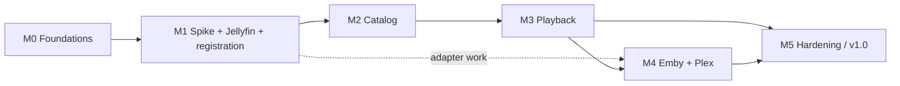

# Cinewren — Roadmap (canonical delivery plan)

| | |
|---|---|
| **Status** | Draft v0.1 (2026-10-04). Written by an agent under delegation. The project owner has not reviewed it. |
| **Authority** | **This is the canonical source** for scope boundaries, priorities, dependencies, sequencing, milestone status and completion criteria. Detailed content lives in the linked documents, and this file links to them rather than copying them. |
| **Update rule** | Every change that completes, starts, blocks or re-scopes work updates the milestone status here in the same commit (see [AGENTS.md](../AGENTS.md)). |

## 1. Product summary

**Cinewren** is a self-hosted, federated media frontend. An operator deploys it to their own Cloudflare account. It merges the movie and TV libraries of several Jellyfin, Emby and Plex servers into **one deduplicated catalog**. For example, it shows a title once as "Interstellar (2014) · 4K HDR · 1080p · Available from 3 servers". When a viewer presses play, Cinewren picks the best copy and sends the browser **directly to that server**. Cloudflare handles everything up to the moment playback begins. Video bytes never pass through it.

- **Users:** an operator (P-1) and the household or friends they invite (P-2). See [PRD](requirements/PRD.md).
- **Outcomes:** BO-1 to BO-5 in the [BRD](requirements/BRD.md): one library, low cost, best available playback, backend-agnostic design, safe operation.
- **Non-goals (v1):** native or TV apps, multi-tenant hosting, hiding origin hostnames, music, photos and live TV, transcoding or storing media in Cloudflare, and others. The full list with revisit triggers is in [PRD §6](requirements/PRD.md#6-non-goals-and-deferred-capabilities).

## 2. Current state and target state

| | Current state (evidence: repository on 2026-10-04) | Target state (v1.0, end of M5) |
|---|---|---|
| Code | None. The repository had no commits, source, tests or configuration before this documentation commit. | A single Cloudflare Worker serving the SPA and API, with D1, Queues and cron handlers, and Jellyfin, Emby and Plex adapters. |
| Docs | Only the owner-provided concept ([sources](sources/2026-10-04-initial-architecture-concept.md)) existed, outside the repo. | This document set, kept in sync with the code. |
| Infra | None provisioned by this work. No production infrastructure was touched. | Staging and production Workers, each with its own D1 database and secrets. Other operators self-host their own instances from tagged releases. |

**Audit finding:** no roadmap or plan existed in the repository, authoritative or fragmented. The only planning input was a single concept document. This roadmap is therefore newly derived from that document, the owner's instructions and the 2026-10-04 product name. It does not replace any earlier plan.

## 3. Constraints, assumptions, decisions and open questions

**Provenance labels:**
- **Owner direction** means the owner supplied it on 2026-10-04: the concept document, the name *Cinewren* and the agent-routing policy in AGENTS.md.
- **Agent decision** means a decision made under delegation, not yet reviewed by the owner. Supplying the concept does not mean the owner approved every derived detail.

### Constraints (owner direction)
- **C-1:** Cloudflare (Workers with Static Assets, and D1) hosts the UI, the API, the catalog and the auth control plane.
- **C-2:** Media bytes never transit Cloudflare. This is also required by Cloudflare's terms for Free, Pro and Business plans, including Tunnel public hostnames ([ADR-0002](adr/0002-cloudflare-control-plane-origins-deliver-media.md)).
- **C-3:** Media stays on the origins. No media is stored in R2.
- **C-4:** The supported origins are Jellyfin, Emby and Plex.
- **C-5:** The client talks only to the Cinewren API. Provider types are an implementation detail ([ADR-0004](adr/0004-provider-adapter-abstraction.md)).
- **C-6:** Agent workflow follows [AGENTS.md](../AGENTS.md).

### Assumptions (agent decisions; revisit if wrong)
| ID | Assumption | If wrong |
|---|---|---|
| A-1 | Single operator per deployment, for a small invited group (envelope NFR-SCALE-001). **Owner decision 2026-10-04:** confirmed, and other operators may self-host their own instances. | Multi-tenancy redesign. [ADR-0011](adr/0011-single-operator-deployment-model.md) would be superseded. |
| A-2 | The operator can create a non-admin service account on each origin | [ADR-0008](adr/0008-origin-service-accounts-and-credential-encryption.md) needs revisiting. |
| A-3 | Browsers reach origins over HTTPS on non-Cloudflare-proxied hostnames. **Owner confirmed 2026-10-04:** origins are on public HTTPS. | Media gateway (DEF-1) or Cloudflare Stream would be needed. Major change. |
| A-4 | Workers reach origin APIs over public HTTPS | Private connectivity (Q-5) is needed. |
| A-5 | Workers Paid plan | Free-plan limits (10 ms CPU, 50 subrequests) make sync infeasible. |
| A-6 | Web browser is the only v1 client | — |
| A-7 | Personal or household use of media the operator is entitled to. No binding regulatory regime is identified. | A legal review would be needed before wider use. |
| A-8 | English-only UI | — |
| A-9 | Origins expose TMDB, IMDb or TVDB IDs for most items | Matching quality drops. TMDB enrichment (DEF-9) would be reconsidered. |
| A-10 | "Single operator per deployment" (owner decision 2026-10-04) means one operating party. Several accounts may hold the operator role, for example two household admins, which also lets BR-8 keep a spare operator. *Agent interpretation.* | Restrict operator invites to one account, and rely on CLI recovery (FR-USR-007) only. |

### Material decisions
15 ADRs are indexed in [adr/README.md](adr/README.md). ADR-0002 records owner direction. **ADR-0014 (passkeys and invite-only signup) is an owner decision**, and it supersedes ADR-0007 (Cloudflare Access). ADR-0003 and ADR-0011 are owner-confirmed. The rest are agent decisions. **ADR-0013 (session-scoped stream credentials) is `Proposed`** until the M1 spike confirms it.

**Owner decisions taken on 2026-10-04 through multiple-choice blocker questions (see AGENTS.md §4):**

| Ref | Question | Owner decision | Effect |
|---|---|---|---|
| B-1 | Cloudflare account and identity layer | Owner has Workers Paid. Asked why Access was planned, then chose **passkeys only, with operator invite links as the only way to create an account**. | ADR-0014 supersedes ADR-0007, and no Zero Trust team is needed. Agent follow-ups: FR-USR-* rewritten, T0.5 reworked, and bootstrap and recovery details in ADR-0014. |
| B-2 | Test servers for the T1.1 spike | **Containers (Jellyfin, Emby) plus the owner's Plex** | T1.1 can proceed. The Plex checks use the owner's account or server. |
| Q-2 | Hide origin hostnames? | **Public HTTPS is fine** | ADR-0003 confirmed. DEF-1 stays deferred. |
| Q-7 | Collections and people/collection search (shown in the design canvas) | **Add both to v1** | CAP-15, CAP-16, FR-SYNC-008, FR-CAT-011, FR-CAT-012, M2 tasks T2.9 and T2.10. Agent follow-up: merge rules in ADR-0015. |
| Q-8 | Light theme | **Dark and light at v1** | NFR-UX-001 (M2). Light tokens are agent-proposed in UX.md, pending light artboards (T2.11). |
| Design | Visual reference | **The owner's design canvas** (https://claude.ai/artifact/LUvVfjGfMr3J4cEmRL44z8) | It is specified in [design/UX.md](design/UX.md). Divergences from the spec are listed there (UX §8). Agent follow-ups: FR-CAT-013 (copy table) and FR-PLAY-010 (why-this-copy reasons). |
| Q-1 | Audience | **Others may self-host** (one operator per deployment) | ADR-0011 confirmed. Agent follow-ups: CAP-14, FR-OPS-008, NFR-MAINT-003, T5.5, and the A-10 interpretation. |

### Open questions (none block M0)
| ID | Question | Blocks | Default until answered |
|---|---|---|---|
| ~~Q-1~~ | Will Cinewren ever be hosted for multiple operators? | — | **Resolved 2026-10-04 by the owner:** no hosted multi-tenancy, but others may self-host |
| ~~Q-2~~ | Must origin hostnames be hidden from viewers? | — | **Resolved 2026-10-04 by the owner:** no, public HTTPS is fine |
| Q-3 | Plex API terms and the token model for third-party clients | M4 Plex task | Resolved by the T1.1 spike |
| Q-5 | Should private-network-only origins be supported? | Nothing in v1 | Unsupported (DEF-10) |
| Q-6 | Minimum provider versions | M1 / M4 adapters | Fixed by the T1.1 spike |
| ~~Q-4~~ | Product name | — | **Resolved 2026-10-04 by the owner: Cinewren** |

### Conflicts found and how they were resolved
| Conflict | Resolution |
|---|---|
| The concept says Workers *can* stream multi-GB responses, and also that Cloudflare terms restrict video delivery. | The terms win. They were checked on 2026-10-04 and also cover Tunnel public hostnames. See ADR-0002 and NFR-COMP-001. |
| The concept suggests "Cloudflare Tunnel" as a way to expose origins. | Tunnel *public hostnames* fall under the same video restriction, so they are rejected for media. Private Tunnel routes are deferred (Q-5). See [HLD](design/HLD.md). |
| The concept lists Option A (direct) and Option B (gateway). | Option A was selected and Option B deferred ([ADR-0003](adr/0003-direct-to-origin-playback.md)). |
| The concept puts the server token in the playback URL (`?token=...`). Passing the long-lived server token to browsers would violate BR-6. | Session-scoped credentials ([ADR-0013](adr/0013-session-scoped-origin-stream-credentials.md), Proposed). |
| ADR-0007 chose Cloudflare Access. The owner then chose passkeys with invite links and asked why Access was used. | Owner decision wins. ADR-0014 supersedes ADR-0007, which is kept for history. |
| The owner's routing text said `agents.md`. The task brief defaults to `AGENTS.md` when neither exists. | Neither file existed, so `AGENTS.md` was created, which is the conventional casing. No case-variant duplicate exists. |

## 4. Documentation map

| Path | Purpose | Authoritative for | Status |
|---|---|---|---|
| [AGENTS.md](../AGENTS.md) | Agent operating rules and model routing | How agents work in this repository | Current |
| [CLAUDE.md](../CLAUDE.md) | Claude Code entry point. It imports AGENTS.md. | Nothing; it only points to AGENTS.md | Current |
| **docs/ROADMAP.md** (this file) | Delivery plan | Scope boundaries, priority, sequence, status, completion criteria | Draft v0.1 |
| [requirements/BRD.md](requirements/BRD.md) | Business Requirements | Business problem, outcomes BO-*, stakeholders, business constraints, success measures | Draft v0.1 |
| [requirements/PRD.md](requirements/PRD.md) | Product Requirements | Personas P-*, capabilities CAP-*, journeys J-*, UX principles, non-goals DEF-* | Draft v0.1 |
| [requirements/FRD.md](requirements/FRD.md) | Functional Requirements | Workflows WF-*, **business rules BR-***, permission matrix, state machines, validation | Draft v0.1 |
| [requirements/SRS.md](requirements/SRS.md) | Software Requirements Specification | **Every FR, IR, DR and NFR requirement and the requirement trace matrix** | Draft v0.1 |
| [design/HLD.md](design/HLD.md) | High-Level Design | Components C-*, trust boundaries TB-*, data flows DF-*, deployment topology, threat model | Draft v0.1 |
| [design/SDD.md](design/SDD.md) | Software Design Document | Subsystem collaboration, module layout, shared patterns, requirement→design satisfaction | Draft v0.1 |
| [design/TDD.md](design/TDD.md) | Technical Design Document | Stack, tooling, config, testing, CI/CD, release, rollback, backup, cross-cutting technical choices | Draft v0.1 |
| [design/UX.md](design/UX.md) | UX and visual design specification | Visual identity, tokens (dark and light), screen inventory, components, copy; maps the owner's design canvas | Draft v0.1 |
| [design/LLD.md](design/LLD.md) | Low-Level Design | Schema, API contracts, provider interface, algorithms, credential lifecycle, error handling (sections LLD-*) | Draft v0.1 |
| [adr/](adr/README.md) | Architecture Decision Records | Individual architectural decisions and their supersession | ADR-0001 to ADR-0012 and ADR-0014 Accepted (ADR-0007 superseded by ADR-0014). ADR-0013 Proposed. |
| [sources/2026-10-04-initial-architecture-concept.md](sources/2026-10-04-initial-architecture-concept.md) | Archived owner-provided concept | Nothing. Historical input only. | Historical |

**Traceability chain:** BO (BRD) → CAP / J (PRD) → WF / BR (FRD) → FR / NFR (SRS: its `Design` and `MS` columns) → C / LLD / ADR (design) → milestone task (this file) → verification (the SRS `Verify` column plus each milestone's exit checks below). The SDD holds the requirement→design satisfaction table.

## 5. Status legend and overview

`Done` · `In progress` · `Partial` · `Planned` · `Blocked` · `Deferred`. A status other than `Planned` must cite evidence: a commit, PR, test name or file path.

| Milestone | Goal | Depends on | Status |
|---|---|---|---|
| M0 | Foundations: scaffold, CI, auth, schema v1, staging | — | Planned (documentation set `Done`: commits cd18afd onward on branch `c/laughing-dirac-nh2651`) |
| M1 | Provider spike, Jellyfin adapter, server registration | M0 | Planned |
| M2 | Catalog: sync, matching, browse/search/detail, users and grants | M1 | Planned |
| M3 | Playback on Jellyfin: selection, session credentials, player, progress | M2 | Planned |
| M4 | Emby and Plex adapters at parity | M3 (M4 can start after M1 for adapter-only work) | Planned |
| M5 | Hardening and v1.0 release gate | M3, M4 | Planned |
| Later | DEF-1 to DEF-11 | v1.0 and the triggers in PRD §6 | Deferred |

No dates are committed. The owner has not set any, and no staffing is known.

## 6. Milestones

Every milestone exit requires three things: CI green on `main`, docs and this file updated, and every listed SRS ID passing its `Verify` method. The checks below are **planned verification**. No test exists yet.

### M0 — Foundations · Planned

**Objective:** a deployable, empty-but-secure Cinewren skeleton with the engineering workflow in place.
**Must requirements:** see [SRS §8](requirements/SRS.md#8-must-requirement-coverage-by-milestone), M0 row. **Should:** FR-OPS-007, NFR-SEC-006.

| Task | Objective | Refs | Depends | Done when |
|---|---|---|---|---|
| T0.1 | Scaffold the repository: pnpm, TypeScript strict, Vite + React SPA, Hono Worker with Static Assets, `wrangler` config for `local` / `staging` / `production`, ESLint and Prettier | ADR-0005, [TDD](design/TDD.md), [SDD](design/SDD.md) (module layout) | — | `pnpm build` and `pnpm typecheck` pass. `wrangler dev` serves the SPA shell at `/` and `/api/v1/health` responds locally. |
| T0.2 | CI workflow: install, typecheck, lint, unit and Workers integration tests (Vitest pool-workers), docs check, dependency audit, secret scanning | NFR-TEST-001, NFR-SEC-006, [TDD](design/TDD.md) | T0.1 | A PR shows all jobs. A deliberately broken link or type error fails CI. |
| T0.3 | Docs check script (`scripts/check-docs.mjs`): relative links resolve, IDs referenced are defined, LLD section IDs exist | NFR-MAINT-002 | — | **Done.** Evidence: `scripts/check-docs.mjs` (commit cd18afd), which passes locally. CI wiring is part of T0.2. |
| T0.4 | D1 schema v1 migration covering the M0 to M2 tables, with the migration runner in local and CI | DR-001, DR-004, [LLD-SCHEMA](design/LLD.md) | T0.1 | Migrations apply to an empty local D1. An integration test asserts the tables, indexes and FK cascades. |
| T0.5 | Passkey auth: `/setup` bootstrap with `SETUP_TOKEN`, invite create/redeem with passkey registration, passkey login and logout, own-passkey management, sessions, Origin check, auth rate limits, role guard | FR-USR-001 to FR-USR-004, FR-USR-006, IR-006, NFR-SEC-002, NFR-SEC-004, NFR-SEC-007, ADR-0014 | T0.4 | Tests (with a virtual WebAuthn authenticator): no session → 401. Setup works once, and only with the token. Account creation without a valid invite is refused. Expired, used or revoked invites are refused. Login with a registered passkey yields a session. A cross-origin mutation is refused. A viewer gets 403 on an operator route. Removing the last passkey is refused. The WebAuthn library runs in the Workers runtime. |
| T0.6 | API conventions: request ID, error envelope, structured logger, security headers baseline, health endpoint | IR-001, NFR-OBS-001, NFR-PRIV-001, FR-OPS-007 | T0.1 | Tests assert the envelope shape, the `x-request-id` header, that no display name, token, cookie value or credential appears in log lines, and that health returns DB status. |
| T0.7 | Staging environment: Worker, D1 and secrets (`SETUP_TOKEN`, credential key). Documented in an operator setup guide (`docs/operations/setup.md`, created in this task). | A-5, [HLD](design/HLD.md) deployment | T0.5, T0.6 | **Demonstration:** on staging, `/setup` creates the operator's passkey. An invite link creates a viewer. A signed-out visitor sees only the login page. *Prerequisite: Workers Paid (owner confirmed 2026-10-04).* |

**M0 exit:** T0.1 to T0.7 done. M0 Must IDs verified. FTS5 search exercised on local D1 (support confirmed in docs on 2026-10-04).

### M1 — Provider spike, Jellyfin adapter, server registration · Planned

**Objective:** settle the provider facts the design rests on, then register a real Jellyfin server.

| Task | Objective | Refs | Depends | Done when |
|---|---|---|---|---|
| T1.1 | **Provider spike** (Jellyfin, Emby, Plex) against real or containerized servers. Determine: auth for a non-admin service account; library listing and incremental "changed since" support; external IDs; playback negotiation (direct play or HLS URLs); whether a **per-session revocable stream credential** can be minted; CORS behaviour on stream, HLS and subtitle URLs; start/progress/stop reporting; minimum versions. | ADR-0013, Q-3, Q-6, IR-003 to IR-005, [LLD-PROV](design/LLD.md) | M0 | Spike report saved at `docs/spikes/2026-provider-spike.md`. ADR-0013 moved to Accepted or superseded. IR-003 to IR-005 version minimums and any FR-PLAY-007 / FR-PLAY-009 changes made in the SRS. LLD-PROV notes marked verified or corrected. |
| T1.2 | `MediaProvider` interface, normalized types, recorded-fixture contract test harness | IR-002, NFR-MAINT-001, ADR-0004 | T1.1 | The harness runs one shared contract suite per adapter against fixtures. |
| T1.3 | Credential vault (AES-256-GCM, versioned keys) | DR-002, NFR-SEC-001, ADR-0008, [LLD-TOKEN](design/LLD.md) | M0 | Tests: round-trip; wrong key fails; key rotation re-encrypts; ciphertext never appears in API responses or logs. |
| T1.4 | Jellyfin adapter: validate, list libraries, list items (paged), get item | IR-003, FR-SRV-002, NFR-SEC-005 | T1.2 | Contract suite green on fixtures. Redirects off-host refused (test). |
| T1.5 | Server registration API and minimal operator UI: register, validate, enable libraries, https enforcement | FR-SRV-001 to FR-SRV-003, FR-SRV-007, WF-1 | T1.3, T1.4 | Tests for each WF-1 failure path. **Demonstration:** a real Jellyfin server registered on staging with its libraries listed. |

**M1 exit:** all M1 Must IDs verified. The spike report is merged. No `(to verify in M1 spike)` marker remains for Jellyfin, and the Emby and Plex markers are either resolved or explicitly carried into M4.

### M2 — Federated catalog · Planned

**Objective:** viewers see one deduplicated, permission-filtered catalog from synced servers.

| Task | Objective | Refs | Depends | Done when |
|---|---|---|---|---|
| T2.1 | Sync orchestrator: cron → Queue → consumer; checkpointed runs with continuation; per-server lock; run records | FR-SYNC-001, FR-SYNC-002, FR-SYNC-004, FR-SYNC-006, FR-SYNC-007, NFR-REL-002, ADR-0009, [LLD-SYNC](design/LLD.md) | M1 | Integration tests: a scheduled tick enqueues one run per due server; a second trigger while running is refused; injected transient errors retry with backoff and then succeed; one server failing leaves the others' runs `succeeded`. |
| T2.2 | Normalization and upsert; missing marking; retention purge | FR-SYNC-003, FR-SYNC-005, DR-003, BR-4 | T2.1 | Fixture tests: a re-run over unchanged data produces no catalog-visible change; a source absent from a completed full sync becomes `missing` and is restored when seen again; the purge removes sources missing for more than 30 days *(proposed)*. |
| T2.3 | Matching (external IDs, episode alignment, conflict flags) | FR-CAT-001, BR-2, ADR-0010, [LLD-MATCH](design/LLD.md) | T2.2 | Table-driven tests: a shared TMDB or IMDb ID merges; title-only similarity doesn't merge; conflicting IDs create a conflict flag; episodes align by series, season and episode. |
| T2.4 | Catalog query layer with central BR-1 filtering; browse, filters, search (FTS5), detail, home "Recently added" | FR-CAT-002 to FR-CAT-006, FR-CAT-008, NFR-REL-001 | T2.3 | API tests for each endpoint. An IDOR test: an ungranted item returns 404 from detail and artwork and never appears in browse or search. Search ignores case and diacritics. |
| T2.5 | Artwork proxy with edge cache | FR-CAT-009, ADR-0012 | T2.4 | Tests: the response never contains the origin URL or credential; a permission check runs before any cached response is served. |
| T2.6 | User lifecycle and grants: disable, re-enable and delete with cascades; viewer library grants; operator re-enrollment link; server disable and removal | FR-USR-005, FR-USR-007, FR-USR-008, FR-SRV-004, DR-005, BR-8 | T2.4 | Tests: disabling a user revokes their sessions immediately; deletion cascades per DR-005; the last operator cannot be removed; a re-enrollment link adds a passkey once and then expires; server removal deletes its sources and hides them at once. |
| T2.7 | Web UI: home, browse, search, detail (versions badge, "Available from N servers"), operator sync-status page | FR-OPS-003, NFR-PERF-003, [PRD](requirements/PRD.md) J-2 | T2.4–T2.6 | Component tests. A bundle-size check fails CI above 250 KB gzipped *(proposed)*. The sync page shows the last run, its outcome and errors. |
| T2.8 | E2E harness: Playwright against `wrangler dev` with a mock origin | NFR-TEST-001 | T2.7 | CI runs the E2E job on every PR. One journey (sign in, browse, open detail) passes. |
| T2.9 | People: sync credits, match people (BR-10), people search, person page | FR-SYNC-008, FR-CAT-011, ADR-0015 | T2.3, T2.4 | Fixture tests: the same TMDB person ID merges; identical names without conflicting IDs merge; a conflicting ID creates a conflict flag. The person page lists only visible titles (IDOR test). |
| T2.10 | Collections: sync membership, match on TMDB collection ID, browse, collection page, collection search | FR-SYNC-008, FR-CAT-012, ADR-0015 | T2.3, T2.4 | Fixture tests: the same TMDB collection ID merges and same-name collections without one don't. A collection whose members are all hidden is absent from browse and search. |
| T2.11 | Themes: implement the UX.md token set with dark and light themes, `prefers-color-scheme` plus a per-user override; add light artboards to the design canvas | NFR-UX-001, NFR-A11Y-001, [UX](design/UX.md) | T2.7 | An automated a11y contrast check passes in both themes. The override persists per user. Light artboards exist in the canvas, and any changes are reflected in UX.md. |

**M2 exit checks:**
- (a) The integration test "same movie on two mock servers yields one item with two sources" passes.
- (b) The T2.4 IDOR test passes.
- (c) A killed sync mid-run, when retried, leaves no duplicates.
- (d) Browse works with all mock origins offline.
- (e) **Demonstration:** a staging catalog from a real Jellyfin server.

### M3 — Playback (Jellyfin) · Planned

**Objective:** press play, start the best Jellyfin source directly from the origin, and resume later.

| Task | Objective | Refs | Depends | Done when |
|---|---|---|---|---|
| T3.1 | Device capability detection in the client | FR-PLAY-002, NFR-COMPAT-001 | M2 | Unit tests over mocked `canPlayType`, `MediaSource.isTypeSupported` and MediaCapabilities produce the expected capability payloads for representative browsers. |
| T3.2 | Source selection (BR-5) with a fixture-driven test table, including the Interstellar example; failover to the next candidate | FR-PLAY-003, FR-PLAY-004, FR-SRV-006, [LLD-SEL](design/LLD.md) | M2 | The table test passes and matches the LLD-SEL worked example. A request excluding a failed source returns the next candidate or `NO_PLAYABLE_SOURCE`. |
| T3.3 | Playback sessions and session-scoped stream credentials (per the T1.1 outcome); expiry and revocation sweep | FR-PLAY-001, FR-PLAY-007, BR-9, ADR-0013, [LLD-TOKEN](design/LLD.md) | T1.1, T3.2 | Tests: the descriptor has a session ID and expiry; an unstarted session expires after 5 min *(proposed)*; after the session ends, the mock origin rejects the stream credential. |
| T3.4 | Player: direct play and HLS (hls.js / native), audio and subtitle selection, manual version choice, dynamic CSP | FR-PLAY-005, FR-PLAY-006, FR-PLAY-008, IR-007, NFR-SEC-003 | T3.3 | E2E: direct play and HLS both start against the mock origin; switching subtitle and audio tracks works; the CSP header lists only self plus registered origin hosts. |
| T3.5 | Progress, resume, watched state, next episode, "Continue watching"; session telemetry to the origin | FR-PROG-001 to FR-PROG-004, FR-PLAY-009, FR-CAT-008, BR-7 | T3.4 | E2E: play, pause, reload, then resume from the stored position. Reaching the BR-7 threshold marks the item watched. The next-episode query passes fixture tests. The mock origin receives start, progress and stop. |
| T3.6 | Compliance check: the operator setup guide documents non-proxied origin hostnames; a test asserts every descriptor URL host equals a registered origin host | NFR-COMP-001, FR-PLAY-008 | T3.4 | Test green, and the setup-guide section is merged. |
| T3.7 | Copy table and "why this copy" | FR-CAT-013, FR-PLAY-010, [UX](design/UX.md) | T3.2, T3.4 | Component tests render every reason code. E2E: the table marks the selected copy and shows the playability status per copy. |

**M3 exit checks:**
- (a) The T3.5 E2E journey passes.
- (b) The T3.3 credential-revocation test passes.
- (c) **Demonstration:** on staging, a real Jellyfin title plays in current Chrome, Firefox and Safari. Browser devtools show media requests going only to the origin host.
- (d) All M3 Must IDs verified.

### M4 — Emby and Plex parity · Planned

| Task | Objective | Refs | Depends | Done when |
|---|---|---|---|---|
| T4.1 | Emby adapter (likely close to Jellyfin; confirm in T1.1) | IR-004 | T1.2, T3.3 | The shared contract suite is green on Emby fixtures, and a playback E2E passes against an Emby fixture origin. |
| T4.2 | Plex adapter, including the Q-3 terms check | IR-005, Q-3 | T1.2, T3.3 | The Q-3 outcome is recorded in §3. The shared contract suite is green on Plex fixtures, and a playback E2E passes against a Plex fixture origin. |
| T4.3 | Cross-provider matching test: one title on all three server types merges into one item | FR-CAT-001 | T4.1, T4.2 | Integration test green. |

**M4 exit:** T4.1 to T4.3 done. **Demonstration:** one title present on Jellyfin, Emby and Plex shows as one item and plays from each source via manual override.

### M5 — Hardening, self-host packaging and v1.0 · Planned

| Task | Objective | Refs | Depends | Done when |
|---|---|---|---|---|
| T5.1 | Health probing, status derivation, health-aware selection, health view | FR-OPS-001, FR-OPS-002, FR-OPS-004 | M3 | Tests: probe failures move a server through `degraded` to `unreachable`, and selection excludes or deprioritizes it. The health page is demonstrated. |
| T5.2 | Curation: merge, split, conflict list | FR-CAT-007, FR-CAT-010, BR-3 | M2 | Tests: overrides persist across a full re-sync; a resolved conflict leaves the list. |
| T5.3 | Credential rotation, audit log, export | FR-SRV-005, FR-OPS-005, FR-OPS-006 | M2 | Tests: rotation keeps catalog rows; every operator mutation writes one audit row; the export contains no secrets (asserted by a test). |
| T5.4 | Per-user rate limits, operational retention, metrics | NFR-SEC-008, DR-003, NFR-OBS-002 | M3 | Tests: limits return 429 above threshold; retention jobs purge per DR-003. A metrics query is demonstrated. |
| T5.5 | **Self-host packaging** (owner decision 2026-10-04: others may self-host; packaging details are agent decisions): self-host guide, Deploy to Cloudflare button or `wrangler` path, SemVer releases with notes, upgrade path | FR-OPS-008, NFR-MAINT-003, CAP-14 | M4 | **Demonstration:** a fresh Cloudflare account deploys a tagged release by following only the guide, completes `/setup`, then upgrades to the next tag with migrations applied. |
| T5.6 | Last-operator CLI recovery rehearsal and D1 restore rehearsal | FR-USR-007, NFR-REL-003 | M4 | Both procedures are executed on staging and their notes are linked here. |
| T5.7 | Accessibility audit; performance and cost analysis at the envelope | NFR-A11Y-001, NFR-PERF-001, NFR-PERF-002, NFR-SCALE-001, NFR-COST-001 | M4 | The audit report has no open WCAG 2.2 AA failures on core journeys. A load test at the NFR-SCALE-001 envelope reports p95 figures and the monthly cost estimate. |
| T5.8 | Security review against the [HLD](design/HLD.md) threat model | NFR-SEC-* | T5.1–T5.5 | The review report is linked here, with every finding rated. Findings rated high or critical are fixed or carry an owner-accepted exception. |

**v1.0 exit:** every `Must` in the SRS is verified with linked evidence. Every `Should` that isn't done has a dated decision row in §3. T5.8 has no open high or critical findings. A production deploy and a rollback have been rehearsed, and the notes are linked.

### Later — Deferred
DEF-1 to DEF-11 per [PRD §6](requirements/PRD.md#6-non-goals-and-deferred-capabilities). Each needs its revisit trigger met and, where it is architectural (DEF-1, DEF-3, DEF-10), a new ADR.

## 7. Risks and blockers

| ID | Risk | Impact | Mitigation / trigger |
|---|---|---|---|
| R-1 | A provider can't mint a session-scoped, revocable, non-admin stream credential | BR-6 weakened, or a gateway (DEF-1) is needed | T1.1 spike first. The fallback is in ADR-0013. |
| R-2 | Origins not reachable by browsers on non-proxied HTTPS (home NAT, CGNAT) | Playback impossible for that origin | A setup-guide prerequisite (A-3). Revisit DEF-1 or Q-5 if common. |
| R-3 | Missing CORS headers on origin HLS or subtitle responses | HLS via MSE or subtitles fail in some browsers | Verified in T1.1. The operator reverse-proxy recipe goes in the setup guide. |
| R-4 | Plex API terms or stability for third-party clients | Plex adapter delayed or dropped | Q-3 is checked in T1.1 and T4.2. Plex is the last adapter. |
| R-5 | Cloudflare terms or limit changes | Architecture assumptions break | Facts re-checked at each milestone exit, with dates noted in ADR-0002. |
| R-6 | Poor external-ID coverage on origins | Duplicate items | Manual curation (FR-CAT-007). DEF-9 enrichment can be reconsidered. |
| ~~R-7~~ | D1 FTS5 is unavailable or limited | — | **Retired 2026-10-04:** FTS5 support confirmed in Cloudflare docs (https://developers.cloudflare.com/d1/sql-api/sql-statements/). T0.4 still exercises it. |
| ~~B-1~~ | Cloudflare account for staging | — | **Resolved 2026-10-04:** owner has Workers Paid. No Access needed (ADR-0014). |
| ~~B-2~~ | Test servers | — | **Resolved 2026-10-04:** containers for Jellyfin and Emby, plus the owner's Plex. Hand-over of Plex access is needed when T1.1 starts. |

## 8. Next actionable milestone

**M0 — Foundations.** Start with T0.1, then T0.2 and T0.4 in parallel.
- **Prerequisites:** none. All earlier blockers are resolved. For T0.7 the owner sets the staging secrets, including `SETUP_TOKEN`, or delegates that.
- **Verification:** the M0 exit criteria above. Every M0 Must ID in [SRS §8](requirements/SRS.md#8-must-requirement-coverage-by-milestone) passes its Verify method, CI is green on `main`, and the staging demonstration (T0.7) is recorded in this file with a link.

## 9. Change log

| Date | Change | By |
|---|---|---|
| 2026-10-04 | Owner supplied the design canvas (the visual reference, now specified in UX.md) and answered Q-7 (collections and people search in v1) and Q-8 (dark and light themes). ADR-0015 and new requirements added. | Agent, recording owner decisions |
| 2026-10-04 | Owner answered the blocker questions (B-1, B-2, Q-1, Q-2): passkeys plus invite links replace Cloudflare Access (ADR-0014), origins on public HTTPS confirmed, self-hosting added to M5. | Agent, recording owner decisions |
| 2026-10-04 | Initial roadmap and document set derived from the owner-provided concept. Product named Cinewren (owner). T0.3 docs check script added and run. | Agent under delegation |
