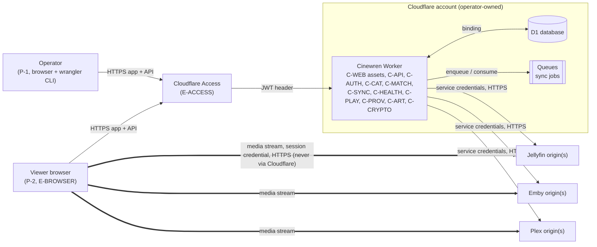
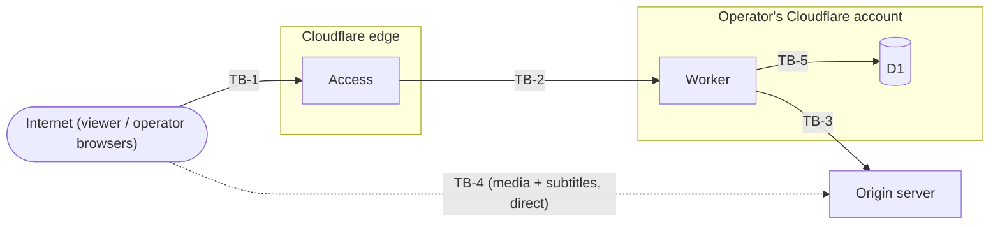
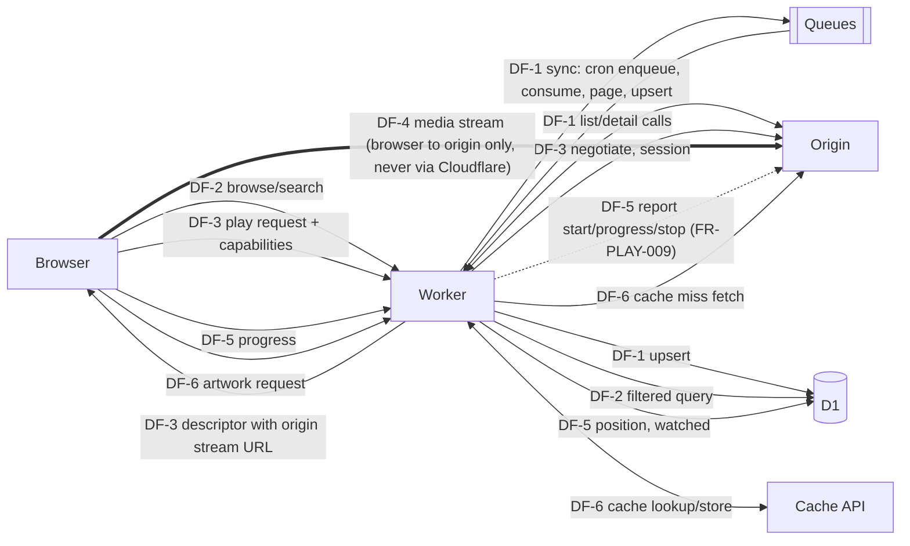

# Cinewren — HLD (High-Level Design)

| | |
|---|---|
| **Status** | Draft v0.1, 2026-10-04, agent-authored under delegation; not owner-reviewed. Nothing described here is implemented (the repository has no source code). |
| **Owns** | System context and boundaries, major components (`C-*`), external dependencies, trust boundaries (`TB-*`), data flows (`DF-*`), deployment topology, origin reachability requirements, threat model, capacity and cost assumptions, availability posture. |
| **Does not own** | Requirements ([SRS](../requirements/SRS.md)), business rationale ([BRD](../requirements/BRD.md)), capabilities ([PRD](../requirements/PRD.md)), workflow rules ([FRD](../requirements/FRD.md)), module-level collaboration and the requirement-to-design table ([SDD](SDD.md)), test and build practice ([TDD](TDD.md)), field-level contracts and algorithms ([LLD](LLD.md)), sequencing ([ROADMAP](../ROADMAP.md)). |

Provenance labels used below: **Owner direction (2026-10-04)** means the owner supplied it (product name, the [concept document](../sources/2026-10-04-initial-architecture-concept.md), the agent-routing policy). The owner supplied the concept and asked for a plan; that is not approval of every detail here. **Agent decision (delegated, 2026-10-04; not yet owner-reviewed)** covers everything else. Assumptions are `A-n`, open questions `Q-n`.

## 1. Architecture in one paragraph

Cloudflare hosts the web app, the API, the catalog index and authentication (Workers, Static Assets, D1, Queues). Jellyfin, Emby and Plex servers ("origins") hold the media and do transcoding and delivery. The Worker syncs every origin into one deduplicated catalog. At play time it selects the best source, negotiates playback with the origin, and hands the browser a stream URL that points **directly at the origin**. Video bytes never pass through Cloudflare ([ADR-0002](../adr/0002-cloudflare-control-plane-origins-deliver-media.md), [ADR-0003](../adr/0003-direct-to-origin-playback.md)). The first is **Owner direction (2026-10-04)** backed by Cloudflare's published terms; the direct-playback choice is an **Agent decision** consistent with the owner-provided recommendation (Option A in the concept document).

## 2. System context

The bold edges are the only path for media bytes. The operator additionally uses `wrangler` to deploy and to set secrets; that path is outside runtime scope.

## 3. Boundaries and explicit exclusions

**Inside the system:** the SPA, the `/api/v1` API, the D1 catalog and primary data, sync, health probing, source selection, playback negotiation, artwork proxying, credential encryption.

**Outside the system (not built, not operated by Cinewren):**

| Exclusion | Why | Reference |
|---|---|---|
| Hosting, storing or transcoding media | Origins do this. Constraints C-2, C-3; no media in R2 | [ADR-0002](../adr/0002-cloudflare-control-plane-origins-deliver-media.md) |
| Proxying or caching stream bytes (including via Cloudflare Tunnel public hostnames) | Cloudflare video terms; FR-PLAY-008, NFR-COMP-001 | [ADR-0002](../adr/0002-cloudflare-control-plane-origins-deliver-media.md) |
| Hiding origin hostnames from viewers (media gateway) | Deferred as DEF-1; revisit if Q-2 is answered "yes" | [ADR-0003](../adr/0003-direct-to-origin-playback.md) |
| Origins reachable only on private networks | Unsupported in v1 (A-4, Q-5, DEF-10) | [PRD](../requirements/PRD.md) |
| Origin installation, TLS certificates, DNS, reverse proxies | Operator responsibility (A-2, A-3) | Section 9 |
| Native/TV apps, multi-tenant hosting, writing watch state back to origins, own metadata enrichment | Deferred (DEF-2, DEF-3, DEF-4, DEF-9) | [PRD](../requirements/PRD.md) |
| Identity provider for Access (email OTP, Google, etc.) | Configured by the operator inside Cloudflare Access | [ADR-0007](../adr/0007-cloudflare-access-identity.md) |

## 4. Major components

All components live in one Worker deployable ([ADR-0005](../adr/0005-single-worker-typescript-stack.md)). The split is logical (modules), not physical (services).

| ID | Component | Responsibilities | Key requirements |
|---|---|---|---|
| C-WEB | Web client | React + TypeScript SPA (Vite), served as Workers Static Assets. Browse, search, detail, admin screens, player (`<video>` + hls.js), reports capabilities and progress. Talks only to the Cinewren API (C-5). | FR-PLAY-002, FR-PROG-002, IR-007, NFR-A11Y-001 |
| C-API | API layer | Hono router under `/api/v1`; request ID, error envelope, CSP/HSTS headers, rate limiting, input validation. Thin: delegates to services. | IR-001, NFR-SEC-003, NFR-SEC-004 |
| C-AUTH | Auth and authorization | Verifies Access JWT; resolves user record, role and library grants; exposes per-request permission context used by every service. | FR-USR-001..005, IR-006, NFR-SEC-002 |
| C-CAT | Catalog service | Browse, search (D1 FTS5, to verify in M0), detail, home rows, next-episode. Single place that applies BR-1 visibility filtering. | FR-CAT-001..009, FR-PROG-004 |
| C-MATCH | Matching and dedup | External-ID matching (BR-2), manual merge/split (BR-3). Used by sync and curation. | FR-CAT-001, FR-CAT-007 |
| C-SYNC | Sync orchestrator | Cron enqueues per-server jobs; queue consumer pages through providers and writes D1 idempotently; marks missing sources; retention purge. | FR-SYNC-001..007, NFR-REL-002 |
| C-HEALTH | Health prober | Cron probes each server; derives status; stores probe history. | FR-OPS-001, FR-OPS-002, FR-OPS-004 |
| C-PLAY | Playback service | Source selection (BR-5), session creation, provider negotiation, stream credential issuance and revocation, progress and watched state. | FR-PLAY-001..009, FR-PROG-001, FR-PROG-003 |
| C-PROV | Provider adapters | `MediaProvider` interface; `JellyfinProvider`, `EmbyProvider`, `PlexProvider`. The only code that knows provider types or calls origins. | IR-002..005, NFR-SEC-005, NFR-MAINT-001 |
| C-ART | Artwork proxy | Fetches origin images with service credentials; small-image passthrough, cached via Cache API; permission-checked. | FR-CAT-009, [ADR-0012](../adr/0012-artwork-proxy-with-edge-cache.md) |
| C-CRYPTO | Credential vault | AES-256-GCM envelope encryption with a key from a Worker secret and key versioning. | DR-002, NFR-SEC-001, [ADR-0008](../adr/0008-origin-service-accounts-and-credential-encryption.md) |

Collaboration between these components is in the [SDD](SDD.md). Field-level contracts are in the [LLD](LLD.md).

## 5. External dependencies

| Dependency | Used for | Notes |
|---|---|---|
| Cloudflare Workers, Static Assets | Compute, SPA hosting | Workers Paid plan required (A-5, [ADR-0005](../adr/0005-single-worker-typescript-stack.md)) |
| Cloudflare D1 | System of record ([ADR-0006](../adr/0006-d1-system-of-record.md)) | FTS5 support and Time Travel retention: to verify in M0 / M1 spike |
| Cloudflare Queues | Sync job fan-out ([ADR-0009](../adr/0009-pull-based-sync-cron-and-queues.md)) | Availability on the operator's plan: to verify in M0 |
| Cloudflare Cache API | Artwork cache | Per-colo cache; best-effort, never required for correctness |
| Cloudflare Access | Authentication ([ADR-0007](../adr/0007-cloudflare-access-identity.md)) | JWT signing keys fetched from the team domain; details beyond basics to verify in M0 |
| Jellyfin, Emby, Plex servers | Media origins | Auth, token and CORS behaviour unverified; see Section 9 and Q-3, Q-6 |
| Operator DNS and TLS for origins | Browser-reachable HTTPS origins | A-3; not provided by Cinewren |

## 6. Trust boundaries

| ID | Boundary | What crosses | How authenticated | Main threats |
|---|---|---|---|---|
| TB-1 | Internet and Cloudflare Access | All app and API requests from browsers | Access policy (identity provider login); Access service token for health checks | Access misconfiguration, unauthorized sign-in, session theft |
| TB-2 | Access and Worker | Request plus `Cf-Access-Jwt-Assertion` | Worker verifies signature, audience, issuer, expiry (FR-USR-001, IR-006); then user record, role, grants | Request reaching the Worker without Access (e.g. `workers.dev` route left enabled), forged header, wrong audience |
| TB-3 | Worker and origins | Library metadata, playback negotiation, session creation/revocation, artwork bytes, health probes | Dedicated non-admin service account per origin, credentials decrypted only for the call ([ADR-0008](../adr/0008-origin-service-accounts-and-credential-encryption.md)); HTTPS only (FR-SRV-007) | SSRF through server URL, credential leak, hostile origin metadata, redirect to another host |
| TB-4 | Browser and origins (direct) | Media stream, subtitle files, HLS segments | Session-scoped stream credential in the URL ([ADR-0013](../adr/0013-session-scoped-origin-stream-credentials.md), proposed, pending M1 spike); HTTPS | Stolen or shared stream URL, mixed content, origin hostnames visible to viewers (accepted, Q-2) |
| TB-5 | Worker and D1 | All reads and writes of primary and derived data | Worker binding (no network credential) | Data loss or corruption, cross-user data access through query bugs, secrets stored in plaintext |

## 7. Data flows

| ID | Flow | Data | Frequency / size | Detail |
|---|---|---|---|---|
| DF-1 | Catalog sync | Provider item metadata into D1 | Incremental 60 min, full 24 h (FR-SYNC-001, proposed); many small pages | [SDD](SDD.md) WF-2, LLD-SYNC in [LLD](LLD.md) |
| DF-2 | Browse and search | Filtered catalog JSON | Per user interaction; no origin call | NFR-REL-001 follows from this: no origin dependency |
| DF-3 | Play negotiation | Capabilities in; descriptor out; origin session create | Per play; one or two origin calls | [SDD](SDD.md) WF-5, LLD-SEL, LLD-TOKEN |
| DF-4 | Media stream | Video, audio, segments, subtitles | Continuous, tens of Mbps | Browser and origin only. FR-PLAY-008 |
| DF-5 | Progress | Position every 15 s (proposed), watched flag | Small JSON | [SDD](SDD.md) WF-6 |
| DF-6 | Artwork | Poster/backdrop images | Many small GETs; cached | [ADR-0012](../adr/0012-artwork-proxy-with-edge-cache.md) |

## 8. Deployment topology

One Worker project (one `wrangler` configuration) exports three handlers: `fetch` (static assets fall through to the Hono API), `scheduled` (sync enqueue, health probe, retention purge) and `queue` (sync job consumer). ([ADR-0005](../adr/0005-single-worker-typescript-stack.md), [ADR-0009](../adr/0009-pull-based-sync-cron-and-queues.md)).

| Environment | Worker + D1 | Access | Purpose |
|---|---|---|---|
| local | `wrangler dev`, local D1 | Mock JWT verifier or dev bypass behind an explicit flag (design in [TDD](TDD.md)) | Development, tests; `ALLOW_INSECURE_ORIGINS` may be set here only (FR-SRV-007) |
| staging | Separate Worker, D1, Queue | Separate Access application | Pre-release checks, restore rehearsal (NFR-REL-003) |
| production | Separate Worker, D1, Queue | Separate Access application | Live |

| Binding / resource | Type | Used by | Notes |
|---|---|---|---|
| `DB` | D1 | all services via repository layer | Forward-only migrations (DR-004) |
| Sync queue | Queue (producer and consumer on same Worker) | C-SYNC | One message = one bounded unit of work (a server's library page) |
| Credential key (e.g. `CRED_KEY_V1`) | Worker secret | C-CRYPTO | Set via `wrangler secret put`; declared in `secrets.required`; never in `vars` |
| Access team domain and audience tag | Configuration (not secret) | C-AUTH | Public values, per environment |
| `BOOTSTRAP_OPERATOR_EMAILS`, `ALLOW_INSECURE_ORIGINS`, sync intervals | Configuration `vars` | C-AUTH, C-PROV, C-SYNC | FR-USR-002, FR-SRV-007, FR-SYNC-001 |
| Static Assets | Assets binding | C-WEB | Free to serve; SPA fallback routing |
| Cache API | Runtime API | C-ART | Cache keys must include the artwork identity, never user identity; permission check happens before cache lookup (Section 10) |

**DNS and proxying (NFR-COMP-001):**

- The Cinewren app hostname may be proxied (orange cloud): it serves HTML, JS and small JSON and images, not video.
- **Origin hostnames MUST be non-proxied** (DNS-only, or non-Cloudflare networking). Proxying them, or exposing them through a Cloudflare Tunnel public hostname, would route video through Cloudflare on Free/Pro/Business plans, which Cloudflare's terms prohibit. Tunnel private network routes are not affected, but they are not reachable from viewer browsers (see Q-5).
- Sources: [Delivering videos with Cloudflare](https://developers.cloudflare.com/fundamentals/reference/policies-compliances/delivering-videos-with-cloudflare/), [Tunnel FAQ](https://developers.cloudflare.com/cloudflare-one/faq/cloudflare-tunnels-faq/) (checked 2026-10-04).
- Cinewren cannot verify the operator's DNS settings. It can only check that the registered URL is HTTPS (FR-SRV-007); the setup guide must state the rule. A Worker-side check for Cloudflare-proxied responses (for example a `cf-ray` response header on the validation call) is a possible aid, to be evaluated in M1.

## 9. Origin reachability requirements

| Requirement | Statement | Basis |
|---|---|---|
| Worker to origin | Origin API reachable from Cloudflare's network over public HTTPS, for sync, health and playback negotiation. | A-4; private-only origins unsupported (Q-5) |
| Browser to origin | Origin reachable from each viewer's browser over HTTPS with a publicly trusted certificate, on a non-proxied hostname. | A-3, NFR-COMP-001 |
| No mixed content | The app is HTTPS-only, so stream, subtitle and segment URLs must be `https://`. Plain `http://` origins are rejected at registration (FR-SRV-007). | NFR-SEC-003 |
| CSP | `media-src` and `connect-src` include only self plus registered origin hostnames, generated from server configuration. Adding a server changes the CSP. | NFR-SEC-003 |
| CORS | `<video>` direct play of a cross-origin URL does not need CORS headers unless the element uses `crossorigin` or reads the response from script. hls.js fetches playlists and segments via XHR/fetch, and `<track>` WebVTT loads require CORS. Whether Jellyfin, Emby and Plex send suitable CORS headers by default, and which settings the operator must change, is **to verify in M1 spike**. | Browser platform behaviour; provider behaviour unverified |
| Range requests | Origins must honour HTTP range requests for direct play seek (standard for all three; confirm in M1 spike). | Provider behaviour: to verify in M1 spike |
| Origin visibility | Viewers can see origin hostnames in network traffic. Accepted for v1. | Q-2 assumed "no"; [ADR-0003](../adr/0003-direct-to-origin-playback.md) |

Residential NAT, dynamic DNS and certificate management are the operator's responsibility (A-2, A-3). The setup guide, delivered with M1, should list tested reverse-proxy and DNS patterns.

## 10. Threat model (concise)

| Threat | Boundary | Mitigations | Residual risk |
|---|---|---|---|
| Stolen or shared stream URL | TB-4 | Credential scoped to one playback session, expires or is revoked at session end (FR-PLAY-007, BR-9); short authorization window; cannot perform admin actions. [ADR-0013](../adr/0013-session-scoped-origin-stream-credentials.md) | If a provider cannot mint per-session tokens, the fallback is a per-server restricted playback token with rotation, a documented higher risk. Pending M1 spike. |
| Service credential leak (logs, errors, exports, browser) | TB-3, TB-5 | Encrypted at rest (DR-002), decrypted only inside C-CRYPTO/C-PROV, never logged or exported (NFR-SEC-001, NFR-OBS-001); dedicated non-admin account (A-2, [ADR-0008](../adr/0008-origin-service-accounts-and-credential-encryption.md)); rotation (FR-SRV-005) | Leak of the Worker secret plus a D1 export exposes credentials; key versioning limits the blast radius. |
| IDOR across libraries | TB-2, TB-5 | Server-side checks on every ID-addressed request (NFR-SEC-002); BR-1 filter in one place in C-CAT (FR-CAT-006); sources the user cannot see are not disclosed, even as counts | Query-layer bugs; covered by authorization tests in [TDD](TDD.md). |
| SSRF via server URL | TB-3 | HTTPS-only (FR-SRV-007); outbound requests only to the registered host, redirects to other hosts refused (NFR-SEC-005); operator-only registration (BR-8); registration validates server identity (FR-SRV-002) | An operator can still point at an internal-looking public host; Workers cannot reach private networks, which limits impact. Whether to block IP literals and reserved ranges is a design item for LLD-PROV. |
| Malicious origin returns hostile metadata or XSS payloads | TB-3 | Metadata treated as untrusted data; UI renders text only (no raw HTML); CSP `script-src 'self'` (NFR-SEC-003); bounded field sizes on normalization (FR-SYNC-003); artwork served from Cinewren with content-type checks | A compromised origin can still show misleading titles; operator removes the server (FR-SRV-004). |
| Access misconfiguration (policy too open, `workers.dev` route enabled, wrong audience) | TB-1, TB-2 | Worker verifies JWT audience and issuer itself, not only Access policy (FR-USR-001); unknown identities get 403 (FR-USR-002); setup guide and `secrets.required` checklist; staging uses a separate Access app | A deployment that never configures Access: the Worker rejects every request with 401 rather than running open. |
| Abuse of play endpoint (session exhaustion, origin hammering) | TB-3 | Per-user rate limits (NFR-SEC-004, proposed); session expiry (BR-9); concurrent-session bound within NFR-SCALE-001; negotiation timeouts and bounded retries (NFR-REL-002) | Authenticated viewer can still burn origin transcode capacity within limits. |
| D1 data loss or corruption | TB-5 | Catalog is derived and rebuildable (DR-001); primary data restorable via Time Travel with documented, rehearsed restore (NFR-REL-003); JSON export (FR-OPS-006, Could); expand-migrate-contract migrations (DR-004) | Time Travel retention window to verify in M0; RPO/RTO are proposed targets. |
| Cache poisoning or cross-user artwork leak | TB-3 | Permission check before cache lookup; cache key excludes user identity; origin responses restricted to image content types | Cached artwork may outlive a grant revocation for the TTL; acceptable for posters, to confirm in [ADR-0012](../adr/0012-artwork-proxy-with-edge-cache.md). |

## 11. Capacity and cost assumptions

Design envelope: NFR-SCALE-001 (50 users, 20 servers, 200,000 source items, 20 concurrent playback sessions, all proposed under A-1). Cost target: NFR-COST-001.

**Verified Cloudflare limits (checked 2026-10-04):**

| Fact | Value | Source |
|---|---|---|
| Free plan Worker | 10 ms CPU, 50 external subrequests per invocation, 100k requests/day, 5 cron triggers per account | [Workers limits](https://developers.cloudflare.com/workers/platform/limits/) |
| Paid plan Worker | CPU default 30 s, up to 5 min per HTTP request; cron CPU 30 s (interval under 1 h) or 15 min (1 h or more); 10,000 subrequests default (configurable up to 10M); 6 simultaneous outgoing connections per request; cron and queue consumer wall duration 15 min; `waitUntil` extends up to 30 s | same |
| D1 pricing | Free: 5M rows read/day, 100k rows written/day, 5 GB; from 2026-09-01 Free-plan queries fail once the daily limit is exceeded. Paid: 25B reads/month and 50M writes/month included, 5 GB included then $0.75/GB-month | [Pricing](https://developers.cloudflare.com/workers/platform/pricing/) |
| D1 per-database size limit | See the linked page (not restated here) | [D1 limits](https://developers.cloudflare.com/d1/platform/limits/) |

The Free plan is unsuitable (A-5): a single full sync exceeds Free-plan CPU, subrequest and daily D1 write limits.

**Estimate for a full sync of 200,000 items (proposed; to be measured in M2 and M5):**

| Quantity | Assumption | Estimate |
|---|---|---|
| Origin page calls | 200 items per page (proposed), one list call per page | about 1,000 subrequests per full sync, spread over many queue messages; far below 10,000 per invocation |
| Origin detail calls | Only for items whose list payload lacks versions or tracks; assume 10% | up to about 20,000 extra subrequests across the whole run, each in its own bounded job, 6 concurrent connections max |
| D1 rows written, first full sync | About 6 rows per source item (source, versions, external IDs, search index entry, canonical link) | about 1.2M rows |
| D1 rows written, steady state | FR-SYNC-004 requires no changes on unchanged data; a content hash lets the writer skip unchanged items. Assume 2% churn per day | about 25k rows per day, under 1M per month |
| D1 rows read per full sync | About 2 to 5 reads per item for hash comparison and match lookup | 0.4M to 1M rows |
| Stored size | About 2 to 4 KB per item including indexes | 0.4 to 0.8 GB, within the 5 GB included |
| Queue messages per full sync | One per page or detail batch | about 1,000 to 2,000 |

Reading: the first sync and any forced re-sync dominate write cost, yet 1.2M rows is small against the 50M/month included. A naive daily full sync that rewrote every row would cost about 36M writes per month, close to the included amount, which is why idempotent skip-unchanged writes (FR-SYNC-004) are a cost requirement as well as a correctness one. Steady-state cost is expected to stay within the Workers Paid base fee (NFR-COST-001, proposed target US$10/month); to be confirmed by measurement in M5.

Concurrent playback load on the Worker is low: a play request is one D1 read set and at most two origin calls; progress writes are 20 sessions at 15 s intervals (proposed), roughly 1.3 writes per second at the envelope.

## 12. Availability posture

| Situation | Behaviour | Requirement |
|---|---|---|
| One origin down | Browse unaffected. Sources on that server are excluded at play time once marked `unreachable`, and failover to the next source is offered (FR-OPS-002, FR-PLAY-004). Title is hidden only if no source remains (BR-1). | FR-SYNC-007, CAP-10 |
| All origins down | Browse, search and detail work from last-synced data; play returns a clear "no playable source" error. | NFR-REL-001 |
| Sync failing | Existing catalog stays; failures isolated per server and visible to the operator. | FR-SYNC-007, FR-OPS-003 |
| Cloudflare outage (Workers, D1, Access or Queues) | The entire control plane is unavailable. Already-started streams continue because they are browser-to-origin, but no new playback starts. There is no second provider. | Accepted single-provider risk (Owner direction on Cloudflare, C-1); mitigation limited to export (FR-OPS-006) and restore (NFR-REL-003). No availability target is set for v1. |
| Access outage | Sign-in blocked; Worker rejects unauthenticated requests. | Accepted, same single-provider risk. |
| D1 unavailable | API returns errors; health endpoint reports database status (FR-OPS-007). | NFR-REL-003 for restore. |

## 13. Related documents

[SRS](../requirements/SRS.md) (requirements) · [SDD](SDD.md) (integrated design, requirement-to-design table) · [TDD](TDD.md) · [LLD](LLD.md) · [ROADMAP](../ROADMAP.md) (milestones M0 to M5) · [ADR-0002](../adr/0002-cloudflare-control-plane-origins-deliver-media.md) · [ADR-0003](../adr/0003-direct-to-origin-playback.md) · [ADR-0004](../adr/0004-provider-adapter-abstraction.md) · [ADR-0006](../adr/0006-d1-system-of-record.md) · [ADR-0007](../adr/0007-cloudflare-access-identity.md) · [ADR-0009](../adr/0009-pull-based-sync-cron-and-queues.md) · [ADR-0011](../adr/0011-single-operator-deployment-model.md)
