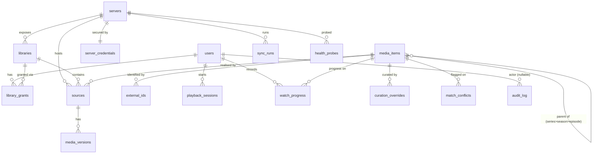
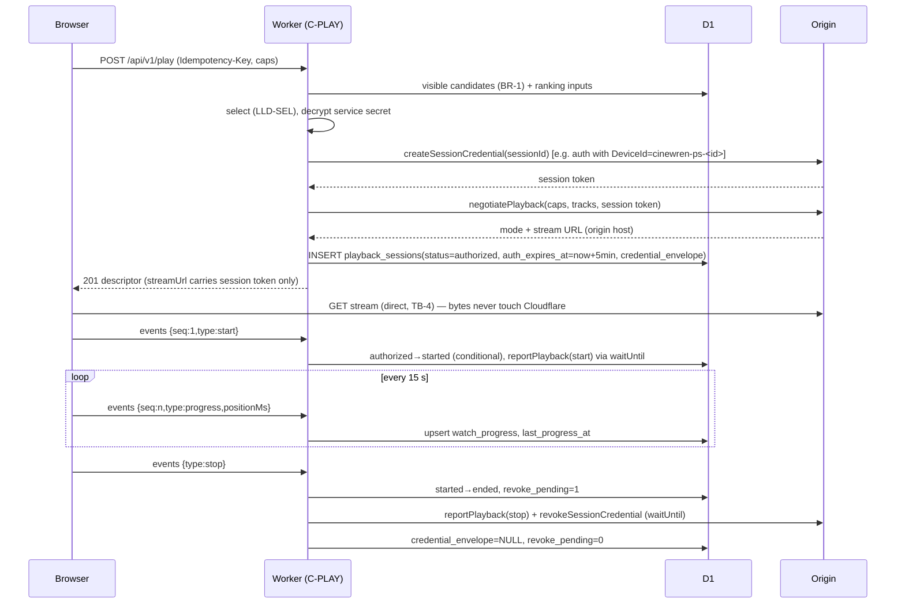

# Cinewren — LLD (Low-Level Design)

| | |
|---|---|
| **Status** | Draft v0.1, 2026-10-04. Agent-authored under delegation; not owner-reviewed. Nothing here is implemented. |
| **Owns** | Field-level D1 schema and migrations, `/api/v1` endpoint contracts, the `MediaProvider` interface, and the algorithms for sync, health, matching, source selection, credential handling and error handling. |
| **Does not own** | Requirements ([SRS](../requirements/SRS.md)); workflows, business rules and state machines ([FRD](../requirements/FRD.md)); components and trust boundaries ([HLD](HLD.md)); module structure ([SDD](SDD.md)); tooling, CI, CSP, configuration ([TDD](TDD.md)); decisions ([ADR-0013](../adr/0013-session-scoped-origin-stream-credentials.md) and other ADRs); sequencing ([ROADMAP](../ROADMAP.md)). |

Provenance: everything here is an **Agent decision (delegated, 2026-10-04; not yet owner-reviewed)**. Numbers are *(proposed)*. Provider endpoints and behaviours are written from general knowledge of those APIs and are **(to verify in M1 spike)**; the spike may change the adapter details, but it should not change the interface. Conventions: IDs are ULIDs (`TEXT`); times are `INTEGER` Unix milliseconds; JSON columns are `TEXT` validated by zod at the `db/` boundary (TDD-D1, TDD-D9).

## LLD-SCHEMA — D1 schema & migrations

### Entity relationships



### DDL sketch (migration `0001_init.sql`)

```sql
CREATE TABLE users (
  id TEXT PRIMARY KEY, email TEXT NOT NULL UNIQUE COLLATE NOCASE, display_name TEXT,
  role TEXT NOT NULL CHECK (role IN ('operator','viewer')),
  status TEXT NOT NULL CHECK (status IN ('invited','active','disabled')),  -- 'deleted' = row removed
  created_at INTEGER NOT NULL, last_seen_at INTEGER);

CREATE TABLE servers (
  id TEXT PRIMARY KEY, type TEXT NOT NULL CHECK (type IN ('jellyfin','emby','plex')),
  name TEXT NOT NULL, base_url TEXT NOT NULL, origin_server_id TEXT NOT NULL UNIQUE, -- provider's unique ID (FR-SRV-002)
  version TEXT, priority INTEGER NOT NULL DEFAULT 0,                                 -- FR-SRV-006
  status TEXT NOT NULL CHECK (status IN ('active','degraded','unreachable','disabled','removing')),
  last_latency_ms INTEGER, consecutive_failures INTEGER NOT NULL DEFAULT 0, consecutive_ok INTEGER NOT NULL DEFAULT 0,
  last_validated_at INTEGER, created_at INTEGER NOT NULL, updated_at INTEGER NOT NULL);

CREATE TABLE server_credentials (            -- DR-002; never selected by catalog queries
  server_id TEXT PRIMARY KEY REFERENCES servers(id) ON DELETE CASCADE,
  key_version INTEGER NOT NULL, secret_envelope TEXT NOT NULL,   -- username/password or token (LLD-TOKEN)
  service_token_envelope TEXT,                                   -- cached origin access token, re-obtained on 401
  updated_at INTEGER NOT NULL);

CREATE TABLE libraries (
  id TEXT PRIMARY KEY, server_id TEXT NOT NULL REFERENCES servers(id) ON DELETE CASCADE,
  provider_library_id TEXT NOT NULL, name TEXT NOT NULL, kind TEXT NOT NULL CHECK (kind IN ('movies','tv')),
  enabled INTEGER NOT NULL DEFAULT 0, last_full_sync_id TEXT, UNIQUE (server_id, provider_library_id));

CREATE TABLE library_grants (               -- viewers only; operators see all enabled libraries (FR-USR-005)
  user_id TEXT NOT NULL REFERENCES users(id) ON DELETE CASCADE,
  library_id TEXT NOT NULL REFERENCES libraries(id) ON DELETE CASCADE,
  granted_at INTEGER NOT NULL, PRIMARY KEY (user_id, library_id));

CREATE TABLE media_items (                  -- canonical, derived (DR-001)
  id TEXT PRIMARY KEY, type TEXT NOT NULL CHECK (type IN ('movie','series','season','episode')),
  parent_id TEXT REFERENCES media_items(id) ON DELETE CASCADE,
  title TEXT NOT NULL, sort_title TEXT NOT NULL, original_title TEXT, year INTEGER, overview TEXT,
  genres TEXT NOT NULL DEFAULT '[]', runtime_ms INTEGER, season_number INTEGER, episode_number INTEGER,
  metadata_source_id TEXT,                  -- source whose metadata is displayed (LLD-MATCH)
  best_height INTEGER, has_hdr INTEGER NOT NULL DEFAULT 0, date_added INTEGER NOT NULL,
  created_at INTEGER NOT NULL, updated_at INTEGER NOT NULL);
CREATE INDEX mi_browse ON media_items(type, sort_title, id);
CREATE INDEX mi_added ON media_items(type, date_added DESC, id);
CREATE INDEX mi_year ON media_items(type, year, id);
CREATE INDEX mi_children ON media_items(parent_id, season_number, episode_number);

CREATE TABLE external_ids (
  media_item_id TEXT NOT NULL REFERENCES media_items(id) ON DELETE CASCADE,
  item_type TEXT NOT NULL, scheme TEXT NOT NULL CHECK (scheme IN ('tmdb','imdb','tvdb')), value TEXT NOT NULL,
  PRIMARY KEY (media_item_id, scheme, value));
CREATE INDEX ext_lookup ON external_ids(item_type, scheme, value);  -- TMDB IDs are namespaced by type

CREATE TABLE sources (
  id TEXT PRIMARY KEY, server_id TEXT NOT NULL REFERENCES servers(id) ON DELETE CASCADE,
  library_id TEXT NOT NULL REFERENCES libraries(id) ON DELETE CASCADE,
  provider_item_id TEXT NOT NULL, provider_parent_id TEXT,
  media_item_id TEXT NOT NULL REFERENCES media_items(id),        -- no cascade: items are deleted only when sourceless
  item_type TEXT NOT NULL, title TEXT NOT NULL, year INTEGER, season_number INTEGER, episode_number INTEGER,
  external_ids TEXT NOT NULL DEFAULT '{}',                       -- raw IDs as reported by provider
  match_method TEXT NOT NULL CHECK (match_method IN ('external_id','episode_position','new','manual')),
  artwork TEXT NOT NULL DEFAULT '{}',                            -- {poster:{tag},backdrop:{tag}}
  content_hash TEXT NOT NULL,                                    -- hash of normalized fields: skip no-op writes
  status TEXT NOT NULL CHECK (status IN ('present','missing')), missing_since INTEGER,
  last_seen_sync_id TEXT, date_added INTEGER, updated_at INTEGER NOT NULL,
  UNIQUE (server_id, provider_item_id));
CREATE INDEX src_item ON sources(media_item_id, status);
CREATE INDEX src_lib_seen ON sources(library_id, status, last_seen_sync_id);
CREATE INDEX src_missing ON sources(status, missing_since);

CREATE TABLE media_versions (
  id TEXT PRIMARY KEY, source_id TEXT NOT NULL REFERENCES sources(id) ON DELETE CASCADE,
  provider_version_id TEXT NOT NULL, container TEXT, video_codec TEXT, video_profile TEXT,
  width INTEGER, height INTEGER,
  hdr TEXT NOT NULL DEFAULT 'none' CHECK (hdr IN ('none','hdr10','hdr10plus','hlg','dolby_vision')),
  bitrate INTEGER, runtime_ms INTEGER,
  audio_tracks TEXT NOT NULL DEFAULT '[]',     -- [{index,codec,channels,language,title,default}]
  subtitle_tracks TEXT NOT NULL DEFAULT '[]',  -- [{index,format,kind:'text'|'image',language,title,forced,default}]
  UNIQUE (source_id, provider_version_id));

CREATE TABLE item_availability (            -- denormalized BR-1 helper; maintained with sources (see below)
  media_item_id TEXT NOT NULL REFERENCES media_items(id) ON DELETE CASCADE,
  library_id TEXT NOT NULL REFERENCES libraries(id) ON DELETE CASCADE,
  PRIMARY KEY (media_item_id, library_id)) WITHOUT ROWID;
CREATE INDEX ia_lib ON item_availability(library_id, media_item_id);

CREATE TABLE sync_runs (
  id TEXT PRIMARY KEY, server_id TEXT NOT NULL REFERENCES servers(id) ON DELETE CASCADE,
  type TEXT NOT NULL CHECK (type IN ('full','incremental')), trigger TEXT NOT NULL CHECK (trigger IN ('schedule','manual')),
  status TEXT NOT NULL CHECK (status IN ('queued','running','succeeded','partial','failed')),
  since_ms INTEGER,                           -- incremental lower bound
  checkpoint TEXT,                            -- {libraryIdx, cursor} (LLD-SYNC)
  lease_token TEXT, lease_expires_at INTEGER,
  libraries_ok TEXT NOT NULL DEFAULT '[]', libraries_failed TEXT NOT NULL DEFAULT '[]',
  added INTEGER NOT NULL DEFAULT 0, updated INTEGER NOT NULL DEFAULT 0, missing INTEGER NOT NULL DEFAULT 0, errors INTEGER NOT NULL DEFAULT 0,
  error_summary TEXT,                         -- ≤ 4 KB, no secrets (FR-SYNC-006)
  queued_at INTEGER NOT NULL, started_at INTEGER, ended_at INTEGER);
CREATE UNIQUE INDEX sync_one_active ON sync_runs(server_id) WHERE status IN ('queued','running');  -- FR-SYNC-002
CREATE INDEX sync_hist ON sync_runs(server_id, queued_at DESC);

CREATE TABLE health_probes (
  id TEXT PRIMARY KEY, server_id TEXT NOT NULL REFERENCES servers(id) ON DELETE CASCADE,
  probed_at INTEGER NOT NULL, ok INTEGER NOT NULL, latency_ms INTEGER, error_code TEXT);
CREATE INDEX hp_server ON health_probes(server_id, probed_at DESC);

CREATE TABLE playback_sessions (
  id TEXT PRIMARY KEY, user_id TEXT NOT NULL REFERENCES users(id) ON DELETE CASCADE,
  media_item_id TEXT REFERENCES media_items(id) ON DELETE SET NULL,
  source_id TEXT REFERENCES sources(id) ON DELETE SET NULL, server_id TEXT REFERENCES servers(id) ON DELETE SET NULL,
  version_id TEXT, mode TEXT NOT NULL CHECK (mode IN ('direct_play','direct_stream','transcode')),
  status TEXT NOT NULL CHECK (status IN ('authorized','started','ended','expired','failed')),
  credential_envelope TEXT,                   -- session-scoped origin credential (LLD-TOKEN); NULL once revoked
  revoke_pending INTEGER NOT NULL DEFAULT 0, provider_session_ref TEXT,
  replaces_session_id TEXT, decision TEXT,    -- ranking keys snapshot (NFR-OBS-002)
  last_event_seq INTEGER NOT NULL DEFAULT 0,
  authorized_at INTEGER NOT NULL, auth_expires_at INTEGER NOT NULL, started_at INTEGER,
  last_progress_at INTEGER, ended_at INTEGER, end_reason TEXT);
CREATE INDEX ps_sweep ON playback_sessions(status, auth_expires_at);
CREATE INDEX ps_idle ON playback_sessions(status, last_progress_at);
CREATE INDEX ps_revoke ON playback_sessions(revoke_pending) WHERE revoke_pending = 1;

CREATE TABLE watch_progress (                -- primary data (DR-001)
  user_id TEXT NOT NULL REFERENCES users(id) ON DELETE CASCADE,
  media_item_id TEXT NOT NULL REFERENCES media_items(id) ON DELETE CASCADE,  -- see gap note below
  position_ms INTEGER NOT NULL, runtime_ms INTEGER, watched INTEGER NOT NULL DEFAULT 0, watched_at INTEGER,
  last_source_id TEXT, updated_at INTEGER NOT NULL, PRIMARY KEY (user_id, media_item_id));
CREATE INDEX wp_continue ON watch_progress(user_id, watched, updated_at DESC);

CREATE TABLE curation_overrides (            -- primary data; keyed by stable provider identity (BR-3)
  id TEXT PRIMARY KEY, kind TEXT NOT NULL CHECK (kind IN ('pin','separate')),
  media_item_id TEXT NOT NULL REFERENCES media_items(id) ON DELETE CASCADE,  -- DR-005
  server_id TEXT NOT NULL REFERENCES servers(id) ON DELETE CASCADE, provider_item_id TEXT NOT NULL,
  created_by TEXT REFERENCES users(id) ON DELETE SET NULL, created_at INTEGER NOT NULL,
  UNIQUE (server_id, provider_item_id));

CREATE TABLE match_conflicts (               -- FR-CAT-010
  id TEXT PRIMARY KEY, source_id TEXT NOT NULL UNIQUE REFERENCES sources(id) ON DELETE CASCADE,
  media_item_id TEXT REFERENCES media_items(id) ON DELETE CASCADE,  -- item it was kept apart from
  reason TEXT NOT NULL CHECK (reason IN ('conflicting_ids','multiple_candidates','type_mismatch')),
  details TEXT NOT NULL,                     -- {candidates:[{itemId, sharedIds, conflictingIds}]}
  status TEXT NOT NULL CHECK (status IN ('open','resolved','dismissed')),
  detected_at INTEGER NOT NULL, resolved_at INTEGER, resolved_by TEXT REFERENCES users(id) ON DELETE SET NULL);
CREATE INDEX mc_open ON match_conflicts(status, detected_at);

CREATE TABLE audit_log (                     -- append-only (FR-OPS-005)
  id TEXT PRIMARY KEY, at INTEGER NOT NULL, actor_user_id TEXT REFERENCES users(id) ON DELETE SET NULL,
  action TEXT NOT NULL, target_type TEXT NOT NULL, target_id TEXT, details TEXT NOT NULL DEFAULT '{}', request_id TEXT);
CREATE INDEX al_at ON audit_log(at DESC);

CREATE TABLE idempotency_keys (              -- LLD-ERR
  user_id TEXT NOT NULL, key TEXT NOT NULL, route TEXT NOT NULL, request_hash TEXT NOT NULL,
  status_code INTEGER, response TEXT, created_at INTEGER NOT NULL, PRIMARY KEY (user_id, key));

CREATE TABLE meta (k TEXT PRIMARY KEY, v TEXT NOT NULL);   -- e.g. servers_version for CSP cache (TDD §6.1)

CREATE VIRTUAL TABLE media_items_fts USING fts5(
  item_id UNINDEXED, title, original_title,
  tokenize = 'unicode61 remove_diacritics 2', prefix = '2 3');  -- FR-CAT-004: case/diacritic-insensitive, prefix
```

Notes:
- **FTS maintenance.** Only `movie` and `series` rows are indexed. The application writes `media_items_fts` in the same `batch()` as the `media_items` change, using delete-then-insert by `item_id`. Triggers are not used, so all writes stay explicit in one place. FTS5 support is verified (TDD §2). The table is derived and rebuildable (TDD §3). Query: `… WHERE media_items_fts MATCH ?` with user input tokenized and each token quoted with a trailing `*`.
- **`item_availability`** holds one row per (item, library) where the item has at least one `present` source. Sync writes and deletes rows in the same batch as source status changes. It lets the BR-1 filter be a semi-join on two small indexes instead of an `EXISTS` scan over `sources`. The M2 benchmark (NFR-PERF-001) decides whether it is needed; if the plain `EXISTS` meets 300 ms, drop it in a contract migration.
- **BR-1 visibility predicate** (used by every catalog query, FR-CAT-006):
  ```sql
  EXISTS (SELECT 1 FROM item_availability a
          JOIN libraries l ON l.id = a.library_id AND l.enabled = 1
          JOIN servers s   ON s.id = l.server_id AND s.status NOT IN ('disabled','removing')
          WHERE a.media_item_id = i.id
            AND (:is_operator = 1 OR EXISTS (SELECT 1 FROM library_grants g WHERE g.user_id = :uid AND g.library_id = a.library_id)))
  ```
  For seasons and episodes the predicate is applied to the row itself, because every provider item, including seasons and episodes, becomes a source. Source lists in responses use the same join per source. `unreachable` servers stay visible for browsing (NFR-REL-001) and are filtered out only at selection (BR-5).

### Cascades and deletion (DR-005)

| Action | Mechanism |
|---|---|
| Delete user | One `batch`: `UPDATE audit_log SET target_id = NULL WHERE target_type='user' AND target_id=?`, then `DELETE FROM users`. FK cascades remove `library_grants`, `watch_progress`, `playback_sessions` and `idempotency_keys` (deleted explicitly, since that table has no FK). `audit_log.actor_user_id` is set to NULL. Audit `details` never contain emails, so no rewrite is needed. Before the batch runs, any live sessions are revoked (LLD-TOKEN). BR-8: the delete fails with `LAST_OPERATOR` if it would leave no active operator, checked by a conditional statement in the same batch. |
| Remove server | Set `status='removing'`, which hides its sources immediately, delete `server_credentials`, and enqueue `purge_server`. The job deletes `media_versions` and `sources` in chunks of 500 *(proposed)* to stay inside D1 query limits, then deletes the `servers` row (cascades: libraries, grants, sync_runs, health_probes, overrides). Orphaned items are then removed as below. Revoking open sessions comes first. This refines the FRD's "removed" state with a short transitional `removing` status. |
| Orphan items | After any source purge, `DELETE FROM media_items WHERE id IN (… items of the affected set with no sources …)`, children first. Cascades remove `external_ids`, `curation_overrides`, `match_conflicts`, `item_availability` and `watch_progress`. |

**Gap (reported):** DR-003 keeps progress "until the user is deleted", but DR-005 removes canonical items with no sources. That deletes their progress through the cascade. An item only becomes sourceless after its sources have been missing for 30 days, so the loss is narrow, but the SRS should say which rule wins.

### Migration practice

Migrations follow TDD §3: forward-only, expand → migrate → contract. Every new column is either nullable or has a default. A CHECK constraint is widened by a table rebuild inside one migration, with `PRAGMA defer_foreign_keys = on`, which D1 supports in migrations (https://developers.cloudflare.com/d1/sql-api/foreign-keys/). A rebuild of `sources` or `media_items` at envelope size must be tested on a staging copy for D1 duration limits before merge.

## LLD-API — Platform HTTP API contracts

Conventions (IR-001):
- JSON over HTTPS. Every response has an `X-Request-Id` header, taken from `cf-ray` plus a ULID.
- Every route requires a verified Access JWT (FR-USR-001; TDD §5.2). Operator routes live under `/api/v1/admin/*`, and the role is checked on every request (FR-USR-003).
- A resource the caller may not see returns `404 NOT_FOUND`, never 403, so its existence is not disclosed (BR-1, NFR-SEC-002).
- Mutating requests accept an `Idempotency-Key` header (LLD-ERR); it is required on `POST /play`.

### Endpoints

| Method | Path | Role | Request | Response (200 unless noted) | Errors | SRS |
|---|---|---|---|---|---|---|
| GET | `/api/v1/health` | service token or any user | — | `{status:"ok", db:"ok"\|"error", version}` | 401, 503 when DB down | FR-OPS-007, FR-USR-001 |
| GET | `/api/v1/me` | user | — | `{id, displayName, role, accessLogoutUrl}` | 401, 403 | FR-USR-002, FR-USR-006 |
| GET | `/api/v1/home` | user | — | `{recentlyAdded:[ItemCard], continueWatching:[ItemCard+progress]}` | — | FR-CAT-008 |
| GET | `/api/v1/items` | user | `type=movie\|series`, `sort=title\|year\|added`, `order`, `genre`, `yearFrom`, `yearTo`, `minHeight`, `cursor`, `limit` (≤100, default 50) | `Page<ItemCard>` | 400 | FR-CAT-002, FR-CAT-003, FR-CAT-006 |
| GET | `/api/v1/search` | user | `q` (1–100 chars), `cursor`, `limit` | `Page<ItemCard>` ranked by bm25, then title | 400 | FR-CAT-004 |
| GET | `/api/v1/items/{id}` | user | — | `ItemDetail` (metadata, artwork URLs, `versionsSummary` e.g. `["4K HDR","1080p"]`, `serverCount`, progress, children summary) | 404 | FR-CAT-005, FR-CAT-006 |
| GET | `/api/v1/items/{id}/children` | user | `cursor`, `limit` | `Page<ItemCard>` (seasons of a series; episodes of a season) | 404 | FR-CAT-005 |
| GET | `/api/v1/items/{id}/versions` | user | — | `[{sourceId, versionId, label, height, hdr, videoCodec, serverName, serverStatus}]` (visible only) | 404 | FR-PLAY-005 |
| GET | `/api/v1/items/{id}/next-episode` | user | — | `ItemCard \| null` | 404 | FR-PROG-004 |
| GET | `/api/v1/artwork/{itemId}/{kind}` | user | `kind=poster\|backdrop\|thumb`, `v` (tag) | image bytes, `Cache-Control: private, max-age=604800, immutable` | 404, 502 | FR-CAT-009 |
| POST | `/api/v1/play` | user | `PlayRequest` (below) | `201 PlaybackDescriptor` | 400, 404, 409 `NO_PLAYABLE_SOURCE`, 429, 502/504 | FR-PLAY-001–008, FR-OPS-002 |
| POST | `/api/v1/play/{sessionId}/events` | user (owner) | `{seq, type:"start"\|"progress"\|"pause"\|"stop"\|"error", positionMs, errorCode?}` | `204` | 404, 410 `SESSION_EXPIRED`, 429 | FR-PROG-001, FR-PLAY-009, BR-9 |
| PUT | `/api/v1/progress/{itemId}` | user | `{watched:boolean}` or `{positionMs}` | `{positionMs, watched}` | 404 | FR-PROG-003 |
| GET | `/api/v1/admin/servers` | operator | — | `[Server]` (no secrets) | — | FR-OPS-003 |
| POST | `/api/v1/admin/servers` | operator | `{type, name, baseUrl, credentials:{username,password}\|{token}}` | `201 Server` + discovered libraries | 400 `INSECURE_ORIGIN_URL`, `BLOCKED_ORIGIN_URL`; 422 `SERVER_VALIDATION_FAILED` `{check:"tls"\|"credentials"\|"identity"\|"version"}`; 409 `SERVER_ALREADY_REGISTERED` | FR-SRV-001, FR-SRV-002, FR-SRV-003, FR-SRV-007 |
| GET | `/api/v1/admin/servers/{id}` | operator | — | `Server` + libraries + last sync + health summary | 404 | FR-OPS-003, FR-OPS-004 |
| PATCH | `/api/v1/admin/servers/{id}` | operator | `{name?, baseUrl?, priority?, enabled?}` (re-enable or base-URL change triggers re-validation) | `Server` | 404, 422 | FR-SRV-004, FR-SRV-006 |
| DELETE | `/api/v1/admin/servers/{id}` | operator | — | `202` (purge job) | 404 | FR-SRV-004, DR-005 |
| POST | `/api/v1/admin/servers/{id}/validate` | operator | — | `{ok, checks:{tls,credentials,identity,version}}` | 422 | FR-SRV-002 |
| PUT | `/api/v1/admin/servers/{id}/credentials` | operator | `{username,password}\|{token}` | `204` after validation | 422 | FR-SRV-005 |
| PATCH | `/api/v1/admin/libraries/{id}` | operator | `{enabled}` | `Library` | 404 | FR-SRV-003 |
| POST | `/api/v1/admin/servers/{id}/sync` | operator | `{type:"full"\|"incremental"}` | `202 {runId}` | 409 `SYNC_IN_PROGRESS`, 409 `SERVER_DISABLED` | FR-SYNC-002 |
| GET | `/api/v1/admin/servers/{id}/sync-runs` | operator | `cursor`, `limit` | `Page<SyncRun>` plus `nextScheduled` | 404 | FR-SYNC-006, FR-OPS-003 |
| GET | `/api/v1/admin/servers/{id}/health` | operator | `since` | `{status, probes:[{at,ok,latencyMs,errorCode}]}` | 404 | FR-OPS-004 |
| GET | `/api/v1/admin/metrics` | operator | `window=24h\|7d` | sync durations/errors per server, play outcomes, mode distribution | — | NFR-OBS-002 |
| GET / POST | `/api/v1/admin/users` | operator | POST `{email, displayName, role, libraryIds?}` (default: all enabled) | `Page<User>` / `201 User` (status `invited`) | 409 `USER_EXISTS` | FR-USR-004, FR-USR-005 |
| PATCH | `/api/v1/admin/users/{id}` | operator | `{role?, status?:"active"\|"disabled", displayName?}` | `User` | 409 `LAST_OPERATOR` | FR-USR-004, BR-8 |
| DELETE | `/api/v1/admin/users/{id}` | operator | — | `204` | 409 `LAST_OPERATOR` | FR-USR-004, DR-005 |
| PUT | `/api/v1/admin/users/{id}/grants` | operator | `{libraryIds:[…]}` (viewers only) | `{libraryIds}` | 409 `GRANTS_NOT_APPLICABLE` for operators | FR-USR-005 |
| POST | `/api/v1/admin/curation/merge` | operator | `{intoItemId, fromItemId}` | `{itemId}` | 409 `TYPE_MISMATCH` | FR-CAT-007 |
| POST | `/api/v1/admin/curation/split` | operator | `{itemId, sourceId}` | `{newItemId}` | 409 `LAST_SOURCE` | FR-CAT-007 |
| GET | `/api/v1/admin/curation/overrides` | operator | `cursor` | `Page<Override>` | — | FR-CAT-007 |
| DELETE | `/api/v1/admin/curation/overrides/{id}` | operator | — | `204` (item rematched on next sync of that source) | 404 | FR-CAT-007, BR-3 |
| GET | `/api/v1/admin/curation/conflicts` | operator | `status=open\|resolved\|dismissed`, `cursor` | `Page<{id, source:{id,title,year,serverName,externalIds}, candidates:[{itemId,title,year,externalIds}], reason, detectedAt}>` | — | FR-CAT-010 |
| POST | `/api/v1/admin/curation/conflicts/{id}/resolve` | operator | `{action:"merge", intoItemId}` \| `{action:"keep_separate"}` \| `{action:"dismiss"}` | `{itemId}` | 404, 409 | FR-CAT-010, FR-CAT-007 |
| GET | `/api/v1/admin/audit-log` | operator | `cursor`, `action?`, `from?`, `to?` | `Page<AuditEntry>` | — | FR-OPS-005 |
| GET | `/api/v1/admin/export` | operator | — | `application/json` attachment: `{schemaVersion, exportedAt, users, grants, progress, curationOverrides, servers:[{id,type,name,baseUrl,priority,libraries}]}`, with no credentials (NFR-SEC-001) | — | FR-OPS-006 |

Every operator mutation writes one `audit_log` row in the same `batch` (FR-OPS-005). Sign-out (FR-USR-006) is a client link to `${ACCESS_TEAM_DOMAIN}/cdn-cgi/access/logout`, not an API call.

### Error envelope

```json
{ "error": { "code": "SERVER_VALIDATION_FAILED", "message": "Credentials were rejected by the server.",
             "requestId": "01J9Z…", "details": { "check": "credentials" } } }
```

`message` is safe to display and never includes origin responses verbatim or any secret. Codes are listed in LLD-ERR.

### Pagination

Pagination uses cursors. `Page<T> = { items: T[], nextCursor: string | null }`. The cursor is base64url JSON `{k:[sortKeyValues…], id}`, signed with an HMAC derived from the current credential key so a client cannot forge one. The query fetches `limit+1` rows with `WHERE (sort_key, id) > (:k, :id)` (row-value comparison) in the requested order. The cursor carries no total count. Search uses `{rank, id}`.

### Device capabilities (FR-PLAY-002) and play request

```json
{ "itemId": "01J9…interstellar",
  "capabilities": {
    "containers": ["mp4", "webm", "hls"],
    "video": [{ "codec": "h264", "maxLevel": "5.1" }, { "codec": "vp9" }, { "codec": "av1", "maxHeight": 2160 }],
    "audio": ["aac", "mp3", "opus", "flac"],
    "maxWidth": 1920, "maxHeight": 1080, "hdr": [], "textSubtitles": ["vtt"], "nativeHls": false, "mse": true },
  "preferences": { "audioLanguage": "en", "subtitle": { "mode": "off" }, "maxHeight": null,
                   "sourceId": null, "versionId": null },
  "excludeSourceIds": [], "replacesSessionId": null }
```

### Playback descriptor (FR-PLAY-001)

```json
{ "sessionId": "01J9…ps", "expiresAt": 1791100000000,
  "item": { "id": "01J9…interstellar", "title": "Interstellar", "runtimeMs": 10140000 },
  "source": { "id": "01J9…src", "versionId": "01J9…ver", "serverName": "Server B", "label": "1080p · H.264" },
  "mode": "direct_play",
  "streamUrl": "https://media-b.example.net/…?…token…",
  "streamType": "progressive",
  "audioTracks": [{ "index": 1, "label": "English 5.1 (AAC)", "language": "en", "selected": true }],
  "subtitleTracks": [{ "index": 3, "label": "English", "language": "en", "kind": "text",
                       "url": "https://media-b.example.net/…vtt…", "selected": false }],
  "resume": { "positionMs": 3605000 },
  "alternatives": 2 }
```

`streamUrl` and subtitle URLs always point at the selected server's own host (FR-PLAY-008). The query string carries only the session-scoped credential (FR-PLAY-007). `alternatives` is the number of other candidates the user may see; it is used to decide whether to offer a replacement (FR-PLAY-004).

## LLD-PROV — MediaProvider interface & adapters

### Interface (IR-002)

```ts
export interface ProviderContext {
  server: { id: string; type: ProviderType; baseUrl: URL; originServerId?: string };
  secret: ServerSecret;                    // decrypted inside the Worker only (BR-6)
  fetch: OriginFetch;                      // TDD §6.4 wrapper: host pinning, timeouts, retries
  serviceToken?: string;                   // cached; adapter refreshes on 401 and returns it via onTokenRefresh
  onTokenRefresh(token: string): Promise<void>;
}

export interface MediaProvider {
  readonly type: ProviderType;
  validate(ctx: ProviderContext): Promise<ValidationResult>;          // FR-SRV-002: tls, credentials, identity, version
  listLibraries(ctx: ProviderContext): Promise<NormalizedLibrary[]>;   // FR-SRV-003
  listItems(ctx: ProviderContext, req: { libraryId: string; cursor?: string; pageSize: number; since?: number })
    : Promise<{ items: NormalizedItem[]; nextCursor: string | null }>; // FR-SYNC-003; since = incremental
  getItem(ctx: ProviderContext, providerItemId: string): Promise<NormalizedItem | null>;
  getArtworkRequest(ctx: ProviderContext, ref: ArtworkRef, kind: ArtworkKind): Request;  // FR-CAT-009
  probe(ctx: ProviderContext): Promise<{ ok: boolean; latencyMs: number; errorCode?: string }>; // FR-OPS-001
  createSessionCredential(ctx: ProviderContext, sessionId: string): Promise<SessionCredential>; // FR-PLAY-007
  revokeSessionCredential(ctx: ProviderContext, cred: SessionCredential): Promise<void>;
  negotiatePlayback(ctx: ProviderContext, req: {
    providerItemId: string; providerVersionId: string; caps: DeviceCapabilities;
    audioIndex?: number; subtitle?: { index: number; kind: 'text' | 'image' } | null;
    startPositionMs?: number; cred: SessionCredential;
  }): Promise<NegotiatedStream>;                                       // FR-PLAY-001, FR-PLAY-006
  reportPlayback(ctx: ProviderContext, cred: SessionCredential,
    ev: { type: 'start' | 'progress' | 'stop'; positionMs: number; stream: NegotiatedStream }): Promise<void>; // FR-PLAY-009: telemetry only
}

export type NormalizedItem = {
  providerItemId: string; providerParentId?: string; type: 'movie' | 'series' | 'season' | 'episode';
  title: string; originalTitle?: string; sortTitle?: string; year?: number; overview?: string; genres: string[];
  runtimeMs?: number; seasonNumber?: number; episodeNumber?: number;
  externalIds: { tmdb?: string; imdb?: string; tvdb?: string };
  artwork: Partial<Record<ArtworkKind, ArtworkRef>>; dateAdded?: number; providerUpdatedAt?: number;
  versions: NormalizedVersion[];           // empty for series/season
};
export type NormalizedVersion = {
  providerVersionId: string; container?: string; videoCodec?: string; videoProfile?: string;
  width?: number; height?: number; hdr: 'none' | 'hdr10' | 'hdr10plus' | 'hlg' | 'dolby_vision';
  bitrate?: number; runtimeMs?: number; audio: AudioTrack[]; subtitles: SubtitleTrack[];
};
export type NegotiatedStream = {
  mode: 'direct_play' | 'direct_stream' | 'transcode'; streamType: 'progressive' | 'hls';
  url: string;                              // MUST be on ctx.server.baseUrl host (asserted by caller)
  subtitleUrls: Record<number, string>; providerSessionRef?: string;
};
export type SessionCredential = { kind: 'session_token' | 'delegated_token' | 'shared_restricted'; token: string; ref?: string; expiresAt?: number };
```

Adapters throw `ProviderError { code: 'AUTH' | 'NOT_FOUND' | 'UNAVAILABLE' | 'TIMEOUT' | 'PROTOCOL' | 'UNSUPPORTED', retryable: boolean }`. No provider-specific type crosses the interface (IR-002; lint-enforced, TDD §1).

### URL policy (FR-SRV-007, NFR-SEC-005; resolves SDD OD-4)

**Decision:** outside `ENVIRONMENT=local`, registration and edits reject the following with `400 BLOCKED_ORIGIN_URL`:
- **IP-literal hosts**, IPv4 and IPv6.
- `localhost`, `*.localhost`, `*.local`, `*.internal`, `*.home.arpa`.
- Anything with userinfo (`user:pass@`).
- A path or query on the base URL other than a plain path prefix.

Rationale: A-3 and A-4 require a publicly trusted certificate on a public hostname, which IP literals almost never have, and these rules stop the Worker from being pointed at internal or metadata addresses. The Worker cannot see the resolved IP address before `fetch`, so a hostname that resolves to a private range cannot be blocked at the application layer. That residual risk is accepted, because only operators can register servers (BR-8). Whether Workers subrequests can reach private ranges at all is to verify in M0. Local mode allows all of the above so developers can use a LAN server.

### Validation (FR-SRV-002)

The checks run in order, and the first failure is reported with its check name:
1. `tls`: HTTPS fetch of the identity endpoint succeeds with a valid certificate.
2. `credentials`: authentication succeeds and the account is **not** an administrator. An admin account fails with `details.reason = "admin_account"` (ADR-0008, A-2).
3. `identity`: the origin's unique server ID is returned. On re-validation it must equal the stored `origin_server_id`.
4. `version`: the version is at least the IR-003 to IR-005 minimum.

### Per-provider notes (all to verify in M1 spike)

| Concern | Jellyfin (IR-003) | Emby (IR-004) | Plex (IR-005, Q-3) |
|---|---|---|---|
| Identity & version | `GET /System/Info/Public` → `Id`, `Version` | Same lineage; path may need `/emby` prefix | `GET /identity` → `machineIdentifier`, `version` |
| Service auth | `POST /Users/AuthenticateByName` with `Authorization: MediaBrowser Client="Cinewren", Device=…, DeviceId=…, Version=…` → `AccessToken`, `User.Id`, `User.Policy.IsAdministrator` | Similar; header `X-Emby-Authorization` / `X-Emby-Token` | Account token from plex.tv sign-in vs. server-local token: unclear for a non-admin "managed/shared" user; Q-3 |
| Libraries | `GET /UserViews?userId=` (CollectionType `movies`/`tvshows`) | `GET /Users/{id}/Views` | `GET /library/sections` (type `movie`/`show`) |
| Paged items | `GET /Items?ParentId=&Recursive=true&IncludeItemTypes=Movie,Series,Season,Episode&Fields=ProviderIds,MediaSources,MediaStreams,Overview,Genres,DateCreated&StartIndex=&Limit=`; incremental filter by last-modified date (parameter name to verify) | Similar | `GET /library/sections/{id}/all?type=…&includeGuids=1` with `X-Plex-Container-Start/Size`; incremental via `updatedAt>=` filter (to verify) |
| External IDs | `ProviderIds.{Tmdb,Imdb,Tvdb}` | Same | `Guid[]` entries `tmdb://…`, `imdb://…`, `tvdb://…` |
| Versions/tracks | `MediaSources[]` → `Container`, `MediaStreams[]` (Type Video/Audio/Subtitle, `Codec`, `VideoRangeType`, `IsTextSubtitleStream`) | Same | `Media[]` → `Part[]` → `Stream[]` (`streamType` 1/2/3) |
| Negotiation | `POST /Items/{id}/PlaybackInfo` with a DeviceProfile built from capabilities → `SupportsDirectPlay`/`SupportsDirectStream`/`TranscodingUrl` | Same | `GET /video/:/transcode/universal/decision` then `start.m3u8`; direct play via part URL |
| Stream URL | Direct: `/Videos/{id}/stream?static=true&MediaSourceId=…&api_key=<session token>`; HLS: `/Videos/{id}/master.m3u8?…` | Similar | Part URL or `start.m3u8` with `X-Plex-Token` query |
| Text subtitles | `/Videos/{id}/{msId}/Subtitles/{idx}/Stream.vtt` | Similar | Transcoder subtitle option or stream URL with `format=vtt` (to verify) |
| Session credential (ADR-0013) | Re-authenticate service account with `DeviceId=cinewren-ps-<sessionId>` → per-session token; revoke with `POST /Sessions/Logout` using that token | Same approach | Transient/delegation token (e.g. `/security/token?type=delegation`) — unknown; fallback per ADR-0013 |
| Telemetry (FR-PLAY-009) | `POST /Sessions/Playing`, `/Sessions/Playing/Progress`, `/Sessions/Playing/Stopped` | Same | `GET /:/timeline?state=playing\|stopped&time=…` |
| Artwork | `/Items/{id}/Images/Primary?tag=…` (may not need auth) | Similar | `/library/metadata/{key}/thumb/{ts}` with token |
| Probe | `GET /System/Info/Public` (unauthenticated) | Same | `GET /identity` |
| CORS for HLS/VTT | Default headers unknown | Unknown | Unknown — see TDD §11.3 |

Mapping capabilities to a device profile is a pure function per adapter, unit-tested against fixtures. The spike must also confirm whether direct-play progressive URLs honour HTTP range requests with the session token passed in the query string.

## LLD-SYNC — Sync, health probing & retention jobs

### Triggers and queues (resolves SDD OD-2)

**Decision:**
- **Two cron triggers** (TDD-D3): the scheduler tick `*/5 * * * *` and the daily retention job `17 3 * * *`.
- **One queue**, `cinewren-jobs-<env>`, with typed messages: `{kind:'sync', runId, leaseToken?}`, `{kind:'purge_server', serverId}`, `{kind:'reencrypt'}`. A dead-letter queue is configured (see below).
- **Health probes are not queued.** With ≤ 20 servers at concurrency 6, a probe round fits inside one scheduled invocation, so a second queue would add configuration without isolation benefit. Per-server isolation for sync (FR-SYNC-007) comes from one message per run, not from separate queues.

Queue facts (verified):
- Queues are available on the Workers Free plan as well as Paid, with 24 h retention on Free vs 14 days on Paid (https://developers.cloudflare.com/changelog/post/2026-02-04-queues-free-plan/).
- `max_retries` defaults to 3. Without a `dead_letter_queue`, messages that keep failing are discarded (https://developers.cloudflare.com/workers/wrangler/configuration/, https://developers.cloudflare.com/workers/platform/pricing/).
- Delivery is at least once, so consumers are idempotent (LLD-ERR).

Consumer config *(proposed)*: `max_batch_size=1`, `max_retries=3`, `retry_delay=60`, `dead_letter_queue=cinewren-jobs-dlq-<env>`.

### Scheduler tick

```
every 5 min:
  sweepPlaybackSessions()                                  # LLD-TOKEN (BR-9)
  if tick % (HEALTH_PROBE_INTERVAL_MIN/5) == 0: probeAll()  # FR-OPS-001
  for s in servers where status in (active, degraded):     # unreachable: skip sync, keep probing
    due = full if now - lastSucceeded(s, any type full)  >= SYNC_FULL_INTERVAL_H
          else incremental if now - lastStarted(s)       >= SYNC_INCREMENTAL_INTERVAL_MIN
    if due: enqueueRun(s, due, 'schedule')
  reapStaleLeases()   # running & lease_expires_at < now - 15 min → re-enqueue same run (≤ 3 times) else failed
  if any reencrypt pending: enqueue {kind:'reencrypt'}
enqueueRun(s, type, trigger):
  INSERT INTO sync_runs(... status='queued') -- fails on sync_one_active ⇒ already queued/running (FR-SYNC-002)
  on success: SYNC_QUEUE.send({kind:'sync', runId})
```

A manual trigger (`POST …/sync`) calls `enqueueRun`. A unique-index violation maps to `409 SYNC_IN_PROGRESS`. A full run requested while an incremental is queued (not yet running) upgrades that run's `type` to `full` by a conditional update.

### Consumer: sync run

```
onMessage({runId, leaseToken}):
  run = load(runId); if run.status in (succeeded, partial, failed): ack; return      # redelivery
  newToken = ulid()
  claimed = UPDATE sync_runs SET status='running', lease_token=newToken, lease_expires_at=now+16min,
                                 started_at=COALESCE(started_at, now)
            WHERE id=runId AND (status='queued' OR (status='running' AND (lease_token=:leaseToken OR lease_expires_at<now)))
  if claimed == 0: ack; return                                  # someone else holds it
  libs = enabled libraries of server (fixed order by id); cp = run.checkpoint ?? {libraryIdx:0, cursor:null}
  deadline = now + 12 min                                       # < 15 min consumer limit (SPINE fact)
  while cp.libraryIdx < libs.length:
    lib = libs[cp.libraryIdx]
    try:
      page = provider.listItems(ctx, {libraryId: lib.provider_library_id, cursor: cp.cursor, pageSize: 200, since: run.since_ms})
    except ProviderError e (after NFR-REL-002 retries):
      record lib in libraries_failed, errors++, append error_summary; cp = {libraryIdx+1, null}; persist cp; continue
    stmts = upsertPage(run, lib, page.items)                    # below; includes matching (LLD-MATCH)
    cp = page.nextCursor ? {cp.libraryIdx, page.nextCursor} : {cp.libraryIdx+1, null}
    if !page.nextCursor: stmts += finishLibrary(run, lib)       # missing marking (full runs only)
    DB.batch(stmts + [UPDATE sync_runs SET checkpoint=cp, counts…, lease_expires_at=now+16min WHERE id=runId AND lease_token=newToken])
    if now > deadline: SYNC_QUEUE.send({kind:'sync', runId, leaseToken:newToken}); ack; return   # continuation
  status = libraries_failed empty ? 'succeeded' : (libraries_ok empty ? 'failed' : 'partial')
  UPDATE sync_runs SET status, ended_at=now, lease_token=NULL WHERE id=runId AND lease_token=newToken
  bump meta.catalog_version
```

Writing the checkpoint in the same `batch` as the page's data makes them atomic. If an invocation dies mid-page, the page is simply re-applied, which is safe because upserts are idempotent (FR-SYNC-004). The batch is split into chunks that fit D1 per-batch limits (limits page to verify in M0). The final chunk carries the checkpoint, and all earlier chunks are idempotent.

`upsertPage` handles each item in the page:
- `INSERT INTO sources … ON CONFLICT(server_id, provider_item_id) DO UPDATE SET …, status='present', missing_since=NULL, last_seen_sync_id=:run WHERE …`. The `content_hash` comparison decides whether `updated` is incremented and whether item metadata, versions and FTS are rewritten.
- New sources and sources whose external IDs changed go through LLD-MATCH, which needs one read per page for candidate lookup by external ID.
- `item_availability` rows are inserted with `INSERT OR IGNORE`.
- Parents (series, then season) are processed before children within a page. A child whose parent source is not yet known is deferred to the end of the library pass. This handles providers that page children before parents.

"Produces no changes" in FR-SYNC-004 is read as no catalog-visible changes; `last_seen_sync_id` and the run counters are bookkeeping. That interpretation is to confirm.

`finishLibrary(run, lib)` runs only for `full` runs, and only when the library completed without page errors (FR-SYNC-005, BR-4):

```sql
-- guard: if marked/present_before > 0.5 and present_before > 100 (proposed), skip and record error 'MASS_MISSING_GUARD'
UPDATE sources SET status='missing', missing_since=:now
 WHERE library_id=:lib AND status='present' AND (last_seen_sync_id IS NULL OR last_seen_sync_id<>:run);
DELETE FROM item_availability WHERE library_id=:lib AND media_item_id NOT IN
  (SELECT media_item_id FROM sources WHERE library_id=:lib AND status='present');
UPDATE libraries SET last_full_sync_id=:run WHERE id=:lib;
```

The mass-missing guard protects against an origin that returns an empty listing because of a permission or mount problem. Without it, such a listing would hide the library. An operator can override the guard by running a manual full sync with `{force:true}`.

Incremental runs never mark sources missing. Their `since` is the previous successful run's `started_at` minus 10 min of skew *(proposed)*. If a provider cannot filter by modification time (to verify in M1 spike), incremental falls back to a full listing without missing marking.

### Health probing and status derivation (FR-OPS-001, FR-OPS-002)

`probeAll` calls `provider.probe` with a 5 s timeout at concurrency 6, with up to 3 attempts and 0.5/1 s jittered backoff within a single probe (NFR-REL-002, bounded to fit the tick). It writes `health_probes` and updates `servers` with this state machine *(all thresholds proposed)*:

| From | Condition | To |
|---|---|---|
| active | probe ok and median latency of last 3 > 1500 ms, **or** 1 failure in last 3 | degraded |
| active / degraded | 3 consecutive failures (≈ 15 min) | unreachable |
| degraded | 3 consecutive ok, latency ≤ 1500 ms | active |
| unreachable | 2 consecutive ok | degraded (then the rule above) |
| disabled / removing | not probed | — |

`servers.last_latency_ms` is the median of the last 3 successful probes. Selection uses it (BR-5 rule 6). A play-time origin failure (timeout or 5xx during negotiation) increments `consecutive_failures` immediately, so failover does not wait for the next tick.

### Retention job (DR-003)

The daily job runs each step as chunked `DELETE … WHERE rowid IN (SELECT rowid … LIMIT 1000)` loops, until done or until 10 min have passed; anything left continues the next day.
1. Purge sources where `status='missing' AND missing_since < now − 30 d`, together with their versions, availability rows and conflicts.
2. Delete sourceless canonical items, children first (DR-005).
3. Delete `sync_runs` older than 90 d (never the latest run per server), `playback_sessions` older than 30 d with a terminal status, `health_probes` older than 7 d, `audit_log` older than 365 d, and `idempotency_keys` older than 24 h.

Progress is not touched (DR-003), apart from the cascade gap noted in LLD-SCHEMA.

## LLD-MATCH — Matching & curation algorithm

Inputs: a normalized source `S` (type, external IDs, season and episode numbers, parent source). Outputs: `S.media_item_id`, `match_method`, and possibly a `match_conflicts` row. Implements BR-2, BR-3, FR-CAT-001, FR-CAT-007 and FR-CAT-010.

```
match(S):
  o = override for (S.server_id, S.provider_item_id)
  if o.kind == 'pin':      return attach(S, o.media_item_id, 'manual')            # BR-3 wins
  if o.kind == 'separate': return S.media_item_id ?? newItem(S, 'manual')         # stays alone
  if S.type == 'season':
      P = item of S's parent series source; return findOrCreateChild(P, season=S.season_number)
  if S.type == 'episode':
      if S.external_ids.tvdb/tmdb/imdb:  C = candidates by episode external IDs (as below)
      if C has exactly 1 non-conflicting:  return attach(S, C, 'external_id')
      P = item of S's parent season source
      if P and S.episode_number != null: return findOrCreateChild(P, episode=S.episode_number, 'episode_position')
      return newItem(S, 'new')
  ids = strong IDs of S: movie → {tmdb, imdb}; series → {tmdb, imdb, tvdb}
  if ids empty: return newItem(S, 'new')                                            # no fuzzy title matching
  C = SELECT DISTINCT media_item_id FROM external_ids WHERE item_type=S.type AND (scheme,value) IN ids
  C = C minus items that S is 'separate'-d from
  if |C| == 0: return newItem(S, 'new')
  if |C| > 1:  flag(S, 'multiple_candidates', C); return keepCurrentOrNew(S)
  I = C[0]
  if conflicts(S, I): flag(S, 'conflicting_ids', I); return keepCurrentOrNew(S)
  return attach(S, I, 'external_id')

conflicts(S, I): ∃ scheme where S has value v and I has a different value for the same scheme
                 coming from a non-manual source (an item aggregates IDs of all its sources)
attach(S, I, m): set S.media_item_id = I; add S's IDs to external_ids(I); recompute I's derived fields;
                 if S previously belonged to I' ≠ I and I' now sourceless → delete I' (DR-005)
flag(S, reason, C): UPSERT match_conflicts(source_id=S.id, status='open', reason, details) unless an
                 existing row for S is 'dismissed' with identical details
```

**Derived fields of an item** are recomputed after a membership change:
- `metadata_source_id`: the present source with the highest server priority, then the most fields filled, then the lowest ID. Its title, overview and artwork are what users see.
- `best_height` and `has_hdr`: taken over present versions.
- `date_added`: the minimum over its sources.

**Series merge cascades to children.** When two series items merge, their seasons and episodes are re-keyed by `(series, season #)` and `(season, episode #)`, which merges children with the same numbers. This runs in the same batch, chunked.

### Curation operations (FR-CAT-007)

| Operation | Effect |
|---|---|
| Merge `from` → `into` (same type, else `TYPE_MISMATCH`) | For every source of `from`, upsert override `pin(media_item_id=into, server_id, provider_item_id)`. Re-attach the sources, delete `from`, and merge children as above. Close any open conflicts on those sources as `resolved`. Write an audit row. |
| Split source `S` out of `I` (`LAST_SOURCE` if it is the only source) | Create a new item from `S`'s metadata and upsert override `separate(media_item_id=new, …)`. Automatic matching will not put `S` back into `I`. |
| Delete override | Remove the row. The next sync that touches the source re-runs `match` (the operator can trigger an incremental sync). |
| Resolve conflict (FR-CAT-010) | `merge` → as Merge, with `into` = the chosen candidate; `keep_separate` → `separate` override on the source; `dismiss` → status `dismissed`, no override, and not re-flagged unless the details change. |

Overrides are keyed by `(server_id, provider_item_id)`, so they survive re-sync and the re-creation of canonical items (BR-3). They are deleted with their item when it becomes sourceless (DR-005).

## LLD-SEL — Source selection algorithm

Implements BR-5, FR-PLAY-003, FR-PLAY-004, FR-PLAY-005 and FR-OPS-002. Candidates are (source, version) pairs.

```
select(user, item, caps, prefs, exclude):
  target = item.type == 'series' ? nextEpisode(user, item) : item          # FR-PROG-004
  cands = [(s, v) for s in sources(target) visible to user (BR-1 predicate)
                  where s.status='present' and server.status in (active, degraded)
                    and s.id ∉ exclude
           for v in versions(s)]
  if prefs.versionId/sourceId: cands = filter(cands, matches pref); if empty → 404   # FR-PLAY-005 override
  if cands empty → 409 NO_PLAYABLE_SOURCE {reason: anyUnreachable ? 'servers_unreachable' : 'none_available'}
  maxH = min(caps.maxHeight, prefs.maxHeight ?? ∞)
  for c in cands:
    c.mode  = predictMode(c.v, caps, prefs)                 # direct_play=2, direct_stream=1, transcode=0
    c.res   = c.v.height <= maxH ? (1, c.v.height) : (0, -c.v.height)
    c.hdr   = (caps.hdr ∩ {c.v.hdr} ≠ ∅) or (c.v.hdr == 'none' and caps.hdr == ∅) ? 1 : 0
    c.health= server.status == 'active' ? 1 : 0
  sort cands by (mode desc, res desc, hdr desc, health desc, server.priority desc,
                 server.last_latency_ms asc NULLS LAST, s.id asc)        # rules 1–7, deterministic
  for c in cands (at most 2 attempts, NFR-PERF-002):
    try: return negotiate(c)                                # LLD-TOKEN; origin may return a different mode
    except UNAVAILABLE/TIMEOUT: markProbeFailure(server); continue
  → 502 ORIGIN_UNAVAILABLE

predictMode(v, caps, prefs):
  a = chosen audio track (prefs.audioLanguage, else default); sub = chosen subtitle
  videoOk = v.video_codec ∈ caps.video (respecting maxLevel/maxHeight per codec)
  if sub.kind == 'image' → transcode                       # burn-in, FR-PLAY-006
  if videoOk and v.container ∈ caps.containers and a.codec ∈ caps.audio → direct_play
  if videoOk and (caps.nativeHls or caps.mse) → direct_stream   # remux; audio may be transcoded
  → transcode
```

The prediction only ranks candidates. The origin's negotiation result is authoritative. Both the predicted and the actual mode are stored in `playback_sessions.decision` so prediction accuracy can be measured (NFR-OBS-002). A replacement request (FR-PLAY-004) passes `excludeSourceIds` and `replacesSessionId`; the old session is ended and revoked first.

### Worked example: *Interstellar (2014)* on three servers

The example comes from the source concept doc. Containers and audio codecs are assumed for illustration.

| Cand. | Server (type, priority, status, latency) | Version |
|---|---|---|
| A | Server A (Jellyfin, prio 0, active, 40 ms) | 2160p HEVC Main10, HDR10, 62 Mbps, MP4, EAC3 |
| B | Server B (Plex, prio 0, active, 25 ms) | 1080p H.264, SDR, 12 Mbps, MP4, AAC |
| C | Server C (Emby, prio 5, degraded, 90 ms) | 2160p AV1, SDR, 28 Mbps, MKV, Opus |

**Viewer 1:** Chrome on a 1080p SDR laptop. Capabilities: H.264, VP9 and AV1 (no HEVC); AAC and Opus; MP4 and WebM; no HDR; `maxHeight=1080`.

| Cand. | mode | res | hdr | health | Rank |
|---|---|---|---|---|---|
| B | direct_play (2) | (1, 1080) | 1 | 1 | **1** |
| C | direct_stream (1): AV1 is ok, MKV is not | (0, −2160) | 1 | 0 | 2 |
| A | transcode (0): HEVC is unsupported | (0, −2160) | 0 | 1 | 3 |

B is selected, as direct play. Rule 1 decides, so priority and latency are never consulted.

**Viewer 2:** Safari on a 4K HDR display. Capabilities: H.264 and HEVC including Main10; HDR10; AAC and EAC3; MP4 and native HLS; no AV1 (assumed hardware); `maxHeight=2160`.

| Cand. | mode | res | hdr | Rank |
|---|---|---|---|---|
| A | direct_play | (1, 2160) | 1 | **1** |
| B | direct_play | (1, 1080) | 0 (SDR on an HDR client) | 2 |
| C | transcode (AV1 unsupported) | (1, 2160) | 1 | 3 |

A and B tie on rule 1. Rule 2 prefers A's 2160p. If Server A then times out during negotiation, B is tried next within the same request.

The detail view shows "4K HDR · 1080p · Available from 3 servers" only to a user who can see all three servers' libraries (BR-1).

## LLD-TOKEN — Credential vault & playback credentials

### Envelope format (DR-002, ADR-0008)

```
cw1.<keyVersion>.<base64url(iv: 12 random bytes)>.<base64url(AES-256-GCM ciphertext ‖ 16-byte tag)>
AAD = "cinewren|" + purpose + "|" + rowId      # purpose ∈ {server_secret, service_token, session_cred, cursor}
```

- Encryption and decryption use WebCrypto `crypto.subtle` with `AES-GCM`. Each envelope gets a fresh random IV.
- The AAD binds a ciphertext to its row and purpose, so an envelope copied into another row fails to decrypt.
- Keys come from `CREDENTIAL_KEYS[keyVersion]`, imported once per isolate as non-extractable keys. A missing version raises `CREDENTIAL_KEY_MISSING`, which surfaces to the operator as "re-enter credentials" for that server (DR-002).
- Plaintext secrets exist only in local variables. They are never logged, never returned and never exported (NFR-SEC-001).

**Rotation (WF-11; FR-SRV-005 covers origin credentials, this covers the master key):**
1. Generate a new key locally and keep an offline copy (DR-002). Add it to `CREDENTIAL_KEYS` under version `n+1`, set `CREDENTIAL_KEY_CURRENT=n+1`, and deploy.
2. The scheduler sees rows with `key_version < current` and enqueues `reencrypt`. That job decrypts with the old key and re-encrypts with the new one, 100 rows per batch, using a conditional `WHERE key_version = :old`.
3. Once no rows reference version `n`, the operator removes it from the secret. `GET /admin/servers` shows a per-server key version, so the operator can check this first.

**Key loss:** decryption fails for every server. Servers are shown as "credentials unavailable"; the catalog, users and progress are untouched. The operator re-enters each server's credentials (FR-SRV-005).

### Playback session lifecycle (FR-PLAY-001, FR-PLAY-007, FR-PLAY-009, BR-9)



| Transition | Trigger | Action |
|---|---|---|
| — → authorized | successful negotiation | Store the session; `auth_expires_at = now + PLAYBACK_AUTH_TTL_S` (300 s, proposed). |
| authorized → started | first `start` or `progress` event before `auth_expires_at` | Conditional update `WHERE status='authorized'`. |
| authorized → expired | sweep: `auth_expires_at < now` | Revoke the credential (BR-9). |
| started → ended | `stop` event, or a replacement play request | Revoke, telemetry `stop`. |
| started → expired | sweep: `last_progress_at < now − 4 h` (proposed) | Revoke, telemetry `stop`. |
| any live → failed | client `error` event, or negotiation failed after the session row was created | Revoke. |

Events for a session that has reached a terminal status return `410 SESSION_EXPIRED`, so the client starts a new play request.

**Revocation is retried.** If the origin is unreachable, `revoke_pending` stays at 1 and every sweep retries it (index `ps_revoke`). After 24 h *(proposed)* the attempt is abandoned and an operator-visible error is logged. A session credential obtained by re-authenticating the service account may remain valid on the origin until revoked; that residual risk is recorded in ADR-0013.

**Progress → watched (BR-7, FR-PROG-003).** The rule is applied server-side on every progress upsert: `watched = position ≥ 0.9 × runtime OR (runtime > 45 min AND runtime − position < 5 min)` *(proposed)*. Setting `watched` resets the position to 0. Manual `PUT /progress` overrides the rule.

**Fallback (ADR-0013).** If a provider cannot issue per-session credentials (M1 spike), its adapter returns `kind:'shared_restricted'` with a per-server restricted playback account token. `revokeSessionCredential` becomes a no-op, the token is rotated on a schedule, and the risk is documented. This choice is per provider, and the descriptor format does not change.

## LLD-ERR — Error handling, retries, idempotency & concurrency

### Error taxonomy

| Code | HTTP | When |
|---|---|---|
| `AUTH_REQUIRED` | 401 | JWT missing or invalid (FR-USR-001). |
| `FORBIDDEN` | 403 | Unknown or disabled user, viewer calling `/admin`, service token on a non-health route. |
| `NOT_FOUND` | 404 | Resource missing **or not visible** (BR-1). |
| `VALIDATION_FAILED` | 400 | Request schema (zod) failure; `details.fields`. |
| `INSECURE_ORIGIN_URL` / `BLOCKED_ORIGIN_URL` | 400 | FR-SRV-007, OD-4 policy. |
| `SERVER_VALIDATION_FAILED` | 422 | FR-SRV-002; `details.check`. |
| `SERVER_ALREADY_REGISTERED`, `USER_EXISTS` | 409 | Uniqueness. |
| `SYNC_IN_PROGRESS`, `SERVER_DISABLED` | 409 | FR-SYNC-002. |
| `LAST_OPERATOR` | 409 | BR-8. |
| `TYPE_MISMATCH`, `LAST_SOURCE`, `GRANTS_NOT_APPLICABLE` | 409 | Curation and grants. |
| `NO_PLAYABLE_SOURCE` | 409 | No candidate after filtering; `details.reason`. |
| `IDEMPOTENCY_KEY_REUSED` | 422 | Same key with a different request hash. |
| `SESSION_EXPIRED` | 410 | Event for a terminal session. |
| `RATE_LIMITED` | 429 | NFR-SEC-004; includes `Retry-After`. |
| `ORIGIN_UNAVAILABLE` / `ORIGIN_TIMEOUT` / `ORIGIN_REDIRECT_REFUSED` / `ORIGIN_PROTOCOL` | 502 / 504 / 502 / 502 | Provider errors on the request path (NFR-SEC-005). |
| `CREDENTIAL_KEY_MISSING` | 500 | DR-002 key loss; operator-facing. |
| `INTERNAL` | 500 | Anything else; message generic, details only in logs. |

Unhandled exceptions are caught by one Hono `onError` handler. It logs the error with `request_id` and returns `INTERNAL` (NFR-OBS-001).

### Retry policy (NFR-REL-002)

| Path | Attempts | Backoff | Retry on |
|---|---|---|---|
| Sync origin calls | 5 *(proposed)* | full jitter, `min(30 s, 0.5 s × 2^n)`; honours `Retry-After` | network error, timeout, 408, 429, 500, 502, 503, 504 |
| Probe | 3 within a tick | 0.5 s, 1 s, jittered | same |
| Play path | 1 retry per candidate, then next candidate | 200 ms | network error and timeout only (latency budget NFR-PERF-002) |
| Queue message | `max_retries=3`, `retry_delay=60 s`, then DLQ | Queues-managed | uncaught consumer error |
| D1 writes | 2 retries only for idempotent statements | 100 ms, 400 ms | D1 retryable errors (D1 retries reads itself; writes are not auto-retried — TDD §2) |

4xx responses other than 408 and 429 are never retried. `AUTH` from a provider triggers exactly one service-token refresh, then fails.

### Idempotency

- **`POST /play` requires `Idempotency-Key`.** The first request stores `(user_id, key, route, request_hash)` and, once complete, the response. A retry with the same key and hash returns the stored descriptor without creating a second origin credential; a different hash returns `IDEMPOTENCY_KEY_REUSED`. Rows expire after 24 h.
- **Admin POST/PUT/DELETE** accept the header optionally and use the same storage. PUT and DELETE are idempotent by design anyway.
- **Progress events** carry a per-session monotonic `seq`. The write is `UPDATE playback_sessions SET last_event_seq=:seq … WHERE id=:id AND last_event_seq < :seq`. Zero rows changed means a duplicate or out-of-order event, which is acknowledged with 204 and otherwise ignored. Across sessions or devices, `watch_progress` is last-write-wins by server receive time.
- **Sync** upserts are keyed by `(server_id, provider_item_id)` and `(source_id, provider_version_id)` (FR-SYNC-004).

### D1 concurrency

- **`batch()` is the only multi-statement atomic unit.** It runs as one transaction and rolls back fully on failure (verified, TDD §2). The design never depends on interactive transactions spanning awaits.
- **State transitions use compare-and-set** (`UPDATE … WHERE status = :expected`) and check `meta.changes`. This applies to session status, run claims and leases, conflict resolution and re-encryption.
- **Singletons use partial unique indexes.** For example, `sync_one_active` provides the FR-SYNC-002 lock without a separate lock table and without TTL bugs. Stale holders are recovered by the lease reaper.
- **Invariants across rows** (BR-8 "last operator") use a guarded statement inside the batch, e.g. `UPDATE users SET role='viewer' WHERE id=:id AND (SELECT COUNT(*) FROM users WHERE role='operator' AND status='active' AND id<>:id) > 0`. Zero changes maps to `LAST_OPERATOR`.
- **Write volume:** D1 executes each batch's statements sequentially. Sync pages are capped at 200 items so a single batch stays short and interactive writes (progress) are not starved. Whether D1 serializes writes across concurrent invocations of the same database (single-writer) is to verify in M0. The design is correct either way, because it relies only on CAS and unique constraints.

### Queue redelivery

Every consumer begins with an idempotency check:
- **`sync`**: skip if the run is terminal; claim only via lease (LLD-SYNC).
- **`purge_server`**: deletes are naturally idempotent, and the job ends when the server row is gone.
- **`reencrypt`**: CAS on `key_version`.

A message that ends up in the DLQ leaves its run in `running` with an expired lease. The reaper marks it `failed` with `error_summary = "dead-lettered"`, so FR-SYNC-006 still shows the outcome. The DLQ is inspected manually; it has no consumer in v1.
