# Cinewren — LLD (Low-Level Design)

| | |
|---|---|
| **Status** | Draft v0.1, 2026-10-04. Agent-authored under delegation; not owner-reviewed. Nothing here is implemented. Updated 2026-10-04 for owner decisions Q-7/Q-8. |
| **Owns** | Field-level D1 schema and migrations, `/api/v1` endpoint contracts, the `MediaProvider` interface, and the algorithms for sync, health, matching, source selection, credential handling and error handling. |
| **Does not own** | Requirements ([SRS](../requirements/SRS.md)); workflows, business rules and state machines ([FRD](../requirements/FRD.md)); components and trust boundaries ([HLD](HLD.md)); module structure ([SDD](SDD.md)); tooling, CI, CSP, configuration, self-hosting ([TDD](TDD.md)); decisions ([ADR-0013](../adr/0013-session-scoped-origin-stream-credentials.md), [ADR-0014](../adr/0014-passkey-auth-with-invite-links.md) and other ADRs); sequencing ([ROADMAP](../ROADMAP.md)). |

Provenance: everything here is an **Agent decision (delegated, 2026-10-04; not yet owner-reviewed)**, except that people, collections, cross-entity search and dark/light themes exist because of **Owner decision Q-7/Q-8 (2026-10-04)**; the identity rules come from [ADR-0015](../adr/0015-people-and-collection-identity.md) (agent decision, owner review pending) and the table, column, endpoint and reason-code details below are agent decisions. Numbers are *(proposed)*. Provider endpoints and behaviours are written from general knowledge of those APIs and are **(to verify in M1 spike)**; the spike may change the adapter details, but it should not change the interface. Conventions: IDs are ULIDs (`TEXT`); times are `INTEGER` Unix milliseconds; JSON columns are `TEXT` validated by zod at the `db/` boundary (TDD-D1, TDD-D9).

## LLD-SCHEMA — D1 schema & migrations

### Entity relationships

```mermaid
erDiagram
  users ||--o{ library_grants : has
  users ||--o{ passkey_credentials : "signs in with"
  users ||--o{ sessions : holds
  users ||--o{ invites : "invited or re-enrolled via"
  libraries ||--o{ library_grants : "granted via"
  servers ||--|| server_credentials : "secured by"
  servers ||--o{ libraries : exposes
  servers ||--o{ sources : hosts
  libraries ||--o{ sources : contains
  media_items ||--o{ media_items : "parent of (series>season>episode)"
  media_items ||--o{ external_ids : "identified by"
  media_items ||--o{ sources : "realised by"
  sources ||--o{ media_versions : has
  servers ||--o{ sync_runs : runs
  servers ||--o{ health_probes : probed
  users ||--o{ playback_sessions : starts
  users ||--o{ watch_progress : records
  media_items ||--o{ watch_progress : "progress on"
  media_items ||--o{ curation_overrides : "curated by"
  media_items ||--o{ match_conflicts : "flagged on"
  users ||--o{ audit_log : "actor (nullable)"
  people ||--o{ person_provider_links : "linked to"
  servers ||--o{ person_provider_links : reports
  people ||--o{ credits : has
  media_items ||--o{ credits : "credited in"
  sources ||--o{ credits : supplies
  person_provider_links ||--o{ credits : "named by"
  collections ||--o{ collection_provider_links : "linked to"
  servers ||--o{ collection_provider_links : reports
  collection_provider_links ||--o{ collection_members : lists
  media_items ||--o{ collection_members : "member of"
  sources ||--o{ collection_members : supplies
  people ||--o{ curation_overrides : "curated by (person)"
  collections ||--o{ curation_overrides : "curated by (collection)"
```



### DDL sketch (migration `0001_init.sql`)

```sql
CREATE TABLE users (                        -- created only by setup or invite redemption (FR-USR-002)
  id TEXT PRIMARY KEY,
  display_name TEXT NOT NULL UNIQUE COLLATE NOCASE,   -- 1–64 chars after trimming, unique case-insensitively; the only personal label; no email is collected (NFR-PRIV-001)
  role TEXT NOT NULL CHECK (role IN ('operator','viewer')),
  status TEXT NOT NULL CHECK (status IN ('invited','active','disabled')),  -- 'deleted' = row removed
  theme_preference TEXT NOT NULL DEFAULT 'system' CHECK (theme_preference IN ('system','dark','light')),  -- NFR-UX-001; owner decision Q-8; the only stored preference
  created_at INTEGER NOT NULL, last_seen_at INTEGER);

CREATE TABLE passkey_credentials (          -- IR-006; a user may have several (FR-USR-006)
  id TEXT PRIMARY KEY, user_id TEXT NOT NULL REFERENCES users(id) ON DELETE CASCADE,
  credential_id TEXT NOT NULL UNIQUE,        -- base64url WebAuthn credential ID
  public_key BLOB NOT NULL,                  -- COSE public key
  sign_count INTEGER NOT NULL DEFAULT 0, transports TEXT NOT NULL DEFAULT '[]',
  aaguid TEXT, backed_up INTEGER, label TEXT,
  created_at INTEGER NOT NULL, last_used_at INTEGER);
CREATE INDEX pk_user ON passkey_credentials(user_id);

CREATE TABLE invites (                      -- invite, re-enrollment and recovery links (FR-USR-002, -004, -007)
  id TEXT PRIMARY KEY, kind TEXT NOT NULL CHECK (kind IN ('signup','reenroll')),
  token_hash TEXT NOT NULL UNIQUE,           -- SHA-256 of the 32-byte token; plaintext never stored (NFR-SEC-007)
  user_id TEXT NOT NULL REFERENCES users(id) ON DELETE CASCADE,
      -- signup: the 'invited' user created with the invite (role + library_grants set then, FR-USR-005)
      -- reenroll: the existing user who gets an extra passkey
  created_by TEXT REFERENCES users(id) ON DELETE SET NULL,     -- NULL for CLI recovery links
  created_at INTEGER NOT NULL, expires_at INTEGER NOT NULL,
  redeemed_at INTEGER, revoked_at INTEGER);
CREATE INDEX inv_open ON invites(kind, redeemed_at, revoked_at, expires_at);
CREATE INDEX inv_user ON invites(user_id);

CREATE TABLE sessions (                     -- NFR-SEC-007
  id_hash TEXT PRIMARY KEY,                  -- SHA-256 of the cookie value
  user_id TEXT NOT NULL REFERENCES users(id) ON DELETE CASCADE,
  passkey_id TEXT REFERENCES passkey_credentials(id) ON DELETE CASCADE,  -- removing a passkey ends its sessions
  created_at INTEGER NOT NULL, last_seen_at INTEGER NOT NULL,
  idle_expires_at INTEGER NOT NULL, absolute_expires_at INTEGER NOT NULL,
  user_agent_hint TEXT);                     -- coarse "Firefox on macOS" label for the user's session list
CREATE INDEX sess_user ON sessions(user_id);
CREATE INDEX sess_expiry ON sessions(idle_expires_at);

CREATE TABLE webauthn_challenges (          -- single-use, TTL 5 min (proposed)
  id TEXT PRIMARY KEY,                       -- opaque handle returned to the client with the options
  challenge TEXT NOT NULL,
  purpose TEXT NOT NULL CHECK (purpose IN ('setup','signup','reenroll','login','add_passkey')),
  invite_id TEXT REFERENCES invites(id) ON DELETE CASCADE, user_id TEXT REFERENCES users(id) ON DELETE CASCADE,
  expires_at INTEGER NOT NULL);
CREATE INDEX wc_expiry ON webauthn_challenges(expires_at);

CREATE TABLE servers (
  id TEXT PRIMARY KEY, type TEXT NOT NULL CHECK (type IN ('jellyfin','emby','plex')),
  name TEXT NOT NULL, base_url TEXT NOT NULL, origin_server_id TEXT NOT NULL UNIQUE, -- provider's unique ID (FR-SRV-002)
  version TEXT, priority INTEGER NOT NULL DEFAULT 0,                                 -- FR-SRV-006
  status TEXT NOT NULL CHECK (status IN ('pending_validation','active','degraded','unreachable','disabled','removing')),  -- 'removed' = row deleted
  last_latency_ms INTEGER, consecutive_failures INTEGER NOT NULL DEFAULT 0, consecutive_ok INTEGER NOT NULL DEFAULT 0,
  last_validated_at INTEGER, created_at INTEGER NOT NULL, updated_at INTEGER NOT NULL);

CREATE TABLE server_credentials (            -- DR-002; never selected by catalog queries
  server_id TEXT PRIMARY KEY REFERENCES servers(id) ON DELETE CASCADE,
  key_version INTEGER NOT NULL, secret_envelope TEXT NOT NULL,   -- username/password or token (LLD-TOKEN)
  service_token_envelope TEXT,                                   -- cached origin access token, re-obtained on 401
  updated_at INTEGER NOT NULL);

CREATE TABLE libraries (
  id TEXT PRIMARY KEY, server_id TEXT NOT NULL REFERENCES servers(id) ON DELETE CASCADE,
  provider_library_id TEXT NOT NULL, name TEXT NOT NULL, kind TEXT NOT NULL CHECK (kind IN ('movies','tv')),
  enabled INTEGER NOT NULL DEFAULT 0, last_full_sync_id TEXT, UNIQUE (server_id, provider_library_id));

CREATE TABLE library_grants (               -- viewers only; operators see all enabled libraries (FR-USR-005)
  user_id TEXT NOT NULL REFERENCES users(id) ON DELETE CASCADE,
  library_id TEXT NOT NULL REFERENCES libraries(id) ON DELETE CASCADE,
  granted_at INTEGER NOT NULL, PRIMARY KEY (user_id, library_id));

CREATE TABLE media_items (                  -- canonical, derived (DR-001)
  id TEXT PRIMARY KEY, type TEXT NOT NULL CHECK (type IN ('movie','series','season','episode')),
  parent_id TEXT REFERENCES media_items(id) ON DELETE CASCADE,
  title TEXT NOT NULL, sort_title TEXT NOT NULL, original_title TEXT, year INTEGER, overview TEXT,
  genres TEXT NOT NULL DEFAULT '[]', runtime_ms INTEGER, season_number INTEGER, episode_number INTEGER,
  metadata_source_id TEXT,                  -- source whose metadata is displayed (LLD-MATCH)
  best_height INTEGER, has_hdr INTEGER NOT NULL DEFAULT 0, date_added INTEGER NOT NULL,
  created_at INTEGER NOT NULL, updated_at INTEGER NOT NULL);
CREATE INDEX mi_browse ON media_items(type, sort_title, id);
CREATE INDEX mi_added ON media_items(type, date_added DESC, id);
CREATE INDEX mi_year ON media_items(type, year, id);
CREATE INDEX mi_children ON media_items(parent_id, season_number, episode_number);

CREATE TABLE external_ids (
  media_item_id TEXT NOT NULL REFERENCES media_items(id) ON DELETE CASCADE,
  item_type TEXT NOT NULL, scheme TEXT NOT NULL CHECK (scheme IN ('tmdb','imdb','tvdb')), value TEXT NOT NULL,
  PRIMARY KEY (media_item_id, scheme, value));
CREATE INDEX ext_lookup ON external_ids(item_type, scheme, value);  -- TMDB IDs are namespaced by type

CREATE TABLE sources (
  id TEXT PRIMARY KEY, server_id TEXT NOT NULL REFERENCES servers(id) ON DELETE CASCADE,
  library_id TEXT NOT NULL REFERENCES libraries(id) ON DELETE CASCADE,
  provider_item_id TEXT NOT NULL, provider_parent_id TEXT,
  media_item_id TEXT NOT NULL REFERENCES media_items(id),        -- no cascade: items are deleted only when sourceless
  item_type TEXT NOT NULL, title TEXT NOT NULL, year INTEGER, season_number INTEGER, episode_number INTEGER,
  external_ids TEXT NOT NULL DEFAULT '{}',                       -- raw IDs as reported by provider
  match_method TEXT NOT NULL CHECK (match_method IN ('external_id','episode_position','new','manual')),
  artwork TEXT NOT NULL DEFAULT '{}',                            -- {poster:{tag},backdrop:{tag}}
  content_hash TEXT NOT NULL,                                    -- hash of normalized fields: skip no-op writes
  status TEXT NOT NULL CHECK (status IN ('present','missing')), missing_since INTEGER,
  last_seen_sync_id TEXT, date_added INTEGER, updated_at INTEGER NOT NULL,
  UNIQUE (server_id, provider_item_id));
CREATE INDEX src_item ON sources(media_item_id, status);
CREATE INDEX src_lib_seen ON sources(library_id, status, last_seen_sync_id);
CREATE INDEX src_missing ON sources(status, missing_since);

CREATE TABLE media_versions (
  id TEXT PRIMARY KEY, source_id TEXT NOT NULL REFERENCES sources(id) ON DELETE CASCADE,
  provider_version_id TEXT NOT NULL, container TEXT, video_codec TEXT, video_profile TEXT,
  width INTEGER, height INTEGER,
  hdr TEXT NOT NULL DEFAULT 'none' CHECK (hdr IN ('none','hdr10','hdr10plus','hlg','dolby_vision')),
  bitrate INTEGER, runtime_ms INTEGER,
  size_bytes INTEGER,                          -- file size as reported by the origin; NULL if unknown (FR-CAT-013)
  audio_tracks TEXT NOT NULL DEFAULT '[]',     -- [{index,codec,channels,language,title,default}]
  subtitle_tracks TEXT NOT NULL DEFAULT '[]',  -- [{index,format,kind:'text'|'image',language,title,forced,default}]
  UNIQUE (source_id, provider_version_id));

CREATE TABLE item_availability (            -- denormalized BR-1 helper; maintained with sources (see below)
  media_item_id TEXT NOT NULL REFERENCES media_items(id) ON DELETE CASCADE,
  library_id TEXT NOT NULL REFERENCES libraries(id) ON DELETE CASCADE,
  PRIMARY KEY (media_item_id, library_id)) WITHOUT ROWID;
CREATE INDEX ia_lib ON item_availability(library_id, media_item_id);

CREATE TABLE people (                       -- canonical, derived (DR-001, ADR-0015)
  id TEXT PRIMARY KEY, name TEXT NOT NULL, sort_name TEXT NOT NULL,
  name_key TEXT NOT NULL,                    -- case- and diacritic-folded, whitespace-collapsed name: the name-merge key (LLD-MATCH)
  metadata_link_id TEXT,                     -- link whose name and portrait are shown (highest server priority, as for items)
  created_at INTEGER NOT NULL, updated_at INTEGER NOT NULL);
CREATE INDEX ppl_name ON people(name_key);
CREATE INDEX ppl_sort ON people(sort_name, id);

CREATE TABLE person_provider_links (        -- one row per (server, origin person); derived
  id TEXT PRIMARY KEY, person_id TEXT NOT NULL REFERENCES people(id) ON DELETE CASCADE,
  server_id TEXT NOT NULL REFERENCES servers(id) ON DELETE CASCADE,
  provider_person_id TEXT NOT NULL, name TEXT NOT NULL,
  tmdb_id TEXT, imdb_id TEXT,                -- person IDs, when the origin reports them (Jellyfin and Plex: absent; Emby: only on the person detail item, lowercase keys; verified T1.1); NULL otherwise
  artwork TEXT NOT NULL DEFAULT '{}',        -- {poster:{tag}} portrait reference
  match_method TEXT NOT NULL CHECK (match_method IN ('external_id','name','new','manual')),
  updated_at INTEGER NOT NULL, UNIQUE (server_id, provider_person_id));
CREATE INDEX ppl_link_person ON person_provider_links(person_id);
CREATE INDEX ppl_link_tmdb ON person_provider_links(tmdb_id) WHERE tmdb_id IS NOT NULL;
CREATE INDEX ppl_link_imdb ON person_provider_links(imdb_id) WHERE imdb_id IS NOT NULL;

CREATE TABLE credits (                      -- person <-> title; derived. Written per supplying source so a purge of one source removes only its credits
  source_id TEXT NOT NULL REFERENCES sources(id) ON DELETE CASCADE,
  link_id TEXT NOT NULL REFERENCES person_provider_links(id) ON DELETE CASCADE,
  role TEXT NOT NULL CHECK (role IN ('actor','director','writer','producer','other')),
  person_id TEXT NOT NULL REFERENCES people(id) ON DELETE CASCADE,          -- denormalized from the link; re-keyed on person merge or split
  media_item_id TEXT NOT NULL REFERENCES media_items(id) ON DELETE CASCADE, -- denormalized from the source; re-keyed on item merge or split
  character TEXT, sort_order INTEGER NOT NULL,                             -- billing order as reported by the origin
  PRIMARY KEY (source_id, link_id, role)) WITHOUT ROWID;
CREATE INDEX cr_person ON credits(person_id, media_item_id);
CREATE INDEX cr_item ON credits(media_item_id, role, sort_order);

CREATE TABLE collections (                  -- canonical, derived (DR-001, ADR-0015)
  id TEXT PRIMARY KEY, name TEXT NOT NULL, sort_name TEXT NOT NULL, overview TEXT,
  metadata_link_id TEXT,                     -- link whose name, overview and artwork are shown
  created_at INTEGER NOT NULL, updated_at INTEGER NOT NULL);
CREATE INDEX col_sort ON collections(sort_name, id);

CREATE TABLE collection_provider_links (    -- one row per (server, origin collection); derived
  id TEXT PRIMARY KEY, collection_id TEXT NOT NULL REFERENCES collections(id) ON DELETE CASCADE,
  server_id TEXT NOT NULL REFERENCES servers(id) ON DELETE CASCADE,
  provider_collection_id TEXT NOT NULL, name TEXT NOT NULL, overview TEXT,
  tmdb_collection_id TEXT,                   -- the only cross-server merge key (ADR-0015); NULL if the origin has none
  artwork TEXT NOT NULL DEFAULT '{}',
  match_method TEXT NOT NULL CHECK (match_method IN ('external_id','new','manual')),
  last_seen_sync_id TEXT, updated_at INTEGER NOT NULL, UNIQUE (server_id, provider_collection_id));
CREATE INDEX col_link_coll ON collection_provider_links(collection_id);
CREATE INDEX col_link_tmdb ON collection_provider_links(tmdb_collection_id) WHERE tmdb_collection_id IS NOT NULL;

CREATE TABLE collection_members (           -- membership as reported by each origin; the canonical collection's members are the union over its links
  link_id TEXT NOT NULL REFERENCES collection_provider_links(id) ON DELETE CASCADE,
  source_id TEXT NOT NULL REFERENCES sources(id) ON DELETE CASCADE,
  media_item_id TEXT NOT NULL REFERENCES media_items(id) ON DELETE CASCADE,  -- denormalized from the source; re-keyed on item merge or split
  PRIMARY KEY (link_id, source_id)) WITHOUT ROWID;
CREATE INDEX cm_item ON collection_members(media_item_id);

CREATE TABLE sync_runs (
  id TEXT PRIMARY KEY, server_id TEXT NOT NULL REFERENCES servers(id) ON DELETE CASCADE,
  type TEXT NOT NULL CHECK (type IN ('full','incremental')), trigger TEXT NOT NULL CHECK (trigger IN ('schedule','manual')),
  status TEXT NOT NULL CHECK (status IN ('queued','running','succeeded','partial','failed')),
  since_ms INTEGER,                           -- incremental lower bound
  checkpoint TEXT,                            -- {libraryIdx, cursor} (LLD-SYNC)
  lease_token TEXT, lease_expires_at INTEGER,
  libraries_ok TEXT NOT NULL DEFAULT '[]', libraries_failed TEXT NOT NULL DEFAULT '[]',
  added INTEGER NOT NULL DEFAULT 0, updated INTEGER NOT NULL DEFAULT 0, missing INTEGER NOT NULL DEFAULT 0, errors INTEGER NOT NULL DEFAULT 0,
  error_summary TEXT,                         -- ≤ 4 KB, no secrets (FR-SYNC-006)
  queued_at INTEGER NOT NULL, started_at INTEGER, ended_at INTEGER);
CREATE UNIQUE INDEX sync_one_active ON sync_runs(server_id) WHERE status IN ('queued','running');  -- FR-SYNC-002
CREATE INDEX sync_hist ON sync_runs(server_id, queued_at DESC);

CREATE TABLE health_probes (
  id TEXT PRIMARY KEY, server_id TEXT NOT NULL REFERENCES servers(id) ON DELETE CASCADE,
  probed_at INTEGER NOT NULL, ok INTEGER NOT NULL, latency_ms INTEGER, error_code TEXT);
CREATE INDEX hp_server ON health_probes(server_id, probed_at DESC);

CREATE TABLE playback_sessions (
  id TEXT PRIMARY KEY, user_id TEXT NOT NULL REFERENCES users(id) ON DELETE CASCADE,
  media_item_id TEXT REFERENCES media_items(id) ON DELETE SET NULL,
  source_id TEXT REFERENCES sources(id) ON DELETE SET NULL, server_id TEXT REFERENCES servers(id) ON DELETE SET NULL,
  version_id TEXT, mode TEXT NOT NULL CHECK (mode IN ('direct_play','direct_stream','transcode')),
  status TEXT NOT NULL CHECK (status IN ('authorized','started','ended','expired','failed')),
  credential_envelope TEXT,                   -- session-scoped origin credential (LLD-TOKEN; ADR-0013); NULL once revoked
  revoke_pending INTEGER NOT NULL DEFAULT 0, provider_session_ref TEXT,
  replaces_session_id TEXT, decision TEXT,    -- ranking keys snapshot (NFR-OBS-002)
  last_event_seq INTEGER NOT NULL DEFAULT 0,
  authorized_at INTEGER NOT NULL, auth_expires_at INTEGER NOT NULL, started_at INTEGER,
  last_progress_at INTEGER, ended_at INTEGER, end_reason TEXT);
CREATE INDEX ps_sweep ON playback_sessions(status, auth_expires_at);
CREATE INDEX ps_idle ON playback_sessions(status, last_progress_at);
CREATE INDEX ps_revoke ON playback_sessions(revoke_pending) WHERE revoke_pending = 1;

CREATE TABLE watch_progress (                -- primary data (DR-001)
  user_id TEXT NOT NULL REFERENCES users(id) ON DELETE CASCADE,
  media_item_id TEXT NOT NULL REFERENCES media_items(id) ON DELETE CASCADE,  -- DR-003 / DR-005: kept until the user is deleted or the item is purged
  position_ms INTEGER NOT NULL, runtime_ms INTEGER, watched INTEGER NOT NULL DEFAULT 0, watched_at INTEGER,
  last_source_id TEXT, updated_at INTEGER NOT NULL, PRIMARY KEY (user_id, media_item_id));
CREATE INDEX wp_continue ON watch_progress(user_id, watched, updated_at DESC);

CREATE TABLE curation_overrides (            -- primary data; keyed by stable provider identity (BR-3)
  id TEXT PRIMARY KEY, kind TEXT NOT NULL CHECK (kind IN ('pin','separate')),
  entity_kind TEXT NOT NULL DEFAULT 'item' CHECK (entity_kind IN ('item','person','collection')),  -- ADR-0015, FR-CAT-007
  media_item_id TEXT REFERENCES media_items(id) ON DELETE CASCADE,   -- DR-005; set iff entity_kind='item'
  person_id TEXT REFERENCES people(id) ON DELETE CASCADE,            -- set iff 'person'
  collection_id TEXT REFERENCES collections(id) ON DELETE CASCADE,   -- set iff 'collection'
  server_id TEXT NOT NULL REFERENCES servers(id) ON DELETE CASCADE,
  provider_item_id TEXT NOT NULL,            -- the origin's ID for that entity: item, person or collection
  created_by TEXT REFERENCES users(id) ON DELETE SET NULL, created_at INTEGER NOT NULL,
  UNIQUE (entity_kind, server_id, provider_item_id),
  CHECK ((entity_kind='item') = (media_item_id IS NOT NULL) AND (entity_kind='person') = (person_id IS NOT NULL)
         AND (entity_kind='collection') = (collection_id IS NOT NULL)));

CREATE TABLE match_conflicts (               -- FR-CAT-010; one open subject per row: a source, a person link or a collection link
  id TEXT PRIMARY KEY,
  entity_kind TEXT NOT NULL DEFAULT 'item' CHECK (entity_kind IN ('item','person','collection')),
  source_id TEXT REFERENCES sources(id) ON DELETE CASCADE,                          -- set iff 'item'
  person_link_id TEXT REFERENCES person_provider_links(id) ON DELETE CASCADE,       -- set iff 'person'
  collection_link_id TEXT REFERENCES collection_provider_links(id) ON DELETE CASCADE, -- set iff 'collection'
  media_item_id TEXT REFERENCES media_items(id) ON DELETE CASCADE,  -- item it was kept apart from (items only)
  reason TEXT NOT NULL CHECK (reason IN ('conflicting_ids','multiple_candidates','type_mismatch','ambiguous_name')),  -- type_mismatch: items; ambiguous_name: people
  details TEXT NOT NULL,                     -- {candidates:[{itemId|personId|collectionId, sharedIds, conflictingIds}]}
  status TEXT NOT NULL CHECK (status IN ('open','resolved','dismissed')),
  detected_at INTEGER NOT NULL, resolved_at INTEGER, resolved_by TEXT REFERENCES users(id) ON DELETE SET NULL,
  CHECK ((entity_kind='item') = (source_id IS NOT NULL) AND (entity_kind='person') = (person_link_id IS NOT NULL)
         AND (entity_kind='collection') = (collection_link_id IS NOT NULL)));
CREATE UNIQUE INDEX mc_source ON match_conflicts(source_id) WHERE source_id IS NOT NULL;
CREATE UNIQUE INDEX mc_person ON match_conflicts(person_link_id) WHERE person_link_id IS NOT NULL;
CREATE UNIQUE INDEX mc_collection ON match_conflicts(collection_link_id) WHERE collection_link_id IS NOT NULL;
CREATE INDEX mc_open ON match_conflicts(status, detected_at);

CREATE TABLE audit_log (                     -- append-only (FR-OPS-005)
  id TEXT PRIMARY KEY, at INTEGER NOT NULL, actor_user_id TEXT REFERENCES users(id) ON DELETE SET NULL,
  action TEXT NOT NULL, target_type TEXT NOT NULL, target_id TEXT, details TEXT NOT NULL DEFAULT '{}', request_id TEXT);
CREATE INDEX al_at ON audit_log(at DESC);

CREATE TABLE idempotency_keys (              -- LLD-ERR
  user_id TEXT NOT NULL, key TEXT NOT NULL, route TEXT NOT NULL, request_hash TEXT NOT NULL,
  status_code INTEGER, response TEXT, created_at INTEGER NOT NULL, PRIMARY KEY (user_id, key));

CREATE TABLE meta (k TEXT PRIMARY KEY, v TEXT NOT NULL);   -- e.g. servers_version for CSP cache (TDD §6.1)

CREATE VIRTUAL TABLE search_fts USING fts5(     -- FR-CAT-004, FR-CAT-011, FR-CAT-012: one index, three kinds
  kind,                                        -- 'title' | 'person' | 'collection' (indexed, so it can be a column filter)
  entity_id UNINDEXED,                         -- media_items.id | people.id | collections.id
  name, alt_name,                              -- title or name; original title or the other names of a merged person or collection
  tokenize = 'unicode61 remove_diacritics 2', prefix = '2 3');  -- case/diacritic-insensitive, prefix
```

Notes:
- **FTS maintenance.** `search_fts` holds `kind='title'` rows for `movie` and `series` items, `kind='person'` rows for people and `kind='collection'` rows for collections. The application writes it in the same `batch()` as the entity change, using delete-then-insert by `(kind, entity_id)`. Triggers are not used, so all writes stay explicit in one place. FTS5 support is verified (TDD §2). The table is derived and rebuildable (TDD §3). Query, once per requested kind: `… WHERE search_fts MATCH 'kind:person AND {name alt_name}:("chr"* "nol"*)'` with each user token quoted and given a trailing `*` (column-filter syntax to verify in the M2 benchmark). FTS knows nothing about BR-1, so each hit is joined with the visibility predicate below before it is returned: a title hit by its own predicate, a person hit by an `EXISTS` over its `credits` rows, a collection hit by an `EXISTS` over its `collection_members` rows, each against the BR-1 join. The query over-fetches (`limit × 4`, *proposed*) so that hidden hits do not leave a short page. Hits with no visible title are dropped, never counted.
- **`item_availability`** holds one row per (item, library) where the item has at least one `present` source. Sync writes and deletes rows in the same batch as source status changes. It lets the BR-1 filter be a semi-join on two small indexes instead of an `EXISTS` scan over `sources`. The M2 benchmark (NFR-PERF-001) decides whether it is needed; if the plain `EXISTS` meets 300 ms, drop it in a contract migration.
- **BR-1 visibility predicate** (used by every catalog query, FR-CAT-006):
  ```sql
  EXISTS (SELECT 1 FROM item_availability a
          JOIN libraries l ON l.id = a.library_id AND l.enabled = 1
          JOIN servers s   ON s.id = l.server_id AND s.status IN ('active','degraded','unreachable')
          WHERE a.media_item_id = i.id
            AND (:is_operator = 1 OR EXISTS (SELECT 1 FROM library_grants g WHERE g.user_id = :uid AND g.library_id = a.library_id)))
  ```
  **People and collections** have no library of their own. A person is visible only through credits whose `media_item_id` passes this predicate; a collection only through its members that pass it. A person or collection with no visible title is treated as not existing (`404`, absent from search and browse), so no count or name of a hidden title is derivable (BR-1, BR-10, NFR-SEC-002). For seasons and episodes the predicate is applied to the row itself, because every provider item, including seasons and episodes, becomes a source. Source lists in responses use the same join per source. Only `active`, `degraded` and `unreachable` servers are exposed: `pending_validation`, `disabled` and `removing` servers are hidden. The FRD's `removed` state means the `servers` row is deleted, so it has no status value. `unreachable` servers stay visible for browsing (NFR-REL-001) and are filtered out only at selection (BR-5).

### Cascades and deletion (DR-005)

| Action | Mechanism |
|---|---|
| Delete user | One `batch`: `UPDATE audit_log SET target_id = NULL WHERE target_type='user' AND target_id=?`, then `DELETE FROM users`. FK cascades remove `library_grants`, `watch_progress`, `playback_sessions`, `passkey_credentials`, `sessions` (so access ends immediately, FR-USR-008) and their invites. `idempotency_keys` are deleted explicitly, since that table has no FK. `invites.created_by` is set to NULL on invites the user issued. `audit_log.actor_user_id` is set to NULL. Audit `details` reference users by ID only, never by display name, so no rewrite is needed. Before the batch runs, any live sessions are revoked (LLD-TOKEN). BR-8: the delete fails with `LAST_OPERATOR` if it would leave no active operator, checked by a conditional statement in the same batch. |
| Remove server | Set `status='removing'`, which hides its sources immediately, delete `server_credentials`, and enqueue `purge_server`. The job deletes `media_versions` and `sources` in chunks of 500 *(proposed)* to stay inside D1 query limits, then deletes the `servers` row (cascades: libraries, grants, sync_runs, health_probes, overrides, `person_provider_links` and `collection_provider_links`). Deleting a source cascades its `credits` and `collection_members`. Orphaned items are then removed as below. Revoking open sessions comes first. This refines the FRD's "removed" state with a short transitional `removing` status. |
| Orphan people and collections | After credits or links are removed, delete `person_provider_links` that no `credits` row references and `collection_provider_links` that were not seen by the last completed full pass of their server (LLD-SYNC). Then delete `people` and `collections` that have no links left, together with their `search_fts` rows. Cascades remove their `credits`, `collection_members` and `curation_overrides` of kind person or collection and any `match_conflicts` on their links. A person who merely has no visible credits stays (it is hidden by BR-1, not deleted). |
| Orphan items | After any source purge, `DELETE FROM media_items WHERE id IN (… items of the affected set with no sources …)`, children first. Cascades remove `external_ids`, `curation_overrides`, `match_conflicts`, `item_availability`, `watch_progress`, `credits` and `collection_members`. |

### Migration practice

Migrations follow TDD §3: forward-only, expand → migrate → contract. Every new column is either nullable or has a default. A CHECK constraint is widened by a table rebuild inside one migration, with `PRAGMA defer_foreign_keys = on`, which D1 supports in migrations (https://developers.cloudflare.com/d1/sql-api/foreign-keys/). A rebuild of `sources` or `media_items` at envelope size must be tested on a staging copy for D1 duration limits before merge.

## LLD-API — Platform HTTP API contracts

Conventions (IR-001):
- JSON over HTTPS. Every response has an `X-Request-Id` header, taken from `cf-ray` plus a ULID.
- Every route requires a valid session cookie (FR-USR-001; TDD §5.1). The exceptions are the **public** routes marked *public* below: health, setup, invite redemption and login. Operator routes live under `/api/v1/admin/*`, and the role is checked on every request (FR-USR-003). Every unknown `/api/*` route returns 401 `AUTH_REQUIRED` when there is no session, and 404 `NOT_FOUND` with a session (agent decision 2026-10-04).
- State-changing requests must carry `Origin: <APP_ORIGIN>` (CSRF, NFR-SEC-007), or they get 403 `CSRF_REJECTED`. Public auth routes are rate limited per IP (NFR-SEC-004).
- A resource the caller may not see returns `404 NOT_FOUND`, never 403, so its existence is not disclosed (BR-1, NFR-SEC-002).
- Mutating requests accept an `Idempotency-Key` header (LLD-ERR); it is required on `POST /play`.

### Endpoints

| Method | Path | Role | Request | Response (200 unless noted) | Errors | SRS |
|---|---|---|---|---|---|---|
| GET | `/api/v1/health` | *public* | — | `{status:"ok"\|"degraded"}` only | — | FR-OPS-007 |
| GET | `/api/v1/admin/status` | operator | — | `{db:"ok"\|"error", appVersion, schemaApplied, schemaRequired, queueBacklog?, serversByStatus, keyVersionsInUse}` | — | FR-OPS-007, TDD §9 |
| GET | `/api/v1/setup` | *public* | — | `{available:boolean}` (false once any operator exists) | — | FR-USR-002 |
| POST | `/api/v1/setup/options` | *public* | `{setupToken, displayName}` | `{challengeId, options}` (WebAuthn creation options) | 404 `NOT_FOUND` (setup disabled and invalid token are indistinguishable), 429 | FR-USR-002 |
| POST | `/api/v1/setup/verify` | *public* | `{setupToken, challengeId, response, displayName}` | `201 {user}` + session cookie | 404 `NOT_FOUND` (same for disabled setup and invalid token), 400 `WEBAUTHN_VERIFICATION_FAILED`, 429 | FR-USR-002, IR-006 |
| POST | `/api/v1/invites/inspect` | *public* | `{token}` | `{kind, role, displayName, expiresAt}` | 404 `INVITE_INVALID` (unknown, expired, revoked or used: one code, no oracle), 429 | FR-USR-002 |
| POST | `/api/v1/invites/redeem/options` | *public* | `{token}` | `{challengeId, options}` (WebAuthn `user.name` = the invited display name) | 404 `INVITE_INVALID`, 429 | FR-USR-002, FR-USR-007 |
| POST | `/api/v1/invites/redeem/verify` | *public* | `{token, challengeId, response}` | `201 {user}` + session cookie. Signup: the user goes from `invited` to `active`; reenroll: a passkey is added. | 404, 400 `WEBAUTHN_VERIFICATION_FAILED`, 429 | FR-USR-002, FR-USR-005, FR-USR-007 |
| POST | `/api/v1/auth/login/options` | *public* | — | `{challengeId, options}` (no `allowCredentials`: discoverable) | 429 | FR-USR-001 |
| POST | `/api/v1/auth/login/verify` | *public* | `{challengeId, response}` | `{user}` + session cookie | 401 `WEBAUTHN_VERIFICATION_FAILED` (unknown credential, disabled user and bad signature look the same), 429 | FR-USR-001, IR-006 |
| POST | `/api/v1/auth/logout` | user | — | `204`, session row deleted, cookie cleared | — | FR-USR-006 |
| GET | `/api/v1/me` | user | — | `{id, displayName, role, preferences:{theme}}` | 401 | FR-USR-003, NFR-UX-001 |
| PATCH | `/api/v1/me/preferences` | user | `{theme:"system"\|"dark"\|"light"}` | `{theme}`. Writes `users.theme_preference`; idempotent; not audited (it is not an operator mutation). | 400 `VALIDATION_FAILED`, 401 | NFR-UX-001 |
| GET | `/api/v1/me/passkeys` | user | — | `[{id, label, createdAt, lastUsedAt, backedUp}]` | — | FR-USR-006 |
| POST | `/api/v1/me/passkeys/options` · `/verify` | user | `{label?}` · `{challengeId, response, label?}` | `{challengeId, options}` · `201 {passkey}` | 400 | FR-USR-006 |
| PATCH / DELETE | `/api/v1/me/passkeys/{id}` | user | `{label}` / — | `{passkey}` / `204` (its sessions end) | 404, 409 `LAST_PASSKEY` | FR-USR-006 |
| GET / DELETE | `/api/v1/me/sessions` · `/{id}` | user | — | list / `204` | 404 | FR-USR-006 |
| GET | `/api/v1/home` | user | — | `{recentlyAdded:[ItemCard], continueWatching:[ItemCard+progress]}` | — | FR-CAT-008 |
| GET | `/api/v1/items` | user | `type=movie\|series`, `sort=title\|year\|added`, `order`, `genre`, `yearFrom`, `yearTo`, `minHeight`, `cursor`, `limit` (≤100, default 50) | `Page<ItemCard>` | 400 | FR-CAT-002, FR-CAT-003, FR-CAT-006 |
| GET | `/api/v1/search` | user | `q` (1–100 chars), `kind?=title\|person\|collection`, `cursor` (only with `kind`), `limit` (default 8 per group, ≤ 50) | **Grouped by kind:** `{titles:Page<ItemCard>, people:Page<PersonCard>, collections:Page<CollectionCard>}`. Each group is ranked by bm25, then name, and holds only hits visible under BR-1. With `kind`, only that group is returned and `cursor` pages it; without it each group is its first page. A group with no hits is `{items:[],nextCursor:null}`. No total counts. | 400 | FR-CAT-004, FR-CAT-011, FR-CAT-012 |
| GET | `/api/v1/people/{id}` | user | `cursor`, `limit` | `{id, name, artworkUrl, credits:Page<{item:ItemCard, role, character?}>}`. Only credits on titles visible under BR-1, ordered by year descending then title. No count of hidden credits. | 404 (unknown, or no visible credit: indistinguishable) | FR-CAT-011, BR-1, BR-10 |
| GET | `/api/v1/collections` | user | `cursor`, `limit` (default 50) | `Page<CollectionCard>` sorted by name. Only collections with at least one visible member. | 400 | FR-CAT-012, BR-1 |
| GET | `/api/v1/collections/{id}` | user | `cursor`, `limit` | `{id, name, overview, artworkUrl, members:Page<ItemCard>}`. Members are the union over the merged provider collections, filtered by BR-1, ordered by year ascending then title. No count of hidden members. | 404 (unknown or no visible member: indistinguishable) | FR-CAT-012, BR-1, BR-10 |
| GET | `/api/v1/items/{id}` | user | optional header `X-Device-Caps` (base64url JSON, the device capabilities below, ≤ 2 KB) | `ItemDetail` (metadata, artwork URLs, `versionsSummary` e.g. `["4K HDR","1080p"]`, `serverCount`, progress, children summary, `cast:[{person:{id,name,artworkUrl}, role, character?}]` (first 12 *(proposed)*, only people with a visible credit), `collections:[{id,name}]` (visible only), and `copies`, the copy table below) | 404 | FR-CAT-005, FR-CAT-006, FR-CAT-011, FR-CAT-012, FR-CAT-013 |
| GET | `/api/v1/items/{id}/children` | user | `cursor`, `limit` | `Page<ItemCard>` (seasons of a series; episodes of a season) | 404 | FR-CAT-005 |
| GET | `/api/v1/items/{id}/versions` | user | — | `[{sourceId, versionId, label, height, hdr, videoCodec, serverName, serverStatus}]` (visible only) | 404 | FR-PLAY-005 |
| GET | `/api/v1/items/{id}/next-episode` | user | — | `ItemCard \| null` | 404 | FR-PROG-004 |
| GET | `/api/v1/artwork/{itemId}/{kind}` | user | `kind=poster\|backdrop\|thumb`, `v` (tag) | image bytes, `Cache-Control: private, max-age=604800, immutable` | 404, 502 | FR-CAT-009 |
| GET | `/api/v1/artwork/people/{id}` · `/artwork/collections/{id}` | user | `v` (tag) | image bytes, same caching and permission rule as above (the entity must have a visible title for the caller) | 404, 502 | FR-CAT-009, FR-CAT-011, FR-CAT-012 |
| POST | `/api/v1/play` | user | `PlayRequest` (below) | `201 PlaybackDescriptor` | 400, 404, 409 `NO_PLAYABLE_SOURCE`, 429, 502/504 | FR-PLAY-001–008, FR-OPS-002 |
| POST | `/api/v1/play/{sessionId}/events` | user (owner) | `{seq, type:"start"\|"progress"\|"pause"\|"stop"\|"error", positionMs, errorCode?}` | `204` | 404, 410 `SESSION_EXPIRED`, 429 | FR-PROG-001, FR-PLAY-009, BR-9 |
| PUT | `/api/v1/progress/{itemId}` | user | `{watched:boolean}` or `{positionMs}` | `{positionMs, watched}` | 404 | FR-PROG-003 |
| GET | `/api/v1/admin/servers` | operator | — | `[Server]` (no secrets) | — | FR-OPS-003 |
| POST | `/api/v1/admin/servers` | operator | `{type, name, baseUrl, credentials:{username,password}\|{token}}` | `201 Server` + discovered libraries | 400 `INSECURE_ORIGIN_URL`, `BLOCKED_ORIGIN_URL`; 422 `SERVER_VALIDATION_FAILED` `{check:"tls"\|"credentials"\|"identity"\|"version"}`; 409 `SERVER_ALREADY_REGISTERED` | FR-SRV-001, FR-SRV-002, FR-SRV-003, FR-SRV-007 |
| GET | `/api/v1/admin/servers/{id}` | operator | — | `Server` + libraries + last sync + health summary | 404 | FR-OPS-003, FR-OPS-004 |
| PATCH | `/api/v1/admin/servers/{id}` | operator | `{name?, baseUrl?, priority?, enabled?}` (re-enable or base-URL change triggers re-validation) | `Server` | 404, 422 | FR-SRV-004, FR-SRV-006 |
| DELETE | `/api/v1/admin/servers/{id}` | operator | — | `202` (purge job) | 404 | FR-SRV-004, DR-005 |
| POST | `/api/v1/admin/servers/{id}/validate` | operator | — | `{ok, checks:{tls,credentials,identity,version}}` | 422 | FR-SRV-002 |
| PUT | `/api/v1/admin/servers/{id}/credentials` | operator | `{username,password}\|{token}` | `204` after validation | 422 | FR-SRV-005 |
| PATCH | `/api/v1/admin/libraries/{id}` | operator | `{enabled}` | `Library` | 404 | FR-SRV-003 |
| POST | `/api/v1/admin/servers/{id}/sync` | operator | `{type:"full"\|"incremental"}` | `202 {runId}` | 409 `SYNC_IN_PROGRESS`, 409 `SERVER_DISABLED` | FR-SYNC-002 |
| GET | `/api/v1/admin/servers/{id}/sync-runs` | operator | `cursor`, `limit` | `Page<SyncRun>` plus `nextScheduled` | 404 | FR-SYNC-006, FR-OPS-003 |
| GET | `/api/v1/admin/servers/{id}/health` | operator | `since` | `{status, probes:[{at,ok,latencyMs,errorCode}]}` | 404 | FR-OPS-004 |
| GET | `/api/v1/admin/metrics` | operator | `window=24h\|7d` | sync durations/errors per server, play outcomes, mode distribution | — | NFR-OBS-002 |
| GET | `/api/v1/admin/users` | operator | `cursor` | `Page<User>` with passkey count and last sign-in | — | FR-USR-008 |
| POST | `/api/v1/admin/invites` | operator | `{displayName, role, libraryIds?}` (`libraryIds` omitted = all enabled; ignored for operators) | `201 {id, userId, link:"https://<host>/invite#t=<token>", expiresAt}`. In one batch this creates the user in state `invited`, their grants and the invite. The token is returned **once** and only its hash is stored. The operator delivers the link; Cinewren sends no email. | 400, 409 `DISPLAY_NAME_TAKEN` | FR-USR-002, FR-USR-004, FR-USR-005 |
| GET | `/api/v1/admin/invites` | operator | `status=open\|redeemed\|expired\|revoked` | `Page<Invite>` (never the token). Revoked signup invites are deleted with their users, so `status=revoked` lists only re-enrollment invites (agent decision 2026-10-04). | — | FR-USR-004 |
| DELETE | `/api/v1/admin/invites/{id}` | operator | — | `204`. Sets `revoked_at`; for a signup invite it also deletes the still-`invited` user (FRD rule). | 404, 409 `INVITE_ALREADY_REDEEMED` | FR-USR-004 |
| POST | `/api/v1/admin/users/{id}/reenroll` | operator | — | `201 {link, expiresAt}` (24 h, proposed) | 404 | FR-USR-007 |
| PATCH | `/api/v1/admin/users/{id}` | operator | `{role?, status?:"active"\|"disabled", displayName?}` (disable also deletes the user's sessions) | `User` | 409 `LAST_OPERATOR` | FR-USR-008, BR-8 |
| DELETE | `/api/v1/admin/users/{id}` | operator | — | `204` | 409 `LAST_OPERATOR` | FR-USR-008, DR-005 |
| PUT | `/api/v1/admin/users/{id}/grants` | operator | `{libraryIds:[…]}` (viewers only) | `{libraryIds}` | 409 `GRANTS_NOT_APPLICABLE` for operators | FR-USR-005 |
| POST | `/api/v1/admin/curation/merge` | operator | `{entityKind?:"item"\|"person"\|"collection" (default item), intoId, fromId}` (`intoItemId`/`fromItemId` are accepted as aliases for items) | `{id}` | 409 `TYPE_MISMATCH` (items) | FR-CAT-007, FR-CAT-010 |
| POST | `/api/v1/admin/curation/split` | operator | `{entityKind?, id, sourceId \| linkId}` (`sourceId` for items, `linkId` for a person or collection provider link) | `{newId}` | 409 `LAST_SOURCE` (also when it is the entity's only link) | FR-CAT-007 |
| GET | `/api/v1/admin/curation/overrides` | operator | `cursor` | `Page<Override>` | — | FR-CAT-007 |
| DELETE | `/api/v1/admin/curation/overrides/{id}` | operator | — | `204` (item rematched on next sync of that source) | 404 | FR-CAT-007, BR-3 |
| GET | `/api/v1/admin/curation/conflicts` | operator | `status=open\|resolved\|dismissed`, `entityKind?`, `cursor` | `Page<{id, entityKind, source:{id,title,year,serverName,externalIds}, candidates:[{itemId,title,year,externalIds}], reason, detectedAt}>`. For a person or collection, `source` is the provider link `{linkId, name, serverName, externalIds}` and `candidates` are `{id, name, externalIds}`. | — | FR-CAT-010 |
| POST | `/api/v1/admin/curation/conflicts/{id}/resolve` | operator | `{action:"merge", intoId}` \| `{action:"keep_separate"}` \| `{action:"dismiss"}` | `{itemId}` | 404, 409 | FR-CAT-010, FR-CAT-007 |
| GET | `/api/v1/admin/audit-log` | operator | `cursor`, `action?`, `from?`, `to?` | `Page<AuditEntry>` | — | FR-OPS-005 |
| GET | `/api/v1/admin/export` | operator | — | `application/json` attachment: `{schemaVersion, exportedAt, users, grants, progress, curationOverrides, servers:[{id,type,name,baseUrl,priority,libraries}]}`, with no credentials (NFR-SEC-001) | — | FR-OPS-006 |

Every operator mutation, including invite creation and revocation and re-enrollment links, writes one `audit_log` row in the same `batch` (FR-OPS-005). Successful and failed sign-ins are logged (`auth.login.*`, NFR-OBS-001) but not audited.

### Error envelope

```json
{ "error": { "code": "SERVER_VALIDATION_FAILED", "message": "Credentials were rejected by the server.",
             "requestId": "01J9Z…", "details": { "check": "credentials" } } }
```

`message` is safe to display and never includes origin responses verbatim or any secret. Codes are listed in LLD-ERR.

### Pagination

Pagination uses cursors. `Page<T> = { items: T[], nextCursor: string | null }`. The cursor is base64url JSON `{k:[sortKeyValues…], id}`, signed with an HMAC derived from the current credential key so a client cannot forge one. The query fetches `limit+1` rows with `WHERE (sort_key, id) > (:k, :id)` (row-value comparison) in the requested order. The cursor carries no total count. Search uses `{rank, id}`.

### Device capabilities (FR-PLAY-002) and play request

```json
{ "itemId": "01J9…interstellar",
  "capabilities": {
    "containers": ["mp4", "webm", "hls"],
    "video": [{ "codec": "h264", "maxLevel": "5.1" }, { "codec": "vp9" }, { "codec": "av1", "maxHeight": 2160 }],
    "audio": ["aac", "mp3", "opus", "flac"],
    "maxWidth": 1920, "maxHeight": 1080, "hdr": [], "textSubtitles": ["vtt"], "nativeHls": false, "mse": true },
  "preferences": { "audioLanguage": "en", "subtitle": { "mode": "off" }, "maxHeight": null,
                   "sourceId": null, "versionId": null },
  "excludeSourceIds": [], "replacesSessionId": null }
```

### Card shapes and the copy table (FR-CAT-013)

`PersonCard = {id, name, artworkUrl}`. `CollectionCard = {id, name, artworkUrl, serverLabel?}`; `serverLabel` is set only when another collection visible to the caller has the same normalized name, and then names a server that the caller can see (ADR-0015: unmerged same-name collections are labelled with their server).

`ItemDetail.copies` has one row per visible `(source, version)` of a movie or episode, and is `[]` for series and seasons (their copies are those of their episodes):

```json
{ "sourceId": "01J9…src", "versionId": "01J9…ver", "serverName": "Server B", "serverType": "jellyfin", "serverStatus": "active",
  "resolution": { "width": 1920, "height": 1080, "label": "1080p" }, "hdr": "none", "videoCodec": "h264", "container": "mp4",
  "audio": [{ "codec": "aac", "channels": 6, "language": "en" }],
  "sizeBytes": 6400000000,
  "expectedPlayability": "direct_play", "reasons": ["direct_play"], "selected": true }
```

- `serverType` is `jellyfin`, `emby` or `plex`; the UI shows it in the copy's "TYPE · network" line.
- `sizeBytes` is `media_versions.size_bytes`, or `null`.
- `expectedPlayability` is `direct_play`, `transcode` or `unavailable`. It is a prediction from `predictMode` (LLD-SEL) against the capabilities in `X-Device-Caps`; `direct_stream` is reported as `direct_play` here because both avoid a video transcode. The origin's negotiation at play time stays authoritative. Without the header it is `null` and `reasons` is `[]`.
- `unavailable` means the copy is visible but cannot be played now (`reasons` contains `server_unreachable`). Copies on `disabled`, `removing` or `pending_validation` servers are not visible at all (BR-1), so they never appear.
- `selected` is true on exactly the copy that `select` (LLD-SEL) would pick with default preferences, so the list and the Play button agree.
- `reasons` uses the codes in the table below. Rows are ordered like the selection ranking. Only the caller's visible copies are returned, so a count of hidden copies cannot be inferred (BR-1); `serverCount` follows the same rule.

### Playback descriptor (FR-PLAY-001)

```json
{ "sessionId": "01J9…ps", "expiresAt": 1791100000000,
  "item": { "id": "01J9…interstellar", "title": "Interstellar", "runtimeMs": 10140000 },
  "source": { "id": "01J9…src", "versionId": "01J9…ver", "serverName": "Server B", "label": "1080p · H.264" },
  "mode": "direct_play",
  "streamUrl": "https://media-b.example.net/…?…token…",
  "streamType": "progressive",
  "audioTracks": [{ "index": 1, "label": "English 5.1 (AAC)", "language": "en", "selected": true }],
  "subtitleTracks": [{ "index": 3, "label": "English", "language": "en", "kind": "text",
                       "url": "https://media-b.example.net/…vtt…", "selected": false }],
  "resume": { "positionMs": 3605000 },
  "reasons": ["direct_play", "highest_playable_resolution"],
  "alternatives": 2 }
```

`streamUrl` and subtitle URLs always point at the selected server's own host (FR-PLAY-008). The query string carries only the session-scoped credential (FR-PLAY-007; ADR-0013). `alternatives` is the number of other candidates the user may see; it is used to decide whether to offer a replacement (FR-PLAY-004).

`reasons: string[]` (FR-PLAY-010) explains the selection. The first entry is the primary reason; the order is stable. It is never empty on a successful play. Clients map each code to a one-sentence explanation and ignore codes they do not know, so codes can be added without a breaking change. The same vocabulary is used for the per-copy `reasons` in `ItemDetail.copies`.

| Code | Meaning | Where emitted |
|---|---|---|
| `direct_play` | Container, video and audio codecs play as stored | selected, copy |
| `direct_stream_container` | Container is unsupported; the origin repackages without re-encoding video | selected, copy |
| `audio_transcoded` | Only the audio is re-encoded (unsupported codec) | selected, copy |
| `transcode_video_codec` | The video codec, profile or level is unsupported, so video is re-encoded | selected, copy |
| `subtitle_burn_in` | An image-based subtitle was chosen, so it is burned in (FR-PLAY-006) | selected, copy |
| `hdr_unsupported` | The copy is HDR and the device cannot display it | copy; selected when no SDR copy exists |
| `hdr_match` | The copy's HDR format is supported by the device | selected |
| `resolution_exceeds_device` | The copy is taller than the device or the user's maximum allows | copy |
| `highest_playable_resolution` | Chosen for the best resolution within the limit (BR-5 rule 2) | selected |
| `server_priority` | Tied on the keys above; the server with higher operator priority won (rule 5) | selected |
| `server_latency` | Tied on priority too; the faster server won (rule 6) | selected |
| `server_degraded` | The server is `degraded`, so it ranks below healthy ones | copy, selected |
| `server_unreachable` | The server is `unreachable`; the copy cannot be played now (BR-5) | copy |
| `user_selected` | The user chose this version or server (FR-PLAY-005) | selected |
| `failover` | An earlier candidate was excluded or failed, so this one was used (FR-PLAY-004) | selected |
| `origin_changed_mode` | The origin's negotiation returned a different mode than predicted | selected |

## LLD-PROV — MediaProvider interface & adapters

### Interface (IR-002)

```ts
export interface ProviderContext {
  server: { id: string; type: ProviderType; baseUrl: URL; originServerId?: string };
  secret: ServerSecret;                    // decrypted inside the Worker only (BR-6)
  fetch: OriginFetch;                      // TDD §6.4 wrapper: host pinning, timeouts, retries
  serviceToken?: string;                   // cached; adapter refreshes on 401 and returns it via onTokenRefresh
  onTokenRefresh(token: string): Promise<void>;
}

export interface MediaProvider {
  readonly type: ProviderType;
  validate(ctx: ProviderContext): Promise<ValidationResult>;          // FR-SRV-002: tls, credentials, identity, version
  listLibraries(ctx: ProviderContext): Promise<NormalizedLibrary[]>;   // FR-SRV-003
  listItems(ctx: ProviderContext, req: { libraryId: string; cursor?: string; pageSize: number; since?: number })
    : Promise<{ items: NormalizedItem[]; nextCursor: string | null }>; // FR-SYNC-003; since = incremental
  listCollections(ctx: ProviderContext, req: { libraryId?: string; cursor?: string; pageSize: number })
    : Promise<{ collections: NormalizedCollection[]; nextCursor: string | null }>; // FR-SYNC-008; members as provider item IDs
  getItem(ctx: ProviderContext, providerItemId: string): Promise<NormalizedItem | null>;
  getArtworkRequest(ctx: ProviderContext, ref: ArtworkRef, kind: ArtworkKind): Request;  // FR-CAT-009
  probe(ctx: ProviderContext): Promise<{ ok: boolean; latencyMs: number; errorCode?: string }>; // FR-OPS-001
  createSessionCredential(ctx: ProviderContext, sessionId: string): Promise<SessionCredential>; // FR-PLAY-007
  revokeSessionCredential(ctx: ProviderContext, cred: SessionCredential): Promise<void>;
  negotiatePlayback(ctx: ProviderContext, req: {
    providerItemId: string; providerVersionId: string; caps: DeviceCapabilities;
    audioIndex?: number; subtitle?: { index: number; kind: 'text' | 'image' } | null;
    startPositionMs?: number; cred: SessionCredential;
  }): Promise<NegotiatedStream>;                                       // FR-PLAY-001, FR-PLAY-006
  reportPlayback(ctx: ProviderContext, cred: SessionCredential,
    ev: { type: 'start' | 'progress' | 'stop'; positionMs: number; stream: NegotiatedStream }): Promise<void>; // FR-PLAY-009: telemetry only
}

export type NormalizedItem = {
  providerItemId: string; providerParentId?: string; type: 'movie' | 'series' | 'season' | 'episode';
  title: string; originalTitle?: string; sortTitle?: string; year?: number; overview?: string; genres: string[];
  runtimeMs?: number; seasonNumber?: number; episodeNumber?: number;
  externalIds: { tmdb?: string; imdb?: string; tvdb?: string };
  artwork: Partial<Record<ArtworkKind, ArtworkRef>>; dateAdded?: number; providerUpdatedAt?: number;
  versions: NormalizedVersion[];           // empty for series/season
  credits: NormalizedCredit[];             // movies and series only; empty otherwise; capped per item (proposed: 40) in the adapter
};
export type NormalizedPerson = {           // FR-SYNC-008
  providerPersonId: string; name: string;
  externalIds: { tmdb?: string; imdb?: string };   // only if the origin reports them (Jellyfin and Plex do not; Emby only on person detail; verified T1.1); never guessed
  artwork?: ArtworkRef;
};
export type NormalizedCredit = {
  person: NormalizedPerson; role: 'actor' | 'director' | 'writer' | 'producer' | 'other';
  character?: string; order: number;       // billing order within the origin's list, 0-based
};
export type NormalizedCollection = {       // Plex collection; Jellyfin or Emby box set
  providerCollectionId: string; name: string; overview?: string;
  externalIds: { tmdb?: string };          // TMDB collection ID, the only cross-server merge key (ADR-0015)
  artwork: Partial<Record<ArtworkKind, ArtworkRef>>;
  memberProviderItemIds: string[];         // movies and series only; resolved to sources by sync
  providerUpdatedAt?: number;
};
export type NormalizedVersion = {
  providerVersionId: string; container?: string; videoCodec?: string; videoProfile?: string;
  width?: number; height?: number; hdr: 'none' | 'hdr10' | 'hdr10plus' | 'hlg' | 'dolby_vision';
  bitrate?: number; runtimeMs?: number; sizeBytes?: number;   // sizeBytes feeds FR-CAT-013
  audio: AudioTrack[]; subtitles: SubtitleTrack[];
};
export type NegotiatedStream = {
  mode: 'direct_play' | 'direct_stream' | 'transcode'; streamType: 'progressive' | 'hls';
  url: string;                              // MUST be on ctx.server.baseUrl host (asserted by caller)
  subtitleUrls: Record<number, string>; providerSessionRef?: string;
};
export type SessionCredential = { kind: 'session_token' | 'delegated_token' | 'shared_restricted'; token: string; ref?: string; expiresAt?: number };
```

Adapters throw `ProviderError { code: 'AUTH' | 'NOT_FOUND' | 'UNAVAILABLE' | 'TIMEOUT' | 'PROTOCOL' | 'UNSUPPORTED', retryable: boolean }`. No provider-specific type crosses the interface (IR-002; lint-enforced, TDD §1).

### URL policy (FR-SRV-007, NFR-SEC-005; resolves SDD OD-4)

**Decision:** outside `ENVIRONMENT=local`, registration and edits reject the following with `400 BLOCKED_ORIGIN_URL`:
- **IP-literal hosts**, IPv4 and IPv6.
- `localhost`, `*.localhost`, `*.local`, `*.internal`, `*.home.arpa`.
- Anything with userinfo (`user:pass@`).
- A path or query on the base URL other than a plain path prefix.

Rationale: A-3 and A-4 require a publicly trusted certificate on a public hostname, which IP literals almost never have, and these rules stop the Worker from being pointed at internal or metadata addresses. The Worker cannot see the resolved IP address before `fetch`, so a hostname that resolves to a private range cannot be blocked at the application layer. That residual risk is accepted, because only operators can register servers (BR-8). Whether Workers subrequests can reach private ranges at all is to verify in M0. Local mode allows all of the above so developers can use a LAN server.

### Validation (FR-SRV-002)

The checks run in order, and the first failure is reported with its check name:
1. `tls`: HTTPS fetch of the identity endpoint succeeds with a valid certificate.
2. `credentials`: authentication succeeds and the account is **not** an administrator. An admin account fails with `details.reason = "admin_account"` (ADR-0008, A-2).
3. `identity`: the origin's unique server ID is returned. On re-validation it must equal the stored `origin_server_id`.
4. `version`: the version is at least the IR-003 to IR-005 minimum.

### Per-provider notes (verified in the T1.1 spike unless marked; Plex managed-user items are open)

Source: [docs/spikes/2026-provider-spike.md](../spikes/2026-provider-spike.md). All IDs are opaque strings (Jellyfin 32-hex GUIDs, Emby short numerics with `MediaSourceId=mediasource_<n>`, Plex numeric `ratingKey`).

| Concern | Jellyfin (IR-003) | Emby (IR-004) | Plex (IR-005, Q-3) |
|---|---|---|---|
| Identity & version | `GET /System/Info/Public` → `Id`, `Version` (`12.1.0`) (verified T1.1) | Same path, `Version` is four-part (`4.10.1.0`); the `/emby` prefix is optional (verified T1.1) | `GET /identity` → `machineIdentifier`, `version` (`1.43.4.10903-…`) (verified T1.1) |
| Service auth | `POST /Users/AuthenticateByName` with `Authorization: MediaBrowser Client="Cinewren", Device=…, DeviceId=…, Version=…[, Token=…]` and body `{Username, Pw}` → `AccessToken`, `User.Id`, `User.Policy.IsAdministrator`. `X-Emby-Authorization` returns 400, and `X-Emby-Token` returns 401 (verified T1.1). The credential is a username and password for a non-admin user | Same `Authorization: MediaBrowser …` header (`X-Emby-Authorization` and `X-Emby-Token` also work but are not needed) (verified T1.1) | A restricted Plex Home or managed user created by the owner for Cinewren, with that user's tokens, never owner tokens (owner decision 2026-10-04). Header or query `X-Plex-Token`. Server-access token retrieval and non-admin status **(to verify in Plex managed-user spike)** |
| Libraries | `GET /UserViews?userId=` (CollectionType `movies`/`tvshows`) (verified T1.1) | `GET /Users/{id}/Views`; `/UserViews` returns 404 (verified T1.1) | `GET /library/sections` (type `movie`/`show`) (verified T1.1) |
| Paged items | `GET /Items?ParentId=&Recursive=true&IncludeItemTypes=Movie,Series,Season,Episode&Fields=ProviderIds,MediaSources,MediaStreams,Overview,Genres,DateCreated&StartIndex=&Limit=` with `TotalRecordCount`. Incremental: `MinDateLastSaved=<ISO-8601 Z>` works, but Jellyfin re-saves items on each scan, so incremental sync can be heavy (verified T1.1) | Same; `MinDateLastSaved` is precise (a no-change rescan returns 0) (verified T1.1) | `GET /library/sections/{id}/all?type=…&includeGuids=1` with `X-Plex-Container-Start/Size` (`offset`, `totalSize` in the response). Incremental: `updatedAt>=<unix>` (and `addedAt>=`) (verified T1.1) |
| External IDs | `ProviderIds.{Tmdb,Imdb,Tvdb}`; movies in a set also carry `ProviderIds.TmdbCollection` (verified T1.1) | `ProviderIds.{Tmdb,Imdb,Tvdb}` on items; person keys are lowercase, so parse case-insensitively (verified T1.1) | `Guid[]` entries `tmdb://…`, `imdb://…`, `tvdb://…` (verified T1.1) |
| Versions/tracks | `MediaSources[]` → `Container`, `Size` (bytes), `MediaStreams[]` (Type Video/Audio/Subtitle, `Codec`, `VideoRangeType`, `IsTextSubtitleStream`) | Same | `Media[]` → `Part[]` (`size` bytes) → `Stream[]` (`streamType` 1/2/3) |
| People and credits (FR-SYNC-008) | `Fields=People` works inline in `/Items` list queries, so no per-item call is needed: `People[]` → `Id`, `Name`, `Role` (character), `Type`, `PrimaryImageTag`, in billing order. Person `ProviderIds` are absent (even when the NFO has `<tmdbid>`), so people merge by name only (ADR-0015). Online-metadata behaviour is untested (verified T1.1, offline) | Inline `People[]` in list queries without `ProviderIds`. Person detail (`GET /Users/{id}/Items/{personId}`) has `ProviderIds` with lowercase keys (`tmdb`, `imdb`), but fetching it per person is too many calls (verified T1.1) | `Role[]` (`id`, `tag`, `role`, `tagKey`, `thumb`), `Director[]`, `Writer[]`, `Producer[]`. `id` is server-local. `tagKey` is a plex.tv global person key and a candidate cross-server merge key (ADR-0015). No TMDB or IMDb person IDs (verified T1.1) |
| Collections (FR-SYNC-008) | BoxSets: `GET /Items?IncludeItemTypes=BoxSet&Recursive=true&Fields=ProviderIds,Overview`, members via `ParentId=<boxSetId>`. With default library options an NFO `<set>` does **not** create a BoxSet, and an API-created BoxSet has empty `ProviderIds`. Movies carry `ProviderIds.TmdbCollection`, a fallback merge key (verified T1.1) | A BoxSet is auto-created from the NFO `<set>` with `ProviderIds.Tmdb` (verified T1.1). Members via `ParentId=` | `GET /library/sections/{id}/collections` and `GET /library/collections/{ratingKey}/children`. A collection has `guid: collection://<uuid>` and no external ID, so collections stay separate per server (ADR-0015) (verified T1.1) |
| Negotiation | `POST /Items/{id}/PlaybackInfo?UserId=` with a DeviceProfile built from capabilities. The MP4 gets `SupportsDirectPlay=true` but no `DirectStreamUrl`; Jellyfin sources are always served through HLS (see Stream URL), so the adapter requests `EnableDirectPlay=false` with `AllowVideoStreamCopy` and `AllowAudioStreamCopy`, and the result is `TranscodingUrl` with `TranscodingSubProtocol=hls` (verified T1.1) | Same call. Returns `DirectStreamUrl` (`/videos/{id}/original.{ext}?…&api_key=<token>`) for direct play and `TranscodingUrl` (`master.m3u8`) otherwise (verified T1.1) | `GET /video/:/transcode/universal/decision?path=/library/metadata/{key}&protocol=hls&…` (decision codes such as 1001), then `start.m3u8`; the direct part URL is `/library/parts/{id}/{ts}/file.ext` (verified T1.1) |
| Stream URL | HLS only: `/Videos/{id}/master.m3u8?…&ApiKey=<session token>`. The token carrier is `ApiKey=` (`api_key=` returns 401 on Jellyfin 12.1) or the `Authorization: MediaBrowser Token=` header. The child playlist and segment URLs carry `ApiKey=`, so revocation stops them. **Never** `/Videos/{id}/stream?static=true`: Jellyfin 12.1 serves it without authentication, so it cannot be revoked (owner decision 2026-10-04; verified T1.1) | Direct: `DirectStreamUrl` with `api_key=<session token>` (`ApiKey=` returns 401 on Emby). HLS: `master.m3u8` with `api_key`; segment URLs carry only `PlaySessionId` and stay fetchable after revocation until the stop is reported (verified T1.1) | Part URL or `start.m3u8` with `X-Plex-Token` query. HLS child playlists and segments (`session/<id>/base/…`) carry no token and are anonymous until the transcode is stopped (verified T1.1) |
| Text subtitles | Use the `DeliveryUrl` from PlaybackInfo with `SubtitleProfiles: [{Format:"vtt",Method:"External"}]`: `/Videos/{id}/{msId}/Subtitles/{idx}/0/Stream.vtt` (the path includes the `/0/` segment). Returns `text/vtt`, served without auth, for embedded and sidecar tracks (verified T1.1) | Same path with `/0/` and `api_key`; `text/vtt`, served without auth (verified T1.1) | A sidecar via `/library/streams/{id}` arrives as raw SRT (`Content-Type: text/html`); embedded tracks return 501. Use Worker-side SRT to VTT conversion (TDD §11.3), or **(to verify in Plex managed-user spike)** WebVTT over HLS |
| Session credential (ADR-0013) | Re-authenticate the service account with `DeviceId=cinewren-ps-<sessionId>` → per-session token (about 190 ms per mint). Re-auth on the same DeviceId invalidates the previous token, so the DeviceId is unique per session. Revoke with `POST /Sessions/Logout` using that token (204; also removes the device entry and stops issued HLS URLs) (verified T1.1) | Re-authenticate with a DeviceId leased from a bounded pool `cinewren-ps-00…NN` (at least peak concurrent sessions); the same DeviceId returns the same token. Logout revokes the token but leaves the device entry. Report stop before revoking (verified T1.1) | The managed user's token (owner decision 2026-10-04). `/security/token?type=delegation&scope=all` exists but inherits the minting account's rights (admin writes succeeded with an owner-derived token), and no other scope is accepted. **(to verify in Plex managed-user spike)**; `shared_restricted` fallback per ADR-0013 if it fails |
| Telemetry (FR-PLAY-009) | `POST /Sessions/Playing`, `/Sessions/Playing/Progress`, `/Sessions/Playing/Stopped` (204 with the session token; `Stopped` ends the transcode) (verified T1.1) | Same; `Stopped` ends the transcode (verified T1.1) | `GET /:/timeline?ratingKey=&key=&state=playing\|stopped&time=&duration=`; `/video/:/transcode/universal/stop?session=` ends the transcode (verified T1.1) |
| Artwork | `/Items/{id}/Images/Primary?tag=…` is served without auth (verified T1.1) | Similar (inconclusive in T1.1: the test item had no image) | `/library/metadata/{key}/thumb/{ts}` with token |
| Probe | `GET /System/Info/Public` (unauthenticated) | Same | `GET /identity` |
| CORS for HLS/VTT | `Access-Control-Allow-Origin: *` on API, stream, HLS, segment, VTT and images; preflight 204 (verified T1.1) | Reflects the origin with `Allow-Credentials: true`; preflight 200 (verified T1.1) | Reflects the origin; preflight 200 with `Allow-Headers: x-plex-token` (verified T1.1) |

Mapping capabilities to a device profile is a pure function per adapter, unit-tested against fixtures. Direct-play progressive URLs honour HTTP range requests (206 with `Content-Range`) with the session token in the query string on all three providers (verified T1.1).

**Telemetry side effect (FR-PLAY-009, verified T1.1).** Reporting playback marks the item played on the origin for the service user (`Played` and `PlayCount` on Jellyfin and Emby). This is an accepted side effect. It is not a write-back of the user's watched state (DEF-4), and Cinewren does not read it back.

### M1 implementation notes (agent decisions, 2026-10-04)

- Outbound origin errors use `ProviderError` code `REDIRECT_REFUSED`, which maps to API error `ORIGIN_REDIRECT_REFUSED` (LLD-ERR). Same-origin redirects are followed at most 3 times.
- The URL policy also blocks single-label hostnames (e.g. `https://nas`) outside local mode. This is a conservative extension of the IP-literal and internal-hostname block.
- Registration checks server identity (`/System/Info/Public`) **before** sending credentials, so a password is never sent to a host that does not identify as the declared provider type.
- Jellyfin `listItems` does not request `Fields=People`; credits come from `getItem`. Inline people in paged sync needs a new fixture recording (M2, T2.9).


## LLD-SYNC — Sync, health probing & retention jobs

### Triggers and queues (resolves SDD OD-2)

**Decision:**
- **Two cron triggers** (TDD-D3): the scheduler tick `*/5 * * * *` and the daily retention job `17 3 * * *`.
- **One queue**, `cinewren-jobs-<env>`, with typed messages: `{kind:'sync', runId, leaseToken?}`, `{kind:'purge_server', serverId}`, `{kind:'reencrypt'}`. A dead-letter queue is configured (see below).
- **Health probes are not queued.** With ≤ 20 servers at concurrency 6, a probe round fits inside one scheduled invocation, so a second queue would add configuration without isolation benefit. Per-server isolation for sync (FR-SYNC-007) comes from one message per run, not from separate queues.

Queue facts (verified):
- Queues are available on the Workers Free plan as well as Paid, with 24 h retention on Free vs 14 days on Paid (https://developers.cloudflare.com/changelog/post/2026-02-04-queues-free-plan/).
- `max_retries` defaults to 3. Without a `dead_letter_queue`, messages that keep failing are discarded (https://developers.cloudflare.com/workers/wrangler/configuration/, https://developers.cloudflare.com/workers/platform/pricing/).
- Delivery is at least once, so consumers are idempotent (LLD-ERR).

Consumer config *(proposed)*: `max_batch_size=1`, `max_retries=3`, `retry_delay=60`, `dead_letter_queue=cinewren-jobs-dlq-<env>`.

### Scheduler tick

```
every 5 min:
  sweepPlaybackSessions()                                  # LLD-TOKEN (BR-9)
  sweepAuth()                                              # LLD-TOKEN: expired challenges, sessions, invites
  if tick % (HEALTH_PROBE_INTERVAL_MIN/5) == 0: probeAll()  # FR-OPS-001
  for s in servers where status in (active, degraded):     # unreachable: skip sync, keep probing
    due = full if now - lastSucceeded(s, any type full)  >= SYNC_FULL_INTERVAL_H
          else incremental if now - lastStarted(s)       >= SYNC_INCREMENTAL_INTERVAL_MIN
    if due: enqueueRun(s, due, 'schedule')
  reapStaleLeases()   # running & lease_expires_at < now - 15 min → re-enqueue same run (≤ 3 times) else failed
  if any reencrypt pending: enqueue {kind:'reencrypt'}
enqueueRun(s, type, trigger):
  INSERT INTO sync_runs(... status='queued') -- fails on sync_one_active ⇒ already queued/running (FR-SYNC-002)
  on success: JOBS_QUEUE.send({kind:'sync', runId})
```

A manual trigger (`POST …/sync`) calls `enqueueRun`. A unique-index violation maps to `409 SYNC_IN_PROGRESS`. A full run requested while an incremental is queued (not yet running) upgrades that run's `type` to `full` by a conditional update.

### Consumer: sync run

```
onMessage({runId, leaseToken}):
  run = load(runId); if run.status in (succeeded, partial, failed): ack; return      # redelivery
  newToken = ulid()
  claimed = UPDATE sync_runs SET status='running', lease_token=newToken, lease_expires_at=now+16min,
                                 started_at=COALESCE(started_at, now)
            WHERE id=runId AND (status='queued' OR (status='running' AND (lease_token=:leaseToken OR lease_expires_at<now)))
  if claimed == 0: ack; return                                  # someone else holds it
  libs = enabled libraries of server (fixed order by id); cp = run.checkpoint ?? {libraryIdx:0, cursor:null}
  deadline = now + 12 min                                       # < 15 min consumer limit (Workers limits: https://developers.cloudflare.com/workers/platform/limits/ (checked 2026-10-04))
  while cp.libraryIdx < libs.length:
    lib = libs[cp.libraryIdx]
    try:
      page = provider.listItems(ctx, {libraryId: lib.provider_library_id, cursor: cp.cursor, pageSize: 200, since: run.since_ms})
    except ProviderError e (after NFR-REL-002 retries):
      record lib in libraries_failed, errors++, append error_summary; cp = {libraryIdx+1, null}; persist cp; continue
    stmts = upsertPage(run, lib, page.items)                    # below; includes matching (LLD-MATCH)
    cp = page.nextCursor ? {cp.libraryIdx, page.nextCursor} : {cp.libraryIdx+1, null}
    if !page.nextCursor: stmts += finishLibrary(run, lib)       # missing marking (full runs only)
    DB.batch(stmts + [UPDATE sync_runs SET checkpoint=cp, counts…, lease_expires_at=now+16min WHERE id=runId AND lease_token=newToken])
    if now > deadline: JOBS_QUEUE.send({kind:'sync', runId, leaseToken:newToken}); ack; return   # continuation
  status = libraries_failed empty ? 'succeeded' : (libraries_ok empty ? 'failed' : 'partial')
  UPDATE sync_runs SET status, ended_at=now, lease_token=NULL WHERE id=runId AND lease_token=newToken
  bump meta.catalog_version
```

Writing the checkpoint in the same `batch` as the page's data makes them atomic. If an invocation dies mid-page, the page is simply re-applied, which is safe because upserts are idempotent (FR-SYNC-004). The batch is split into chunks that fit D1 per-batch limits (limits page to verify in M0). The final chunk carries the checkpoint, and all earlier chunks are idempotent.

`upsertPage` handles each item in the page:
- `INSERT INTO sources … ON CONFLICT(server_id, provider_item_id) DO UPDATE SET …, status='present', missing_since=NULL, last_seen_sync_id=:run WHERE …`. The `content_hash` comparison decides whether `updated` is incremented and whether item metadata, versions and FTS are rewritten.
- Credits and collection membership (FR-SYNC-008). The `content_hash` covers an item's normalized credits. When it changed, the item's `credits` rows for that source are replaced in the same batch: each credit's person link is upserted by `(server_id, provider_person_id)` and goes through LLD-MATCH (`matchPerson`) only when the link is new or its IDs or name changed. After the last page of a library, `listCollections` runs and, for each collection, the link is upserted and passed to `matchCollection`, and its `collection_members` rows are replaced by resolving `memberProviderItemIds` through `(server_id, provider_item_id)` to sources. A completed full pass deletes links of that server that it did not see, with their members (derived data, DR-001), and then the orphan cleanup in LLD-SCHEMA runs. Incremental runs re-list collections whose `providerUpdatedAt` changed, or all of them if the provider cannot filter by date. `search_fts` rows are written in the same batch.
- New sources and sources whose external IDs changed go through LLD-MATCH, which needs one read per page for candidate lookup by external ID.
- `item_availability` rows are inserted with `INSERT OR IGNORE`.
- Parents (series, then season) are processed before children within a page. A child whose parent source is not yet known is deferred to the end of the library pass. This handles providers that page children before parents.

"Produces no changes" in FR-SYNC-004 is read as no catalog-visible changes; `last_seen_sync_id` and the run counters are bookkeeping. That interpretation is to confirm.

`finishLibrary(run, lib)` runs only for `full` runs, and only when the library completed without page errors (FR-SYNC-005, BR-4):

```sql
-- guard: if marked/present_before > 0.5 and present_before > 100 (proposed), skip and record error 'MASS_MISSING_GUARD'
UPDATE sources SET status='missing', missing_since=:now
 WHERE library_id=:lib AND status='present' AND (last_seen_sync_id IS NULL OR last_seen_sync_id<>:run);
DELETE FROM item_availability WHERE library_id=:lib AND media_item_id NOT IN
  (SELECT media_item_id FROM sources WHERE library_id=:lib AND status='present');
UPDATE libraries SET last_full_sync_id=:run WHERE id=:lib;
```

The mass-missing guard protects against an origin that returns an empty listing because of a permission or mount problem. Without it, such a listing would hide the library. An operator can override the guard by running a manual full sync with `{force:true}`.

Incremental runs never mark sources missing. Their `since` is the previous successful run's `started_at` minus 10 min of skew *(proposed)*. Jellyfin and Emby filter with `MinDateLastSaved` and Plex with `updatedAt>=` (verified T1.1); unknown query parameters are silently ignored, so contract tests must prove the filter applies (a future date returns 0). Jellyfin re-saves every item on each library scan, so an incremental run after a scan can be as heavy as a full run. If a provider cannot filter by modification time, incremental falls back to a full listing without missing marking.

### Health probing and status derivation (FR-OPS-001, FR-OPS-002)

`probeAll` calls `provider.probe` with a 5 s timeout at concurrency 6, with up to 3 attempts and 0.5/1 s jittered backoff within a single probe (NFR-REL-002, bounded to fit the tick). It writes `health_probes` and updates `servers` with this state machine *(all thresholds proposed)*:

| From | Condition | To |
|---|---|---|
| active | probe ok and median latency of last 3 > 1500 ms, **or** 1 failure in last 3 | degraded |
| active / degraded | 3 consecutive failures (≈ 15 min) | unreachable |
| degraded | 3 consecutive ok, latency ≤ 1500 ms | active |
| unreachable | 2 consecutive ok | degraded (then the rule above) |
| disabled / removing | not probed | — |

`servers.last_latency_ms` is the median of the last 3 successful probes. Selection uses it (BR-5 rule 6). A play-time origin failure (timeout or 5xx during negotiation) increments `consecutive_failures` immediately, so failover does not wait for the next tick.

### Retention job (DR-003)

The daily job runs each step as chunked `DELETE … WHERE rowid IN (SELECT rowid … LIMIT 1000)` loops, until done or until 10 min have passed; anything left continues the next day.
1. Purge sources where `status='missing' AND missing_since < now − 30 d`, together with their versions, availability rows and conflicts.
2. Delete sourceless canonical items, children first (DR-005).
3. Delete `sync_runs` older than 90 d (never the latest run per server), `playback_sessions` older than 30 d with a terminal status, `health_probes` older than 7 d, `audit_log` older than 365 d, and `idempotency_keys` older than 24 h.

Progress is not touched directly (DR-003). It is deleted only with its user, or through the cascade when its item is purged under DR-005, whichever comes first.

## LLD-MATCH — Matching & curation algorithm

This section covers items first, then people and collections (ADR-0015, BR-10).

Inputs: a normalized source `S` (type, external IDs, season and episode numbers, parent source). Outputs: `S.media_item_id`, `match_method`, and possibly a `match_conflicts` row. Implements BR-2, BR-3, FR-CAT-001, FR-CAT-007 and FR-CAT-010.

```
match(S):
  o = override for (S.server_id, S.provider_item_id)
  if o.kind == 'pin':      return attach(S, o.media_item_id, 'manual')            # BR-3 wins
  if o.kind == 'separate': return S.media_item_id ?? newItem(S, 'manual')         # stays alone
  if S.type == 'season':
      P = item of S's parent series source; return findOrCreateChild(P, season=S.season_number)
  if S.type == 'episode':
      if S.external_ids.tvdb/tmdb/imdb:  C = candidates by episode external IDs (as below)
      if C has exactly 1 non-conflicting:  return attach(S, C, 'external_id')
      P = item of S's parent season source
      if P and S.episode_number != null: return findOrCreateChild(P, episode=S.episode_number, 'episode_position')
      return newItem(S, 'new')
  ids = strong IDs of S: movie → {tmdb, imdb}; series → {tmdb, imdb, tvdb}
  if ids empty: return newItem(S, 'new')                                            # no fuzzy title matching
  C = SELECT DISTINCT media_item_id FROM external_ids WHERE item_type=S.type AND (scheme,value) IN ids
  C = C minus items that S is 'separate'-d from
  if |C| == 0: return newItem(S, 'new')
  if |C| > 1:  flag(S, 'multiple_candidates', C); return keepCurrentOrNew(S)
  I = C[0]
  if conflicts(S, I): flag(S, 'conflicting_ids', I); return keepCurrentOrNew(S)
  return attach(S, I, 'external_id')

conflicts(S, I): ∃ scheme where S has value v and I has a different value for the same scheme
                 coming from a non-manual source (an item aggregates IDs of all its sources)
attach(S, I, m): set S.media_item_id = I; add S's IDs to external_ids(I); recompute I's derived fields;
                 if S previously belonged to I' ≠ I and I' now sourceless → delete I' (DR-005)
flag(S, reason, C): UPSERT match_conflicts(source_id=S.id, status='open', reason, details) unless an
                 existing row for S is 'dismissed' with identical details
```

**Derived fields of an item** are recomputed after a membership change:
- `metadata_source_id`: the present source with the highest server priority, then the most fields filled, then the lowest ID. Its title, overview and artwork are what users see.
- `best_height` and `has_hdr`: taken over present versions.
- `date_added`: the minimum over its sources.

**Series merge cascades to children.** When two series items merge, their seasons and episodes are re-keyed by `(series, season #)` and `(season, episode #)`, which merges children with the same numbers. This runs in the same batch, chunked.

### People and collections (FR-CAT-011, FR-CAT-012, ADR-0015, BR-10)

People and collections are matched by link, not by item. A link `L` is a row in `person_provider_links` or `collection_provider_links`, identified by `(server_id, provider_person_id)` or `(server_id, provider_collection_id)`. An existing link keeps its canonical entity across syncs unless an override applies or its external IDs changed (so merges do not flip-flop). Names are compared by `name_key`: lowercase, diacritics removed, punctuation dropped and whitespace collapsed.

```
matchPerson(L):                                    # L: server, provider_person_id, name, {tmdb, imdb}
  o = override(entity_kind='person', L.server_id, L.provider_person_id)
  if o.kind == 'pin':      return attachPerson(L, o.person_id, 'manual')                # BR-3 wins
  if o.kind == 'separate': return L.person_id ?? newPerson(L, 'manual')
  P = people with a link sharing L.tmdb or L.imdb (non-null values only), minus people L is 'separate'-d from
  if |P| > 1:  flag(L, 'multiple_candidates', P); return keepCurrentOrNew(L)
  if |P| == 1:
      if idConflict(L, P[0]): flag(L, 'conflicting_ids', P[0]); return keepCurrentOrNew(L)
      return attachPerson(L, P[0], 'external_id')
  # no shared external ID: exact-name rule, for links with or without IDs of their own
  N = people with name_key == key(L.name), minus separated,
      minus people that already have a link from L.server_id          # two origin people on one server are distinct people
      minus people with a link whose tmdb/imdb differs from L's      # idConflict: stay separate, no flag (two different "Chris Evans")
  if |N| == 1: return attachPerson(L, N[0], 'name')
  if |N| > 1:  flag(L, 'ambiguous_name', N); return keepCurrentOrNew(L)          # ambiguous cases stay separate
  return keepCurrentOrNew(L)                                                       # newPerson(L, 'new')

idConflict(L, P): for scheme in {tmdb, imdb}: L and a link of P both have a value for it and the values differ

matchCollection(L):                                # L: server, provider_collection_id, name, tmdb_collection_id
  o = override(entity_kind='collection', L.server_id, L.provider_collection_id)
  if o.kind == 'pin':      return attachCollection(L, o.collection_id, 'manual')
  if o.kind == 'separate': return L.collection_id ?? newCollection(L, 'manual')
  if L.tmdb_collection_id is null: return keepCurrentOrNew(L)                      # never merged by name (Favourites, Kids)
  C = collections with a link whose tmdb_collection_id == L's, minus separated
  if |C| == 0: return keepCurrentOrNew(L)
  if |C| > 1:  flag(L, 'multiple_candidates', C); return keepCurrentOrNew(L)       # only after an operator split
  return attachCollection(L, C[0], 'external_id')
```

- `attachPerson` and `attachCollection` set the link's entity, re-key the denormalized `credits.person_id` (by `link_id`) or recompute collection links' canonical entity, and recompute derived fields: the shown name, portrait or artwork and overview come from the link on the highest-priority server, as for item metadata. An entity left without links is deleted (DR-005), together with its `search_fts` row.
- `keepCurrentOrNew` returns the link's current entity if it has one, else creates a new entity. A conflict flag is raised with `flag(...)`, which has the same semantics as for items, using `person_link_id` or `collection_link_id`.
- Same-name collections that do not merge stay as separate collections. The API labels them with their server when a caller can see more than one with the same name (LLD-API `serverLabel`).
- **Membership** is not matched. A canonical collection's members are the union of `collection_members` over its links, filtered by BR-1 at read time. When items merge or split (above), `credits.media_item_id` and `collection_members.media_item_id` are re-keyed from their `source_id` in the same batch.
- **Volume.** `ambiguous_name` flags may be frequent for common names. The conflicts list shows people and collections under their own `entityKind` filter, and the M2 data decides whether flagging name ambiguity stays on or only the ID conflicts are flagged (ADR-0015 revisit trigger).

### Curation operations (FR-CAT-007)

| Operation | Effect |
|---|---|
| Merge `from` → `into` (same type, else `TYPE_MISMATCH`) | For every source of `from`, upsert override `pin(media_item_id=into, server_id, provider_item_id)`. Re-attach the sources, delete `from`, and merge children as above. Close any open conflicts on those sources as `resolved`. Write an audit row. |
| Split source `S` out of `I` (`LAST_SOURCE` if it is the only source) | Create a new item from `S`'s metadata and upsert override `separate(media_item_id=new, …)`. Automatic matching will not put `S` back into `I`. |
| Delete override | Remove the row. The next sync that touches the source re-runs `match` (the operator can trigger an incremental sync). |
| Resolve conflict (FR-CAT-010) | `merge` → as Merge, with `into` = the chosen candidate; `keep_separate` → `separate` override on the source; `dismiss` → status `dismissed`, no override, and not re-flagged unless the details change. |

Merge, split, delete-override and conflict resolution work the same way for `entityKind` person and collection: merge pins every link of `from` to `into` and re-keys credits or links; split moves one provider link (`linkId`) out into a new entity and records a `separate` override on it (`LAST_SOURCE` if it is the entity's only link); a collection or person with no links left is deleted. Overrides are keyed by `(entity_kind, server_id, provider ID)`, so they survive re-sync and the re-creation of canonical items (BR-3). They are deleted with their item when it becomes sourceless (DR-005).

## LLD-SEL — Source selection algorithm

Implements BR-5, FR-PLAY-003, FR-PLAY-004, FR-PLAY-005, FR-PLAY-010 and FR-OPS-002. Candidates are (source, version) pairs. In-request failover to the next candidate (the bounded loop below) and client replacement requests are FR-PLAY-004, delivered in M3; health-based exclusion is FR-OPS-002 (M5).

```
select(user, item, caps, prefs, exclude):
  target = item.type == 'series' ? nextEpisode(user, item) : item          # FR-PROG-004
  cands = [(s, v) for s in sources(target) visible to user (BR-1 predicate)
                  where s.status='present' and server.status in (active, degraded)
                    and s.id ∉ exclude
           for v in versions(s)]
  if prefs.versionId/sourceId: cands = filter(cands, matches pref); if empty → 404   # FR-PLAY-005 override
  if cands empty → 409 NO_PLAYABLE_SOURCE {reason: anyUnreachable ? 'servers_unreachable' : 'none_available'}
  maxH = min(caps.maxHeight, prefs.maxHeight ?? ∞)
  for c in cands:
    (c.mode, c.modeReasons) = predictMode(c.v, caps, prefs) # direct_play=2, direct_stream=1, transcode=0, plus reason codes
    c.res   = c.v.height <= maxH ? (1, c.v.height) : (0, -c.v.height)
    c.hdr   = (caps.hdr ∩ {c.v.hdr} ≠ ∅) or (c.v.hdr == 'none' and caps.hdr == ∅) ? 1 : 0
    c.health= server.status == 'active' ? 1 : 0
  sort cands by (mode desc, res desc, hdr desc, health desc, server.priority desc,
                 server.last_latency_ms asc NULLS LAST, s.id asc)        # rules 1–7, deterministic
  for i, c in enumerate(cands) (at most 2 attempts, NFR-PERF-002):
    try: r = negotiate(c)                                   # LLD-TOKEN; origin may return a different mode
         return (r, reasons(c, cands, prefs, exclude, failedBefore=i>0 or exclude≠∅, actualMode=r.mode))
    except UNAVAILABLE/TIMEOUT: markProbeFailure(server); continue
  → 502 ORIGIN_UNAVAILABLE

predictMode(v, caps, prefs):                                # returns (mode, reason codes)
  a = chosen audio track (prefs.audioLanguage, else default); sub = chosen subtitle
  # Jellyfin never yields direct_play (static streams are unauthenticated, ADR-0013): provider == 'jellyfin' skips the direct_play rule below
  videoOk = v.video_codec ∈ caps.video (respecting maxLevel/maxHeight per codec)
  if sub.kind == 'image' → (transcode, ['subtitle_burn_in'])                          # burn-in, FR-PLAY-006
  if videoOk and v.container ∈ caps.containers and a.codec ∈ caps.audio:
      → provider == 'jellyfin' ? (direct_stream, []) : (direct_play, ['direct_play'])   # Jellyfin: token-gated HLS remux, copy codecs
  if videoOk and (caps.nativeHls or caps.mse):                                        # remux; audio may be transcoded
      → (direct_stream, [container ∉ caps.containers ? 'direct_stream_container' : null,
                         a.codec ∉ caps.audio ? 'audio_transcoded' : null].compact())
  → (transcode, [videoOk ? null : 'transcode_video_codec'].compact())
```

### Reason codes (FR-PLAY-010)

`reasons(c, cands, …)` is a pure function that builds the `reasons: string[]` returned with the descriptor. The code vocabulary is the table in LLD-API (Playback descriptor). Order: first the mode reasons (`c.modeReasons`), then at most one resolution or HDR reason, then at most one tie-break reason, then status reasons.

```
reasons(c, cands, prefs, excluded, failedBefore, actualMode):
  out = c.modeReasons
  if c.v.hdr ≠ 'none': out += c.hdr == 1 ? 'hdr_match' : 'hdr_unsupported'
  if c.v.height > maxH: out += 'resolution_exceeds_device'
  elif c is top-ranked on key 2 and some other candidate is shorter within maxH: out += 'highest_playable_resolution'
  if prefs.versionId or prefs.sourceId: out += 'user_selected'
  else: t = first ranking key on which c beats the runner-up (the keys after 'health');
        out += t == priority ? 'server_priority' : t == latency ? 'server_latency' : nothing
  if c.server.status == 'degraded': out += 'server_degraded'
  if failedBefore: out += 'failover'
  if actualMode ≠ c.mode: out += 'origin_changed_mode'
  return dedupe(out)                                         # never empty: falls back to the mode code
```

The same function, run without negotiation, produces the per-copy `reasons` and `expectedPlayability` for the copy table (`direct_play` and `direct_stream` map to `direct_play`; `transcode` to `transcode`; an `unreachable` server maps to `unavailable` with `server_unreachable`). Because both use one ranking, the copy marked `selected` is the one `select` returns. Unreachable servers are filtered from `cands` for playback (BR-5) but are still evaluated for the copy table, where they are shown as unavailable.

The prediction only ranks candidates. The origin's negotiation result is authoritative. Both the predicted and the actual mode are stored in `playback_sessions.decision` so prediction accuracy can be measured (NFR-OBS-002). A replacement request (FR-PLAY-004) passes `excludeSourceIds` and `replacesSessionId`; the old session is ended and revoked first.

### Worked example: *Interstellar (2014)* on three servers

The example comes from the source concept doc. Containers and audio codecs are assumed for illustration.

| Cand. | Server (type, priority, status, latency) | Version |
|---|---|---|
| A | Server A (Jellyfin, prio 0, active, 40 ms) | 2160p HEVC Main10, HDR10, 62 Mbps, MP4, EAC3 |
| B | Server B (Plex, prio 0, active, 25 ms) | 1080p H.264, SDR, 12 Mbps, MP4, AAC |
| C | Server C (Emby, prio 5, degraded, 90 ms) | 2160p AV1, SDR, 28 Mbps, MKV, Opus |

**Viewer 1:** Chrome on a 1080p SDR laptop. Capabilities: H.264, VP9 and AV1 (no HEVC); AAC and Opus; MP4 and WebM; no HDR; `maxHeight=1080`.

| Cand. | mode | res | hdr | health | Rank |
|---|---|---|---|---|---|
| B | direct_play (2) | (1, 1080) | 1 | 1 | **1** |
| C | direct_stream (1): AV1 is ok, MKV is not | (0, −2160) | 1 | 0 | 2 |
| A | transcode (0): HEVC is unsupported | (0, −2160) | 0 | 1 | 3 |

B is selected, as direct play. Rule 1 decides, so priority and latency are never consulted.

**Viewer 2:** Safari on a 4K HDR display. Capabilities: H.264 and HEVC including Main10; HDR10; AAC and EAC3; MP4 and native HLS; no AV1 (assumed hardware); `maxHeight=2160`.

| Cand. | mode | res | hdr | Rank |
|---|---|---|---|---|
| A | direct_play | (1, 2160) | 1 | **1** |
| B | direct_play | (1, 1080) | 0 (SDR on an HDR client) | 2 |
| C | transcode (AV1 unsupported) | (1, 2160) | 1 | 3 |

A and B tie on rule 1. Rule 2 prefers A's 2160p. If Server A then times out during negotiation, B is tried next within the same request.

The detail view shows "4K HDR · 1080p · Available from 3 servers" only to a user who can see all three servers' libraries (BR-1).

## LLD-TOKEN — Credential vault & playback credentials

### Envelope format (DR-002, ADR-0008)

```
cw1.<keyVersion>.<base64url(iv: 12 random bytes)>.<base64url(AES-256-GCM ciphertext ‖ 16-byte tag)>
AAD = "cinewren|" + purpose + "|" + rowId      # purpose ∈ {server_secret, service_token, session_cred, cursor}
```

- Encryption and decryption use WebCrypto `crypto.subtle` with `AES-GCM`. Each envelope gets a fresh random IV.
- The AAD binds a ciphertext to its row and purpose, so an envelope copied into another row fails to decrypt.
- Keys come from `CREDENTIAL_KEYS[keyVersion]`, imported once per isolate as non-extractable keys. A missing version raises `CREDENTIAL_KEY_MISSING`, which surfaces to the operator as "re-enter credentials" for that server (DR-002).
- Plaintext secrets exist only in local variables. They are never logged, never returned and never exported (NFR-SEC-001).

**Rotation (WF-11; FR-SRV-005 covers origin credentials, this covers the master key):**
1. Generate a new key locally and keep an offline copy (DR-002). Add it to `CREDENTIAL_KEYS` under version `n+1`, set `CREDENTIAL_KEY_CURRENT=n+1`, and deploy.
2. The scheduler sees rows with `key_version < current` and enqueues `reencrypt`. That job decrypts with the old key and re-encrypts with the new one, 100 rows per batch, using a conditional `WHERE key_version = :old`.
3. Once no rows reference version `n`, the operator removes it from the secret. `GET /admin/servers` shows a per-server key version, so the operator can check this first.

**Key loss:** decryption fails for every server. Servers are shown as "credentials unavailable"; the catalog, users and progress are untouched. The operator re-enters each server's credentials (FR-SRV-005).

### Auth sessions, invites and challenges (FR-USR-001 to FR-USR-008, NFR-SEC-007, ADR-0014)

These are *not* envelope-encrypted. They are random secrets that are **hashed** (SHA-256), because the server only needs to recognise them, never to read them back.

| Artefact | Created | Validated | Ends |
|---|---|---|---|
| Session | On successful setup, invite redemption or login verify: 32 random bytes go into the cookie, the hash into `sessions`. Idle expiry = now + 14 d, absolute = now + 90 d *(proposed)*. | Each request hashes the cookie and looks up `id_hash`, joining `users.status='active'`. It requires `now < idle_expires_at AND now < absolute_expires_at`, and slides `idle_expires_at` at most hourly. | On logout, passkey removal, user disable or delete (FR-USR-008), or expiry. The sweep deletes expired rows. |
| Invite (signup) | The operator creates it. One batch inserts `users(status='invited', role)`, `library_grants` and `invites(token_hash, expires_at=now+7d)`. | Redeem: `token_hash` matches, `redeemed_at IS NULL AND revoked_at IS NULL AND expires_at > now`. | **Redeem**, one batch: CAS `UPDATE invites SET redeemed_at=now WHERE id=? AND redeemed_at IS NULL AND revoked_at IS NULL AND expires_at>now`, insert the passkey, set the user `active`, create the session. The redeem guard (agent decision 2026-10-04): if the CAS changes 0 rows, the batch inserts NULL into a NOT NULL column, aborting and rolling back atomically. **Revoke or expire:** the invited user is deleted (FRD rule), which cascades to grants and the invite. |
| Invite (reenroll / CLI recovery) | `POST …/reenroll` or the recovery command (TDD §5.1); 24 h *(proposed)*. | As above. | Redeem adds a passkey to the existing user and creates a session; existing passkeys are kept. Expiry or revocation affects only the invite. |
| Setup | — (token is the `SETUP_TOKEN` secret) | Constant-time compare **and** no operator exists. | Inserting the first operator uses `INSERT … SELECT … WHERE NOT EXISTS (SELECT 1 FROM users WHERE role='operator')`, so two concurrent setups cannot both succeed. |
| WebAuthn challenge | On `*/options`, with a 5 min TTL *(proposed)* and a purpose binding (and, where relevant, the invite or user). | On `*/verify`, the row is deleted **first** (`DELETE … RETURNING`), then checked for expiry and purpose. That makes it single-use even when verification fails. | Deleted on use; the sweep removes expired rows. |
| Passkey sign count | Stored at registration. | On login, if both the stored and the new count are non-zero and the new count is ≤ the stored one, the login is rejected and logged as `auth.passkey.counter_regression` (a possible cloned authenticator). Many synced passkeys always report 0, which is accepted. | — |

`sweepAuth()` runs on the 5-minute tick. It deletes expired challenges and sessions, and for each signup invite past `expires_at` and not redeemed it deletes the invited user (cascade). It runs in chunks of 500 *(proposed)*.

### Playback session lifecycle (FR-PLAY-001, FR-PLAY-007, FR-PLAY-009, BR-9)

This lifecycle assumes per-session origin stream credentials (ADR-0013). ADR-0013 is Accepted for Jellyfin and Emby (verified T1.1) and Proposed for Plex, where the managed-user spike decides whether this model or the shared-restricted fallback applies.

Provider specifics (verified T1.1): Jellyfin mints with a unique DeviceId per session, at about 190 ms per play (counted in NFR-PERF-002), and logout removes the device entry. Emby leases a DeviceId from a bounded pool (`cinewren-ps-00…NN`, at least the peak concurrent sessions) for the life of the session and releases it after revoke; re-auth on a logged-out DeviceId mints a new token, and logout leaves the device entry. **Revocation does not stop Emby or Plex HLS segments of a live transcode until the stop is reported, so `reportPlayback(stop)` runs before the revoke, never after it or concurrently.** The session token keeps the service account's non-admin scope (not stream-only), and origins do not enforce library grants on stream endpoints, so BR-1 is enforced before any descriptor is issued.

```mermaid
sequenceDiagram
  participant B as Browser
  participant W as Worker (C-PLAY)
  participant D as D1
  participant O as Origin
  B->>W: POST /api/v1/play (Idempotency-Key, caps)
  W->>D: visible candidates (BR-1) + ranking inputs
  W->>W: select (LLD-SEL), decrypt service secret
  W->>O: createSessionCredential(sessionId)  [ADR-0013; Jellyfin: auth with DeviceId=cinewren-ps-<id>; Emby: pooled DeviceId]
  O-->>W: session token
  W->>O: negotiatePlayback(caps, tracks, session token)
  O-->>W: mode + stream URL (origin host)
  W->>D: INSERT playback_sessions(status=authorized, auth_expires_at=now+5min, credential_envelope)
  W-->>B: 201 descriptor (streamUrl carries session token only)
  B->>O: GET stream (direct, TB-4) — bytes never touch Cloudflare
  B->>W: events {seq:1,type:start}
  W->>D: authorized→started (conditional), reportPlayback(start) via waitUntil
  loop every 15 s
    B->>W: events {seq:n,type:progress,positionMs}
    W->>D: upsert watch_progress, last_progress_at
  end
  B->>W: events {type:stop}
  W->>D: started→ended, revoke_pending=1
  W->>O: reportPlayback(stop), then revokeSessionCredential (sequential, waitUntil)
  W->>D: credential_envelope=NULL, revoke_pending=0
```

| Transition | Trigger | Action |
|---|---|---|
| — → authorized | successful negotiation | Store the session; `auth_expires_at = now + PLAYBACK_AUTH_TTL_S` (300 s, proposed). |
| authorized → started | first `start` or `progress` event before `auth_expires_at` | Conditional update `WHERE status='authorized'`. |
| authorized → expired | sweep: `auth_expires_at < now` | Revoke the credential (BR-9). |
| started → ended | `stop` event, or a replacement play request | Revoke, telemetry `stop`. |
| started → expired | sweep: `last_progress_at < now − 4 h` (proposed) | Revoke, telemetry `stop`. |
| any live → failed | client `error` event, or negotiation failed after the session row was created | Revoke. |

Events for a session that has reached a terminal status return `410 SESSION_EXPIRED`, so the client starts a new play request.

**Revocation is retried.** If the origin is unreachable, `revoke_pending` stays at 1 and every sweep retries it (index `ps_revoke`). After 24 h *(proposed)* the attempt is abandoned and an operator-visible error is logged. A session credential obtained by re-authenticating the service account may remain valid on the origin until revoked; that residual risk is recorded in ADR-0013.

**Progress → watched (BR-7, FR-PROG-003).** The rule is applied server-side on every progress upsert: `watched = position ≥ 0.9 × runtime OR (runtime > 45 min AND runtime − position < 5 min)` *(proposed)*. Setting `watched` resets the position to 0. Manual `PUT /progress` overrides the rule.

**Fallback (ADR-0013).** If a provider cannot issue per-session credentials (expected for Plex only if the managed-user spike fails), its adapter returns `kind:'shared_restricted'` with a per-server restricted playback account token. `revokeSessionCredential` becomes a no-op, the token is rotated on a schedule, and the risk is documented. This choice is per provider, and the descriptor format does not change.

### Service-token caching (agent decision, 2026-10-04; resolves an M1 spec conflict)

The service account's **API token** (used for sync, health and negotiation) is cached encrypted in `server_credentials.service_token_envelope`, under a **fixed DeviceId per server**. It is renewed only when the origin returns 401. Per-playback **stream** credentials always use their own DeviceIds (unique per session on Jellyfin, pooled on Emby). This avoids a ~190 ms sign-in on every request, and avoids isolates invalidating each other's tokens (Jellyfin kills the previous token when the same DeviceId signs in again). Implemented in T2.1. Until then, M1 code signs in per request context.

### M2 implementation notes (agent decisions, 2026-10-04)

**LLD-API:**
- `ItemCard` is `{id, type, title, year, artworkUrl, seasonNumber?, episodeNumber?}`.
- `GET /admin/users` accepts `limit`.
- Role demotion that would leave no active operator returns `LAST_OPERATOR` (BR-8).
- Pagination cursors are sealed with the vault's reserved `cursor` AEAD purpose, bound to the user and the query.
- Search applies BR-1 visibility inside the FTS query, so there is no over-fetch.

**LLD-SCHEMA:**
- Migration `0002_sources_meta.sql` adds `sources.meta`. It holds per-source overview, genres and original title, so an item can fall back when its displayed source goes missing.
- `search_fts` rows use explicit rowids: item `rowid*3`, person `*3+1`, collection `*3+2`.
- BR-1 visibility reads `item_availability`, which sync keeps current on source upsert, missing, restore and purge, together with `libraries.enabled` and `servers.status`.

**LLD-SYNC:**
- Collections are listed once per run, after the libraries, not per library (Jellyfin and Emby box sets live outside libraries).
- A failing server is retried at the incremental interval.
- An incremental run with no prior success becomes full, and a library never fully synced is listed in full.
- A mass-missing guard exists, and an operator `force` overrides it.
- An open conflict flag is closed automatically when its subject later matches cleanly.
- Run counters may under-report `added` after a mid-page kill. Counts commit with the page checkpoint, items per item. This is accepted.
- `Retry-After` is not honoured yet.

## LLD-ERR — Error handling, retries, idempotency & concurrency

### Error taxonomy

| Code | HTTP | When |
|---|---|---|
| `AUTH_REQUIRED` | 401 | No session cookie, or the session is unknown or expired (FR-USR-001). The SPA redirects to `/login`. |
| `FORBIDDEN` | 403 | Viewer calling `/admin`. |
| `CSRF_REJECTED` | 403 | State-changing request whose `Origin` is not `APP_ORIGIN` (NFR-SEC-007). |
| `WEBAUTHN_VERIFICATION_FAILED` | 400 / 401 | Challenge missing, expired or reused; origin or RP ID mismatch; bad signature; unknown credential; disabled user. One generic message. |
| `INVITE_INVALID` | 404 | Unknown, expired, revoked or redeemed invite. These are indistinguishable on purpose. |
| `LAST_PASSKEY` | 409 | FR-USR-006. |
| `INVITE_ALREADY_REDEEMED` | 409 | Revoking a used invite. |
| `MIGRATIONS_PENDING` | 503 | Worker newer than the applied schema (TDD §9.3). |
| `NOT_FOUND` | 404 | Resource missing **or not visible** (BR-1). Also returned by the setup endpoints both when setup is disabled and when the token is invalid, so the two cases are indistinguishable (FR-USR-002, NFR-SEC-004). |
| `VALIDATION_FAILED` | 400 | Request schema (zod) failure; `details.fields`. |
| `INSECURE_ORIGIN_URL` / `BLOCKED_ORIGIN_URL` | 400 | FR-SRV-007, OD-4 policy. |
| `SERVER_VALIDATION_FAILED` | 422 | FR-SRV-002; `details.check`. |
| `SERVER_ALREADY_REGISTERED`, `DISPLAY_NAME_TAKEN` | 409 | Uniqueness. |
| `SYNC_IN_PROGRESS`, `SERVER_DISABLED` | 409 | FR-SYNC-002. |
| `LAST_OPERATOR` | 409 | BR-8. |
| `TYPE_MISMATCH`, `LAST_SOURCE`, `GRANTS_NOT_APPLICABLE` | 409 | Curation and grants. |
| `NO_PLAYABLE_SOURCE` | 409 | No candidate after filtering; `details.reason`. |
| `IDEMPOTENCY_KEY_REUSED` | 422 | Same key with a different request hash. |
| `SESSION_EXPIRED` | 410 | Event for a terminal session. |
| `RATE_LIMITED` | 429 | NFR-SEC-004 (per IP on setup, redeem and login) and NFR-SEC-008 (per user on play, progress and operator mutations); includes `Retry-After`. |
| `ORIGIN_UNAVAILABLE` / `ORIGIN_TIMEOUT` / `ORIGIN_REDIRECT_REFUSED` / `ORIGIN_PROTOCOL` | 502 / 504 / 502 / 502 | Provider errors on the request path (NFR-SEC-005). |
| `CREDENTIAL_KEY_MISSING` | 500 | DR-002 key loss; operator-facing. |
| `INTERNAL` | 500 | Anything else; message generic, details only in logs. |

Unhandled exceptions are caught by one Hono `onError` handler. It logs the error with `request_id` and returns `INTERNAL` (NFR-OBS-001).

### Retry policy (NFR-REL-002)

| Path | Attempts | Backoff | Retry on |
|---|---|---|---|
| Sync origin calls | 5 *(proposed)* | full jitter, `min(30 s, 0.5 s × 2^n)`; honours `Retry-After` | network error, timeout, 408, 429, 500, 502, 503, 504 |
| Probe | 3 within a tick | 0.5 s, 1 s, jittered | same |
| Play path | 1 retry per candidate, then next candidate | 200 ms | network error and timeout only (latency budget NFR-PERF-002) |
| Queue message | `max_retries=3`, `retry_delay=60 s`, then DLQ | Queues-managed | uncaught consumer error |
| D1 writes | 2 retries only for idempotent statements | 100 ms, 400 ms | D1 retryable errors (D1 retries reads itself; writes are not auto-retried — TDD §2) |

4xx responses other than 408 and 429 are never retried. `AUTH` from a provider triggers exactly one service-token refresh, then fails.

### Idempotency

- **`POST /play` requires `Idempotency-Key`.** The first request stores `(user_id, key, route, request_hash)` and, once complete, the response. A retry with the same key and hash returns the stored descriptor without creating a second origin credential; a different hash returns `IDEMPOTENCY_KEY_REUSED`. Rows expire after 24 h.
- **Admin POST/PUT/DELETE** accept the header optionally and use the same storage. PUT and DELETE are idempotent by design anyway.
- **Progress events** carry a per-session monotonic `seq`. The write is `UPDATE playback_sessions SET last_event_seq=:seq … WHERE id=:id AND last_event_seq < :seq`. Zero rows changed means a duplicate or out-of-order event, which is acknowledged with 204 and otherwise ignored. Across sessions or devices, `watch_progress` is last-write-wins by server receive time.
- **Sync** upserts are keyed by `(server_id, provider_item_id)` and `(source_id, provider_version_id)` (FR-SYNC-004).

### D1 concurrency

- **`batch()` is the only multi-statement atomic unit.** It runs as one transaction and rolls back fully on failure (verified, TDD §2). The design never depends on interactive transactions spanning awaits.
- **State transitions use compare-and-set** (`UPDATE … WHERE status = :expected`) and check `meta.changes`. This applies to session status, run claims and leases, conflict resolution and re-encryption.
- **Singletons use partial unique indexes.** For example, `sync_one_active` provides the FR-SYNC-002 lock without a separate lock table and without TTL bugs. Stale holders are recovered by the lease reaper.
- **Invariants across rows** (BR-8 "last operator") use a guarded statement inside the batch, e.g. `UPDATE users SET role='viewer' WHERE id=:id AND (SELECT COUNT(*) FROM users WHERE role='operator' AND status='active' AND id<>:id) > 0`. Zero changes maps to `LAST_OPERATOR`.
- **Write volume:** D1 executes each batch's statements sequentially. Sync pages are capped at 200 items so a single batch stays short and interactive writes (progress) are not starved. Whether D1 serializes writes across concurrent invocations of the same database (single-writer) is to verify in M0. The design is correct either way, because it relies only on CAS and unique constraints.

### Queue redelivery

Every consumer begins with an idempotency check:
- **`sync`**: skip if the run is terminal; claim only via lease (LLD-SYNC).
- **`purge_server`**: deletes are naturally idempotent, and the job ends when the server row is gone.
- **`reencrypt`**: CAS on `key_version`.

A message that ends up in the DLQ leaves its run in `running` with an expired lease. The reaper marks it `failed` with `error_summary = "dead-lettered"`, so FR-SYNC-006 still shows the outcome. The DLQ is inspected manually; it has no consumer in v1.
