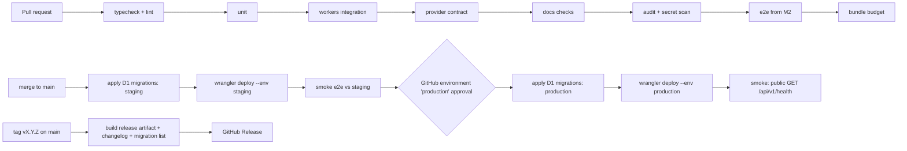

# Cinewren — TDD (Technical Design Document)

| | |
|---|---|
| **Status** | Draft v0.1, 2026-10-04. Agent-authored under delegation; not owner-reviewed. Nothing described here is implemented. Updated 2026-10-04 for owner decisions Q-7/Q-8. |
| **Owns** | Concrete engineering choices and their tradeoffs: language and tooling, D1 access and migrations, configuration and secrets, environments, the passkey authentication implementation, cross-cutting concerns (security headers and CSP, CSRF, logging and metrics, rate limiting), testing strategy, CI/CD, versioned releases and the self-host install and upgrade path, release and rollback, backup and restore, the browser playback approach, performance budgets, and how the design leaves room for future changes. |
| **Does not own** | Requirements ([SRS](../requirements/SRS.md)), components and data flows ([HLD](HLD.md)), module structure ([SDD](SDD.md)), schemas, contracts and algorithms ([LLD](LLD.md)), architecture decisions ([ADRs](../adr/0001-record-architecture-decisions.md); authentication model in [ADR-0014](../adr/0014-passkey-auth-with-invite-links.md)), sequencing ([ROADMAP](../ROADMAP.md)). |

Provenance: everything in this document is an **Agent decision (delegated, 2026-10-04; not yet owner-reviewed)** unless it is labelled otherwise. Dark and light themes are **Owner decision Q-8 (2026-10-04)**, and collections plus people and collection search are **Owner decision Q-7 (2026-10-04)**; the theming and font approach below is an agent decision. Two items are **Owner direction (2026-10-04)**: passkey-only authentication with operator invite links (ADR-0014, which supersedes ADR-0007), and packaging Cinewren so that other operators can self-host their own single-operator instance (FR-OPS-008). Cloudflare Access is not part of the design. An operator *may* put Access in front of their deployment as an optional extra layer; that option is neither designed nor required (see §6.5 for one side-effect). Cloudflare facts that were checked against the Cloudflare documentation on 2026-10-04 carry a URL. Anything not checked is marked "to verify in M0" (platform) or "to verify in M1 spike" (providers).

## 1. Stack and tooling

The stack decision is [ADR-0005](../adr/0005-single-worker-typescript-stack.md). This section records how the stack is used.

| Area | Choice | Why | Tradeoff accepted |
|---|---|---|---|
| Language | TypeScript, `strict: true`, `noUncheckedIndexedAccess`, `exactOptionalPropertyTypes` | NFR-MAINT-001. One language across SPA, API and jobs. | Slower prototyping than plain JS. |
| Package manager | pnpm workspace (`apps/web`, `apps/worker`, `packages/shared`) | Shared API types between SPA and Worker without publishing anything. | Workspace configuration overhead. |
| SPA | React + Vite, served as Workers Static Assets (C-WEB) | Mature ecosystem; Vite code-splitting supports NFR-PERF-003. | React runtime counts against the 250 KB budget. |
| API | Hono on Workers, under `/api/v1` (C-API) | Small, Workers-native router with middleware for request ID, auth, errors and validation. | Less built-in structure than larger frameworks. |
| Validation | `zod` schemas in `packages/shared` to validate API requests and to derive TypeScript types | One schema serves the server check and the client type (IR-001). | About 12 KB gzipped on the client if imported there; the SPA imports types only. |
| Authentication | `@simplewebauthn/server` in the Worker, `@simplewebauthn/browser` in the SPA (IR-006) | A maintained WebAuthn implementation with attestation and assertion verification; it avoids hand-written CBOR and COSE parsing. | Workers compatibility (it needs WebCrypto, not Node `crypto`) is to verify in M0. The fallback is a smaller WebCrypto-native verifier with the same interface. |
| Player | HTML5 `<video>` plus `hls.js`, loaded lazily on the player route (IR-007) | Native HLS where the browser has it; MSE elsewhere. | `hls.js` is large, so it is loaded only on the player route (§12). |
| Unit and integration tests | Vitest; `@cloudflare/vitest-pool-workers` for tests that run in the Workers runtime against local D1 and Queues | Tests exercise the real runtime bindings (NFR-TEST-001). | The pool's startup cost makes the suite slower. |
| End-to-end tests | Playwright (Chromium, Firefox, WebKit) | Covers the browser matrix in NFR-COMPAT-001. | WebKit on Linux is only an approximation of Safari; a manual Safari check is still needed (§7). |
| Build and deploy | `wrangler`. One project with `fetch`, `scheduled` and `queue` handlers. | Single deployable unit (ADR-0005). | Every handler shares one version and one rollback. |
| Lint and format | ESLint (typescript-eslint, `no-restricted-imports`) and Prettier | `no-restricted-imports` stops code outside `providers/*` from importing provider modules (IR-002, checked by inspection and by CI). | — |

## 2. D1 access approach

**Decision TDD-D1:** use raw SQL through a small typed query layer (`db/` module) instead of Drizzle or another ORM.

| Option | For | Against |
|---|---|---|
| **Raw SQL + typed helpers (chosen)** | Full use of D1 features the design depends on: FTS5 virtual tables, partial unique indexes (the sync lock in [LLD-SYNC](LLD.md#lld-sync--sync-health-probing--retention-jobs)), `INSERT … ON CONFLICT DO UPDATE` upserts, `batch()` transactions. No extra runtime bundle. The SQL in [LLD-SCHEMA](LLD.md#lld-schema--d1-schema--migrations) is exactly what runs. | The compiler cannot check column names. |
| Drizzle ORM | Typed queries; can generate migrations. | FTS5 and partial indexes need raw SQL anyway. A second schema source competes with the migration files (DR-004). It adds abstraction over `batch()` semantics that LLD-ERR relies on. |

How the risk is reduced:
- Each table has a row type and a `mapRow` function in `db/rows.ts`. Queries are named functions (for example, `upsertSource(stmt params)`), not inline SQL in handlers.
- A Workers-runtime integration test applies every migration to an empty local D1. It then compares `PRAGMA table_info` for each table with the row types' declared columns, so a renamed column fails CI.
- Every statement uses `prepare().bind()`. String-concatenated SQL is banned by a lint rule (template literals passed to `prepare` must be constants).

Verified D1 facts this relies on:
- D1 supports the FTS5 module, including `fts5vocab` (https://developers.cloudflare.com/d1/sql-api/sql-statements/ (checked 2026-10-04)).
- `batch()` runs its statements as one SQL transaction. If any statement fails, the whole sequence is rolled back (https://developers.cloudflare.com/d1/worker-api/d1-database/).
- Cloudflare Queues are available on the Free and Paid plans (https://developers.cloudflare.com/changelog/post/2026-02-04-queues-free-plan/ (checked 2026-10-04)).
- Foreign keys are enforced by default, `ON DELETE CASCADE` is supported, and `PRAGMA defer_foreign_keys` can be used inside migrations (https://developers.cloudflare.com/d1/sql-api/foreign-keys/).
- D1 automatically retries read-only queries up to two times. Writes are not retried, so writes must be idempotent if the application retries them (https://developers.cloudflare.com/d1/observability/debug-d1/).
- Per-query limits (for example, bound parameters per statement and query duration) are on https://developers.cloudflare.com/d1/platform/limits/. LLD batch chunk sizes must respect those limits; check the numbers in M0.

## 3. Migrations (DR-004)

**Decision TDD-D2:** use Wrangler's built-in D1 migrations (`migrations/NNNN_slug.sql`, applied with `wrangler d1 migrations apply`). Do not use a custom runner.

Rules:
1. **Forward-only.** There are no down migrations. To revert, write a new migration.
2. **Expand → migrate → contract.** Each migration must work with the Worker version that is currently deployed *and* the one about to be deployed:
   - *Expand* (release N): add nullable columns, new tables or new indexes. Code N writes both the old and the new shape, and reads the old shape.
   - *Migrate* (release N, or a job after it): backfill the new shape. Large backfills run as chunked jobs, not inside the migration file, because D1 query duration limits apply.
   - *Contract* (release N+1 or later): code stops using the old shape; a later migration drops it.
3. **Order of operations in CI:** apply migrations, then deploy the Worker. Because of rule 2, the old Worker still works against the new schema while the deploy happens, and also after a code rollback (§9).
4. **Destructive steps** (`DROP`, table rebuilds) need their own PR, labelled `migration:contract`, and a note in the PR description naming the release that stopped using the old shape.
5. **The FTS table is derived.** It can be dropped and rebuilt from `media_items`, `people` and `collections` by a job (`rebuildSearchIndex`). This matters for exports (§10).

## 4. Configuration and secrets

Non-secret settings are Wrangler `vars`, defined per environment. Secrets are set with `wrangler secret put`. Mandatory secrets are listed under `secrets.required`, so a deploy fails when one is missing (https://developers.cloudflare.com/workers/configuration/secrets/ (checked 2026-10-04)). A secret is never placed in `vars`. Locally, secrets live in `.dev.vars`, which is git-ignored.

| Key | Kind | Default | Purpose / requirement |
|---|---|---|---|
| `ENVIRONMENT` | var | `production` | `local` \| `staging` \| `production`. Gates `ALLOW_INSECURE_ORIGINS`. |
| `APP_ORIGIN` | var | — | Exact public origin, e.g. `https://cinewren.example.org`. Used as the expected WebAuthn origin, for the CSRF `Origin` check (NFR-SEC-007) and for building invite links. The Worker refuses to serve (500 on every route except health) if it is unset or not `https:` outside local. |
| `RP_ID` | var | hostname of `APP_ORIGIN` | WebAuthn Relying Party ID (IR-006). Changing it invalidates every registered passkey, so the self-host guide warns that the hostname is effectively permanent. |
| `RP_NAME` | var | `Cinewren` | Name shown by authenticators. |
| `SETUP_TOKEN` | **secret** | — | One-time bootstrap token for `/setup` (FR-USR-002). It is ignored once any operator exists, so it can be left set; the guide recommends deleting it after setup. For that reason it is **not** listed in `secrets.required`; only `CREDENTIAL_KEYS` is. At least 32 random bytes; compared in constant time. |
| `CREDENTIAL_KEYS` | **secret** | — | JSON object mapping key version to a base64-encoded 32-byte AES key, for example `{"1":"…","2":"…"}` (DR-002, [LLD-TOKEN](LLD.md#lld-token--credential-vault--playback-credentials)). The operator generates the key locally and keeps an offline copy, such as in a password manager, before running `wrangler secret put`. Secrets cannot be read back from Cloudflare. If the key is lost, server credentials must be re-entered; the catalog and other primary data are not affected. |
| `CREDENTIAL_KEY_CURRENT` | var | — | Key version used for new encryptions. It must exist in `CREDENTIAL_KEYS`; the Worker checks this on the first request and fails closed. |
| `ALLOW_INSECURE_ORIGINS` | var | `false` | Allows `http://` base URLs (FR-SRV-007). It is ignored, and an error is logged, unless `ENVIRONMENT=local`. |
| `SYNC_INCREMENTAL_INTERVAL_MIN` | var | `60` *(proposed)* | FR-SYNC-001. |
| `SYNC_FULL_INTERVAL_H` | var | `24` *(proposed)* | FR-SYNC-001. |
| `HEALTH_PROBE_INTERVAL_MIN` | var | `5` *(proposed)* | FR-OPS-001. Must be a multiple of the scheduler tick. |
| `PLAYBACK_AUTH_TTL_S` / `PLAYBACK_IDLE_TIMEOUT_H` | var | `300` / `4` *(proposed)* | BR-9. |
| `RETENTION_*_DAYS` | var | per DR-003 *(proposed)* | Retention job (LLD-SYNC). |
| `SESSION_IDLE_DAYS` / `SESSION_ABSOLUTE_DAYS` | var | `14` / `90` *(proposed)* | NFR-SEC-007. |
| `INVITE_TTL_DAYS` / `REENROLL_TTL_HOURS` | var | `7` / `24` *(proposed)* | FR-USR-002, FR-USR-007. |
| `RATE_PLAY_PER_MIN` / `RATE_MUTATION_PER_MIN` | binding config | `60` / `600` *(proposed)* | NFR-SEC-008 (§6.3), M5. |
| `RATE_AUTH_PER_MIN` | binding config | `10` *(proposed)* | NFR-SEC-004 (§6.3), M0. |

Bindings: `DB` (D1), `JOBS_QUEUE` (Queue producer and consumer, with dead-letter queue `cinewren-jobs-dlq-<env>`; see [LLD-SYNC](LLD.md#lld-sync--sync-health-probing--retention-jobs)), `ASSETS` (Static Assets), `RL_PLAY`, `RL_MUTATION` and `RL_AUTH` (rate limit).

**Decision TDD-D3: one scheduler tick.** Cron Trigger expressions are fixed in the Wrangler config, but FR-SYNC-001 requires configurable intervals. So there is one cron, `*/5 * * * *`, that runs the scheduler. On each tick the scheduler compares every server's last runs with the configured intervals and decides what is due: syncs, probes, and the playback-session sweep. A second cron runs daily (`17 3 * * *`, proposed) for retention. That uses 2 of the Free-plan limit of 5 cron triggers per account (https://developers.cloudflare.com/workers/platform/limits/ (checked 2026-10-04)). Intervals therefore have a granularity of 5 minutes.

## 5. Environments and authentication

| Env | Worker | D1 | Hostname / RP ID | Origins | Notes |
|---|---|---|---|---|---|
| local | `wrangler dev` | local D1 (Miniflare) | `localhost` (browsers treat it as a secure context for WebAuthn; to verify per browser in M0) | mock origin server (§7) or a developer's own server | `ALLOW_INSECURE_ORIGINS` may be `true`. `pnpm dev:setup` runs `/setup` with a local `SETUP_TOKEN` from `.dev.vars`. |
| staging | `cinewren-staging` | `cinewren-staging` | project staging hostname (custom domain) | dedicated test origins (Jellyfin first; M1) | The project's own environment. Deployed automatically from `main`. Restore rehearsals happen here first. |
| production | `cinewren` | `cinewren-prod` | project or self-hoster hostname (custom domain) | operator's origins | Deployed manually with approval (project), or by the self-hoster (§9). |

A custom domain is recommended over `workers.dev`. The hostname becomes the passkey RP ID (§4), and the Cache API is documented as working for Workers on custom domains (§6.5).

### 5.1 Passkey authentication implementation (FR-USR-001 to FR-USR-007, NFR-SEC-007, ADR-0014)

Schemas and endpoint contracts are in [LLD-SCHEMA](LLD.md#lld-schema--d1-schema--migrations) and [LLD-API](LLD.md#lld-api--platform-http-api-contracts). The session and token lifecycle is in [LLD-TOKEN](LLD.md#lld-token--credential-vault--playback-credentials).

| Concern | Implementation |
|---|---|
| Registration and login | WebAuthn ceremonies via `@simplewebauthn`. `userVerification: "required"`, `residentKey: "required"` (discoverable credentials, so login needs no username), attestation `none`. Expected origin = `APP_ORIGIN`, RP ID = `RP_ID`. |
| Challenges | 32 random bytes, stored in `webauthn_challenges` with a 5 min TTL *(proposed)* and bound to a purpose (`setup`, `signup`, `reenroll`, `login`, `add_passkey`). Deleted on first use, whether or not verification succeeds (NFR-SEC-007). |
| Sessions | The session ID is 32 random bytes (≥ 128 bits), sent as cookie `__Host-cw_session` with `HttpOnly; Secure; SameSite=Lax; Path=/`, and stored only as a SHA-256 hash. Idle expiry is 14 days and absolute expiry 90 days *(proposed)*. `last_seen_at` is refreshed at most once per hour so reads do not cost a write each time. |
| CSRF | Every non-GET/HEAD request must carry an `Origin` header equal to `APP_ORIGIN`, or it gets 403 `CSRF_REJECTED`. Combined with `SameSite=Lax`, this is the CSRF control. The API accepts only `application/json` bodies (400 `VALIDATION_FAILED` otherwise, agent decision 2026-10-04), which rules out cross-site form posts. |
| Invite, re-enrollment and setup tokens | 32 random bytes, base64url-encoded in the link fragment (`/invite#t=…`) so they do not appear in server logs or `Referer` headers. The SPA posts the token in the request body. The database stores only SHA-256 hashes. Tokens are single-use; consumption is a compare-and-set in the same `batch` that creates the user or passkey. |
| First-operator bootstrap | `/setup` is enabled only while `SELECT COUNT(*) FROM users WHERE role='operator'` is 0 **and** the posted token matches `SETUP_TOKEN` in constant time. A guarded insert closes the race between two concurrent setups. Afterwards every `/setup` endpoint returns 404 `NOT_FOUND`, and so does a request with an invalid token while setup is enabled, so a disabled setup and a wrong token are indistinguishable. |
| Recovery of the last operator | `pnpm cinewren:recovery-link --user <id> --env production` runs locally with the operator's Cloudflare credentials. It generates a token, inserts its hash as a `reenroll` invite through `wrangler d1 execute --remote`, and prints the link. Access to the Cloudflare account is the proof of authority (FR-USR-007). The command writes an `audit_log` row. |
| Disable or delete user | One `batch` updates or deletes the user and deletes all their `sessions` rows, so access ends on the next request (FR-USR-008). |
| Health | `GET /api/v1/health` needs no authentication and returns only `{status:"ok"\|"degraded"}` (FR-OPS-007). Details are on the operator-only `/api/v1/admin/status`. |

**No authentication bypass (resolves SDD OD-3).** The Worker contains no code path that skips authentication in any mode. Local development uses real passkeys on `localhost`. Tests get sessions in two ways:
- Playwright on Chromium uses a CDP virtual authenticator (`WebAuthn.addVirtualAuthenticator`), so the e2e suite exercises the real ceremonies.
- Firefox and WebKit e2e runs, and the Workers integration tests, insert a hashed session row into the local D1 through a test fixture. That fixture is test code and is not shipped in the Worker.

The ceremonies themselves are covered by unit tests with recorded attestation and assertion fixtures.

## 6. Cross-cutting concerns

### 6.1 Security headers and dynamic CSP (NFR-SEC-003)

Headers on every HTML and API response:
- `Strict-Transport-Security: max-age=31536000; includeSubDomains`
- `X-Content-Type-Options: nosniff`
- `Referrer-Policy: no-referrer`. This keeps stream URLs, which carry tokens, out of `Referer` headers.
- `Permissions-Policy` limited to what the player needs (`fullscreen=(self)`, `picture-in-picture=(self)`)
- `Cross-Origin-Opener-Policy: same-origin`

The CSP is built per request from the registered origin hostnames:

```
default-src 'self'; script-src 'self'; style-src 'self';
img-src 'self' data: blob:; font-src 'self';
media-src 'self' blob: <origin-hosts>; connect-src 'self' <origin-hosts>;
frame-ancestors 'none'; base-uri 'none'; form-action 'self'
```

`<origin-hosts>` is the list of `https://host[:port]` values of servers that are not removed. `blob:` in `media-src` is required for MSE playback through hls.js. `connect-src` covers hls.js fetching playlists and segments from origins.

**Decision TDD-D6:** the Worker must run before static assets for HTML navigations, so it can attach the dynamic CSP. A static `_headers` file cannot be dynamic. The plan is the Static Assets `run_worker_first` setting, scoped to navigation and HTML routes (to verify in M0). Hashed JS and CSS assets stay asset-served without running the Worker. The host list is cached in isolate memory and keyed by a `servers_version` counter in D1, which is incremented whenever a server is changed.

### 6.2 Logging and observability (NFR-OBS-001, NFR-OBS-002)

- One logger writes single-line JSON with `ts`, `level`, `request_id`, `user_id` (the internal ID; never the display name), `route`, `event`, `duration_ms` and event fields. Output goes to `console.log` and is collected by Workers Logs (log retention and limits to verify in M0).
- Redaction happens in the logger, not at call sites. Keys matching `/token|password|secret|authorization|credential|api_key|cookie|display_?name/i` are replaced. The session cookie and any invite, setup or re-enrollment token are never logged. Before logging, URLs are stripped of query strings, which may carry stream tokens (NFR-SEC-001). A unit test sends known secrets through every log path.
- Events that must be logged: `sync.run.*`, `sync.page`, `probe.result`, `play.decision` (the candidates with their ranking keys, the chosen source and mode), `play.session.*`, `auth.denied`, `error`.
- **Decision TDD-D4: metrics come from D1, not from an extra product.** NFR-OBS-002 metrics are SQL views over `sync_runs` (duration and errors per server), `playback_sessions` (outcome and mode distribution) and `health_probes`. An operator page shows them. Workers Analytics Engine is an option if query cost becomes a problem; it is not adopted.
- There are no third-party analytics or error trackers (NFR-PRIV-001).

### 6.3 Rate limiting (NFR-SEC-004, NFR-SEC-008)

**Decision TDD-D5 (resolves SDD OD-1):** use the Workers rate limiting binding. The per-user limits (NFR-SEC-008, M5) are keyed by `user_id`; the per-IP auth limit (NFR-SEC-004, M0) is described below. `RL_PLAY` allows 60 requests per 60 s for `POST /api/v1/play`. `RL_MUTATION` allows 600 per 60 s for progress events, operator mutations and the caller's own account writes under `/api/v1/me/` (both proposed; the last added by the T5.8 review). Verified behaviour: the period must be 10 or 60 seconds; limits apply per Cloudflare location; counting is permissive and eventually consistent (https://developers.cloudflare.com/workers/runtime-apis/bindings/rate-limit/). That is good enough for abuse protection by a small invited group. It is not a quota system. `RL_AUTH` allows 10 requests per 60 s per client IP (`CF-Connecting-IP`) on the setup, invite-redemption (which includes re-enrollment) and login endpoints only *(proposed; NFR-SEC-004)*, as a brake on token guessing. Tokens carry 256 bits, so the limiter is defence in depth, not the main control. A request over the limit gets 429 `RATE_LIMITED` with `Retry-After: 60` ([LLD-ERR](LLD.md#lld-err--error-handling-retries-idempotency--concurrency)).

### 6.4 Outbound origin requests (NFR-SEC-005, FR-SRV-007)

There is a single `originFetch` wrapper and no other code calls `fetch` against origins:
- It sends requests only to the server's registered scheme, host and port.
- It sets `redirect: "manual"`. A 3xx response whose target is another host is refused with `ORIGIN_REDIRECT_REFUSED`; a same-host redirect is followed at most 3 times.
- It applies per-call timeouts (default 10 s for sync and 5 s for probes and the play path, proposed) and the retry policy in LLD-ERR.
- It counts calls against the subrequest budget. Paid plans default to 10,000 subrequests and 6 simultaneous outgoing connections per invocation (https://developers.cloudflare.com/workers/platform/limits/ (checked 2026-10-04)), so concurrency is capped at 6.

### 6.5 Artwork caching (ADR-0012)

ADR-0012 uses the Workers **Cache API** (`caches.default`). The Cache API docs state that Workers on custom domains have working cache operations, and that "for Workers fronted by Cloudflare Access, the Cache API is not currently available" (https://developers.cloudflare.com/workers/runtime-apis/cache/). Cinewren does not use Access (ADR-0014), so the ADR-0012 approach stands on a custom domain. **Decision TDD-D7:**
1. The artwork handler looks up `caches.default` with a synthetic key, `https://<app-host>/__art/<serverId>/<providerItemId>/<kind>/<tag>`, which never includes credentials. On a miss it fetches from the origin and `put`s the result with `Cache-Control: max-age=2592000` *(proposed)*.
2. The browser response carries `Cache-Control: private, max-age=604800, immutable` *(proposed)*. URLs are versioned by the provider's image tag.
3. The handler must work, without edge caching, when `caches.default` is unavailable or a no-op: on `workers.dev`, in previews, or if an operator chooses to put Access in front. The self-host guide states this side-effect of optional Access.

The Cache API is per data centre and does not use tiered caching (same page). At this scale that is acceptable.

### 6.6 Theming and fonts (NFR-UX-001, NFR-PRIV-001)

**Theming approach (Owner decision Q-8; mechanism is an agent decision).** The design tokens come from [UX](UX.md), which owns their names and values. The SPA implements them as CSS custom properties in `apps/web/src/theme/tokens.css`:
- The dark and light token sets are two blocks of the same property names. Components reference only `var(--…)`; lint (a Stylelint rule banning colour literals outside `theme/`) enforces this.
- The default follows the browser: the light values sit under `@media (prefers-color-scheme: light)` and the dark values are the base, or the other way round if UX.md says so.
- An explicit choice sets `data-theme="dark"` or `data-theme="light"` on `<html>`. Those blocks come after the media query and override it, so a user override wins in either direction. `system` removes the attribute. `color-scheme` is set with the theme so native controls match.
- The choice is stored as `users.theme_preference` and changed through `PATCH /me/preferences` ([LLD-API](LLD.md#lld-api--platform-http-api-contracts)). To avoid a flash of the wrong theme, the last applied value is also cached in `localStorage` (in try/catch; the page works without it) and applied by a tiny external script, `theme-init.js`, loaded in `<head>` before the styles. It is a separate file because the CSP allows no inline script (§6.1); the value from `GET /me` replaces the cached one after load.

**Contrast checks (NFR-A11Y-001, NFR-UX-001).** Both themes must meet contrast independently.
- The Playwright journeys run an `@axe-core/playwright` scan on each main screen (browse, search results, title detail, person page, collection page, player, sign-in, admin) **once per theme**, by setting `data-theme` before the scan. Any `color-contrast` violation fails CI.
- A unit test reads `tokens.css` and checks the declared text and surface token pairs against the WCAG ratios in NFR-A11Y-001 for each theme, so a bad token fails before a page is rendered.
- The `prefers-color-scheme` path is covered by running one journey with Playwright's `colorScheme: 'light'` and `'dark'` contexts and no override.

**Fonts (agent decision).** The UX.md type system uses Bricolage Grotesque, Instrument Sans and JetBrains Mono.
- They are **self-hosted**: WOFF2 files bundled into the SPA build and served by Workers Static Assets with hashed names and long-lived caching. The page loads no Google Fonts or other font CDN, so no third-party request is made and no visitor IP or Referer reaches a third party (NFR-PRIV-001). The CSP already restricts `font-src 'self'` and `style-src 'self'` (§6.1), and the CSP test fails if a third-party font request appears.
- Only the needed weights and the Latin subset are shipped *(proposed)*, as variable fonts where available, with `font-display: swap` and system fallbacks, to respect the NFR-PERF-003 budget. Fonts are not part of the 250 KB initial JS budget but are preloaded sparingly (body font only).
- **Licenses must be checked (to verify in M0):** confirm that each font's license (all three are expected to be SIL Open Font License, but this has not been checked) permits self-hosting and redistribution with the build, and keep the license files in the repository and in the build output.

## 7. Testing strategy (NFR-TEST-001)

| Layer | Tooling | Scope | Covers SRS method |
|---|---|---|---|
| Unit | Vitest (Node) | Pure modules: matching ([LLD-MATCH](LLD.md#lld-match--matching--curation-algorithm)), selection ([LLD-SEL](LLD.md#lld-sel--source-selection-algorithm)), BR-7 thresholds, envelope crypto, CSP builder, cursor codec, redaction, capability-to-device-profile mapping | T |
| Workers integration | `@cloudflare/vitest-pool-workers` with local D1 and Queues | Full Hono app through `SELF.fetch` with session cookies from the test fixture (§5.1); migrations applied; the scheduled and queue handlers called directly. Covers BR-1 filtering for every catalog endpoint (FR-CAT-006), role enforcement (FR-USR-003), the auth flows (setup disabled after the first operator, single-use and expired invites, CSRF `Origin` rejection, session idle and absolute expiry, session revocation on disable; FR-USR-001 to FR-USR-007, NFR-SEC-007), the sync lock (FR-SYNC-002), idempotency (FR-SYNC-004), missing marking (FR-SYNC-005), cascades (DR-005) and retention (DR-003) | T |
| Provider contract | Vitest plus recorded fixtures | Each adapter runs against fixtures served by the **mock origin server**, a small Hono app in `test/mock-origin/` that replays recorded responses for each provider and version and can inject faults (timeouts, 5xx, redirects to a foreign host, truncated pages). The same contract suite runs against every adapter (NFR-MAINT-001, IR-002 to IR-005). Fixtures are recorded from real servers during the M1 spike and M4, then scrubbed of tokens, hostnames and personal data by a script that CI re-checks. | T |
| End-to-end | Playwright against `wrangler dev` plus the mock origin (from M2) | Journeys J-1 to J-6 (PRD) with seeded data. Playback uses tiny test media (H.264/AAC MP4 and an HLS variant) served by the mock origin. CSP violations are collected and fail the test. axe-core checks feed NFR-A11Y-001 and run in both themes (§6.6). | T, part of A |
| Docs checks | Node script in CI | Relative links resolve. Every `FR-/NFR-/IR-/DR-` ID cited in `docs/` exists in the SRS. LLD and PRD headings match the expected IDs. ADR filenames follow the pattern (NFR-MAINT-002). | I |
| Static and security checks | `tsc --noEmit`, ESLint, `pnpm audit --prod`, GitHub secret scanning or gitleaks, Dependabot | NFR-SEC-006, IR-002 import boundaries | I |
| Bundle budget | `size-limit` or a Vite manifest check | NFR-PERF-003 | T |
| Staging demonstration | Scripted checklist run against staging with real test origins | FR-OPS-003, FR-OPS-004, FR-USR-007 recovery command, FR-OPS-008 fresh self-host install and upgrade from the previous release, NFR-REL-003 rehearsal, passkey sign-in on real devices (platform authenticator and security key), real-browser playback on the NFR-COMPAT-001 matrix (manual Safari and iOS) | D |
| Analysis | Seeded dataset at the NFR-SCALE-001 envelope in staging; a load script that measures p95 for browse, search, detail and play; a cost worksheet from the Cloudflare dashboard | NFR-PERF-001, NFR-PERF-002, NFR-SCALE-001, NFR-COST-001 | A |

Media bytes never pass through the Worker (FR-PLAY-008). An integration test asserts that every descriptor `stream_url` host equals the selected server's host and that no `/api` route streams `video/*` or `audio/*`.

## 8. CI/CD pipeline (proposed)



- These are the project's own pipelines. Self-hosters do not need GitHub Actions (§9.2).
- **Deploys use Cloudflare Workers Builds** (owner decision 2026-10-04): each environment's Worker is connected to the GitHub repo, with root `/`, build `pnpm install --frozen-lockfile && pnpm build`, and a deploy command that applies D1 migrations, then runs `wrangler deploy --env <env>`. The build token is managed by Cloudflare, so no GitHub secret is needed. GitHub Actions runs CI checks only. Production is connected the same way with its own branch or tag rule; a manual-approval gate is configured when production is created (M5).
- Production deploys are manual (`workflow_dispatch`, or promotion from the staging run) and need approval. Staging deploys automatically on every merge to `main` via Workers Builds.
- Each pipeline step's commands live in `package.json` scripts, so a developer can run CI locally.

## 9. Releases, self-hosting, upgrades and rollback

### 9.1 Versioned releases (FR-OPS-008)

- SemVer tags `vX.Y.Z` on `main` produce a GitHub Release with the changelog, the list of migrations by number, any new or changed configuration keys, and upgrade notes.
- **Major** releases may contain *contract* migrations or breaking configuration changes. **Minor** and **patch** releases contain only *expand* migrations and additive configuration with defaults.
- The `/api/v1` prefix is versioned separately (IR-001). The SPA and API ship together, so the API version only matters for external scripts.
- The Worker embeds `APP_VERSION` and `SCHEMA_VERSION_REQUIRED`, the highest migration number it depends on. The operator-only `/api/v1/admin/status` shows both, alongside the applied migration number read from `d1_migrations`.

### 9.2 Self-host install path

Cinewren is still one operator per deployment (ADR-0011). Self-hosting means many independent deployments of the same code, not multi-tenancy.

| Path | Steps |
|---|---|
| **Deploy to Cloudflare button** (README) | The button clones the repository into the operator's GitHub or GitLab account, provisions the D1 database and Queues declared in the Wrangler config, and sets up Workers Builds so that pushes to the production branch deploy automatically. Secrets listed in `.dev.vars.example` are offered for entry during deployment (https://developers.cloudflare.com/workers/platform/deploy-buttons/). The Workers Builds deploy command is `pnpm run deploy`, which runs `wrangler d1 migrations apply DB --remote && wrangler deploy`. Whether Workers Builds runs remote migrations with the build token's permissions is to verify in M0. The fallback is for the operator to run migrations once from their machine. |
| **Wrangler (manual)** | Clone the release tag, `pnpm install`, `wrangler d1 create`, `wrangler queues create` (jobs queue and DLQ), put the IDs into `wrangler.jsonc`, `wrangler secret put CREDENTIAL_KEYS`, `wrangler secret put SETUP_TOKEN`, set `APP_ORIGIN`, then `pnpm run deploy` and attach a custom domain. |

Both paths share these steps:
- **Prerequisites** (self-host guide): the Workers Paid plan (A-5); a custom domain on Cloudflare for the app; origins on grey-cloud or non-Cloudflare hostnames with public TLS (A-3); an offline copy of `CREDENTIAL_KEYS` (DR-002).
- **First run:** open `https://<host>/setup`, paste `SETUP_TOKEN`, enter a display name and register a passkey. That creates the first operator (FR-USR-002), after which setup is disabled. Then register servers (J-1).
- **Preflight:** a `pnpm cinewren:doctor` script checks bindings, secrets present (via `secrets.required`), `APP_ORIGIN` scheme, D1 migration state and the cron triggers, and prints fixes.

### 9.3 Upgrade path on others' deployments

1. The operator records a Time Travel bookmark (`wrangler d1 time-travel info`) as an undo point (§10).
2. The operator brings the new tag into their repository: merge the upstream tag into their fork (the button path) or check out the tag (the manual path).
3. The deploy runs `migrations apply`, then `wrangler deploy`. Migrations apply in order, so skipping minor versions within one major is safe: every pending expand migration is compatible with the still-running old Worker (§3).
4. **Crossing a major** (contract migrations): the release notes require upgrading first to the latest minor of the previous major. A contract migration starts with a guard statement that fails the migration if the database has not reached the required earlier migration number. Nothing is half-applied, because D1 applies each migration file as a unit (to verify in M0).
5. **Schema-skew guard:** if the deployed Worker sees an applied migration number below `SCHEMA_VERSION_REQUIRED` (migrations were skipped), the API returns 503 `MIGRATIONS_PENDING` on every `/api` route except health (setup is blocked too, because it would fail on a missing schema), and health reports `degraded`. Implemented in `apps/worker/src/platform/schema-version.ts`; the fix is `pnpm run migrate`. `pnpm check:upgrade` rehearses the in-order upgrade. This avoids running new code against an old schema.
6. If the upgrade misbehaves: `wrangler rollback` for code (§9.4). Restore from the bookmark is the last resort.

### 9.4 Rollback

- **Code rollback:** `wrangler rollback` (or the dashboard) makes a previous version the active deployment immediately (https://developers.cloudflare.com/workers/versions-and-deployments/rollbacks/). Because migrations follow expand/contract (§3), the previous version still works against the current schema. Rollbacks have binding-related constraints described on that page, so changes to bindings (adding a Queue or rate limiter) should ship in a release that contains no other risky changes.
- **Schema rollback** does not exist (forward-only). A bad migration is fixed with a new migration, or in the worst case by Time Travel restore (§10), which also discards data written since.
- Gradual deployments (traffic split between versions) are available (https://developers.cloudflare.com/workers/versions-and-deployments/gradual-deployments/). They are not used in v1: with ≤ 50 users the signal from a split is too weak to justify the complexity.

## 10. Backup and restore (NFR-REL-003, FR-OPS-006)

| Mechanism | What | Notes |
|---|---|---|
| D1 Time Travel | Whole database, restorable to any minute within 30 days (Workers Paid) or 7 days (Free). `wrangler d1 time-travel restore <db> --timestamp=…` or `--bookmark=…`. The restore **overwrites the database in place**. | https://developers.cloudflare.com/d1/reference/time-travel/ (checked 2026-10-04). Meets RPO ≤ 24 h (proposed). Before restoring, run `wrangler d1 time-travel info` and record the current bookmark, so the restore itself can be undone. |
| Application export (FR-OPS-006) | Primary data as JSON, no secrets ([LLD-API](LLD.md#lld-api--platform-http-api-contracts)) | A portable copy the operator controls. It works with any schema version that has an importer. |
| `wrangler d1 export` | SQL dump | **Not supported while virtual tables exist.** The workaround is to drop them, export and recreate them (https://developers.cloudflare.com/d1/best-practices/import-export-data/). Because the FTS table is derived (§3, rule 5), the runbook is: drop `search_fts`, export, then run `rebuildSearchIndex`. Search is degraded until the rebuild finishes. |

Restore rehearsal (M5, NFR-REL-003): on staging, write marker data, record a bookmark, mutate the data, restore to the bookmark, then check primary data and the RTO stopwatch (target ≤ 4 h, proposed). After the restore, run a full sync so derived catalog data reconciles with the origins. Write the results into the runbook.

## 11. Browser playback approach

### 11.1 Capability detection (FR-PLAY-002)

The client builds a `DeviceCapabilities` payload (shape in LLD-API) once per session and caches it in memory:
- **Containers and codecs:** `MediaSource.isTypeSupported()` with candidate MIME and codec strings (for example `video/mp4; codecs="avc1.640028"`, `"hvc1.2.4.L153.B0"`, `"av01.0.08M.10"`, `"vp09.00.40.08"`, audio `mp4a.40.2`, `ac-3`, `ec-3`, `opus`, `flac`), and `HTMLMediaElement.canPlayType()` for progressive playback, including `application/vnd.apple.mpegurl` for native HLS.
- **Smooth and efficient decoding, and HDR:** `navigator.mediaCapabilities.decodingInfo()` for the top candidates (2160p and 1080p) with `hdrMetadataType`, `colorGamut` and `transferFunction`, combined with `matchMedia('(dynamic-range: high)')`.
- **Max resolution:** `screen.width × devicePixelRatio`, capped by the user's quality preference.
- **Subtitles:** `text_formats: ["vtt"]`. Image-based subtitles are always burned in by the origin (FR-PLAY-006).

Codec support differs by browser and hardware (HEVC in Chrome, for example). Detection is therefore always live; the client never uses a static per-browser table.

### 11.2 Playback modes

| Mode | Browser mechanism | Origin role |
|---|---|---|
| `direct_play` | `<video src=…>` progressive file (MP4 or WebM) with HTTP range requests | Serves the file as stored. |
| `direct_stream` | HLS: native on Safari, otherwise `hls.js` with MSE | Remuxes (video copied; audio may be transcoded) into HLS. |
| `transcode` | HLS, as above | Full transcode to codecs the client supports. |

The origin makes the final mode decision. Cinewren sends the capabilities, translated into the provider's device profile, during negotiation ([LLD-PROV](LLD.md#lld-prov--mediaprovider-interface--adapters)), and it uses the mode the origin returns.

### 11.3 CORS and origin prerequisites

- Progressive `<video>` without the `crossorigin` attribute needs no CORS.
- hls.js loads playlists and segments with `fetch`/XHR, so the origin must return `Access-Control-Allow-Origin` for the Cinewren hostname on HLS endpoints. Cross-origin WebVTT `<track>` elements need CORS and `crossorigin="anonymous"` on the `<video>` element, which in turn makes progressive media requests CORS requests too.
- Verified T1.1: all three providers send suitable CORS headers by default (Jellyfin `*`; Emby and Plex echo the origin), so no reverse-proxy change is needed unless the operator narrowed Jellyfin's `CorsHosts`. Range requests work on all three. If an origin cannot be configured, WebVTT can be fetched through the Worker. Subtitles are small text and are not video or audio bytes, so FR-PLAY-008 still holds. The origin hostname must be grey-cloud or non-Cloudflare (A-3, NFR-COMP-001); the setup guide covers reverse-proxy CORS headers.
- Mixed content: the app runs over HTTPS, so origins must use HTTPS (FR-SRV-007).

### 11.4 Player behaviour

Resume offers follow BR-7 (FR-PROG-002). Progress is reported every 15 s *(proposed)* and on `pause`, `seeked`, `ended` and `visibilitychange→hidden`; the last of these uses `navigator.sendBeacon`, falling back to `fetch(…, {keepalive:true})` (FR-PROG-001). If no `playing` event arrives within 15 s *(proposed)*, or on a fatal `MediaError` or hls.js error, the client sends a replacement request that excludes the failed sources (in-request and client failover are FR-PLAY-004, delivered in M3). Keyboard controls and caption toggling are covered by NFR-A11Y-001 tests.

## 12. Performance budgets

| Budget | Target | Requirement | How measured |
|---|---|---|---|
| Catalog API p95 server time | ≤ 300 ms *(proposed)* | NFR-PERF-001 | Load script against staging seeded at the envelope (200k sources) |
| D1 queries per catalog request | ≤ 3 *(proposed)* | NFR-PERF-001 | Integration test counts statements through a wrapped binding |
| Play descriptor p95 | ≤ 2 s *(proposed)* | NFR-PERF-002 | Origin calls on the play path ≤ 3 (session credential (ADR-0013; Jellyfin mint about 190 ms), negotiation, optional subtitle info), each with a 5 s timeout and at most one retry |
| Initial route JS | ≤ 250 KB gzip *(proposed)* | NFR-PERF-003 | CI bundle check; hls.js and admin routes lazy-loaded |
| Sync throughput | Full sync of 200k sources inside the 24 h interval with margin | FR-SYNC-001, NFR-SCALE-001 | Analysis in M5. Each consumer invocation is bounded at 15 min (https://developers.cloudflare.com/workers/platform/limits/ (checked 2026-10-04)), and the run continues across invocations (LLD-SYNC). |
| D1 writes | Full sync rewrites `last_seen_sync_id` for each source: about 200k rows/day, about 6M/month, within the 50M rows included in Workers Paid | NFR-COST-001 | Cost worksheet. If this ever matters, only touch rows that were not already seen in this run. |

## 13. Migration considerations

There is no legacy system to migrate from. The design keeps these future changes open:

| Future change | What the v1 design keeps open |
|---|---|
| Media gateway, DEF-1 (if Q-2 requires hiding origins) | Stream URLs are built only inside adapters, through one `buildStreamUrl` path, and returned in an opaque descriptor (FR-PLAY-001). A gateway would change URL construction and the CSP host list, not the client. |
| Optional Cloudflare Access in front (operator choice) | Not designed or required. Passkey sessions still apply behind it. The known side-effect is the loss of the Cache API (§6.5). |
| Multi-tenancy, DEF-3 (Q-1) | IDs are opaque ULIDs, not integers that leak counts. All queries go through the `db/` layer, where a `tenant_id` predicate could be added in one place. Configuration is per deployment. This is real work, not a switch; see ADR-0011. |
| Origin webhooks (ADR-0009 alternative) | Sync upserts are idempotent and keyed by `(server_id, provider_item_id)`, so a webhook could enqueue a targeted single-item sync message using the same consumer. |
| Private-network origins (Q-5, DEF-10) | `originFetch` is the single egress point, so a different transport could be swapped in there. |
| New provider types | Adding one means a new adapter plus its contract suite (ADR-0004). The schema CHECK on `servers.type` needs an expand migration. |
| Writing watch state back to origins (DEF-4) | `reportPlayback` sends session telemetry only (FR-PLAY-009). Write-back would be a separate, opt-in interface method so telemetry semantics stay unchanged. |

## 14. Decisions in this document

| ID | Decision | Elevated to ADR? |
|---|---|---|
| — | Single Worker, TypeScript strict, React+Vite, Hono, pnpm, Vitest, Playwright | Yes: [ADR-0005](../adr/0005-single-worker-typescript-stack.md) |
| — | D1 as system of record, FTS5 search | Yes: [ADR-0006](../adr/0006-d1-system-of-record.md). FTS5 support is now verified (§2). |
| — | Passkey-only authentication, invite-only accounts, setup token, recovery (Owner direction) | Yes: [ADR-0014](../adr/0014-passkey-auth-with-invite-links.md), superseding [ADR-0007](../adr/0007-cloudflare-access-identity.md) |
| — | Credential encryption | Yes: [ADR-0008](../adr/0008-origin-service-accounts-and-credential-encryption.md) |
| — | Cron + Queues sync | Yes: [ADR-0009](../adr/0009-pull-based-sync-cron-and-queues.md) |
| — | Artwork proxy + cache | Yes: [ADR-0012](../adr/0012-artwork-proxy-with-edge-cache.md). It stands now that Access is not used. A custom domain is required for edge caching (§6.5). |
| — | Session-scoped stream credentials | Yes: [ADR-0013](../adr/0013-session-scoped-origin-stream-credentials.md) (Accepted for Jellyfin and Emby, Proposed for Plex; spike T1.1) |
| TDD-D1 | Raw SQL with typed helpers, no ORM | No: reversible within the `db/` module |
| TDD-D2 | Wrangler built-in D1 migrations, forward-only, expand/contract | No: implements DR-004 |
| TDD-D3 | One 5-minute scheduler cron plus a daily retention cron | No |
| TDD-D4 | Operational metrics from D1 views; no Analytics Engine in v1 | No |
| TDD-D5 | Workers rate limiting binding, per user (resolves SDD OD-1) | No |
| TDD-D6 | Worker runs first for HTML navigations to attach the dynamic CSP | No (mechanism to verify in M0) |
| TDD-D7 | Artwork cache key scheme and graceful degradation without the Cache API | No: implements ADR-0012 |
| TDD-D8 | zod for request validation, shared types package | No |
| TDD-D9 | ULID primary keys; time stored as INTEGER Unix milliseconds | No |
| TDD-D10 | No authentication bypass in any mode; real passkeys on `localhost` and test-only session fixtures (§5.1) | No (resolves SDD OD-3) |
| TDD-D11 | `@simplewebauthn/server` and `browser` for WebAuthn (§1) | No (Workers compatibility to verify in M0) |
| TDD-D12 | Session cookie `__Host-` prefix, hashed IDs, `Origin` check for CSRF, tokens carried in the URL fragment (§5.1) | No: implements NFR-SEC-007 |
| TDD-D13 | Self-host packaging: Deploy button and Wrangler paths, `SCHEMA_VERSION_REQUIRED` skew guard, major-only contract migrations (§9) | No: implements FR-OPS-008 |
| TDD-D14 | Theming: CSS custom properties from the UX.md tokens, `prefers-color-scheme` plus a `data-theme` override, per-user preference stored server-side, axe contrast checks in both themes (§6.6) | No: implements NFR-UX-001 |
| TDD-D15 | Fonts self-hosted through Static Assets; no third-party font requests; font licenses to verify in M0 (§6.6) | No: implements NFR-PRIV-001 |
