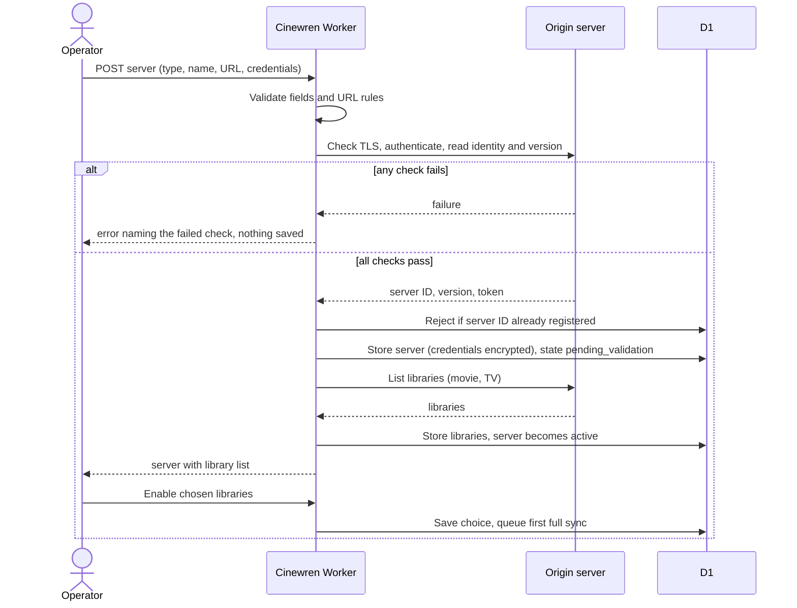
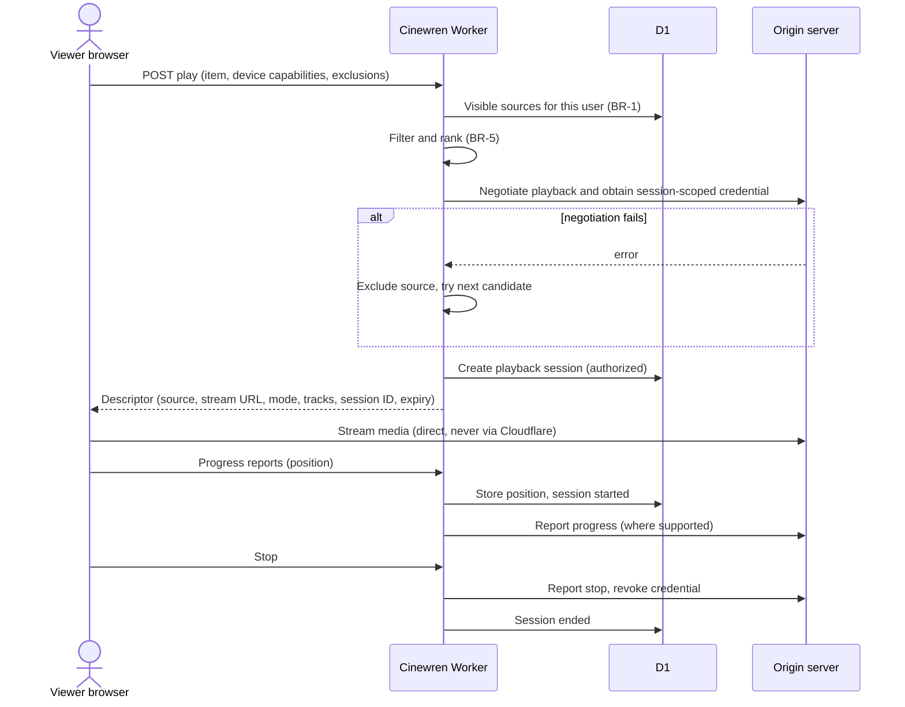
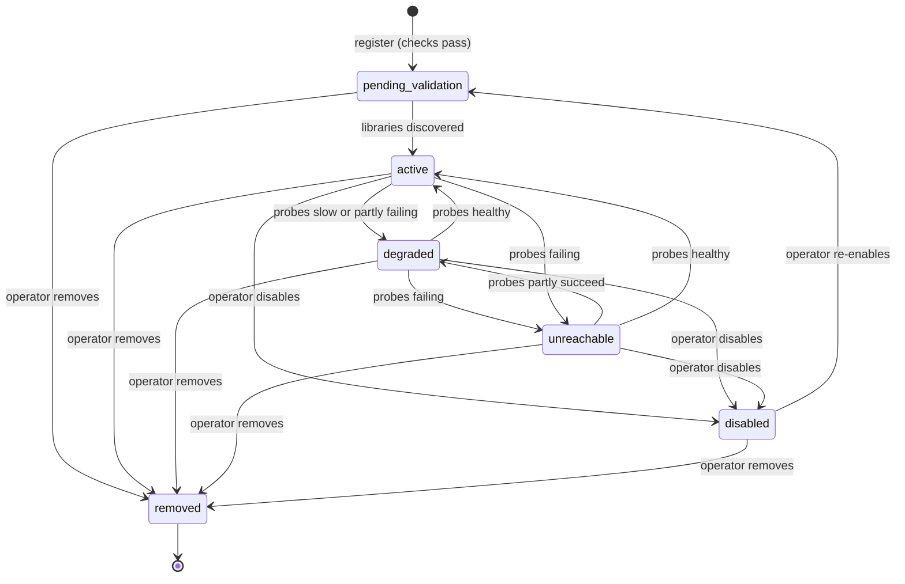
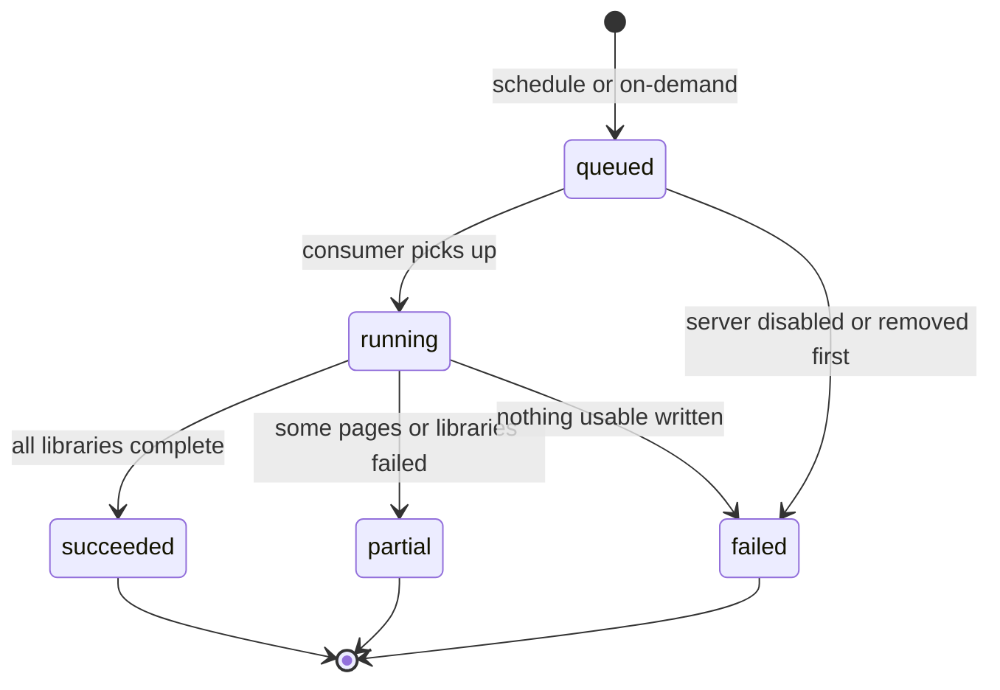
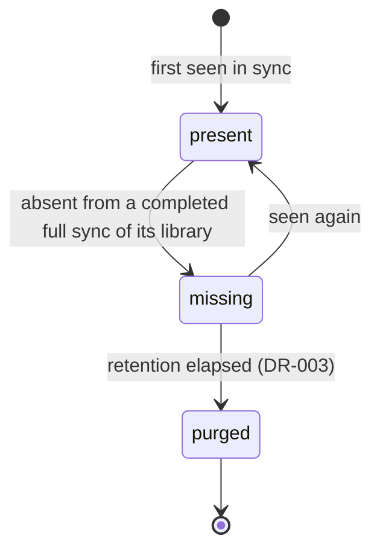
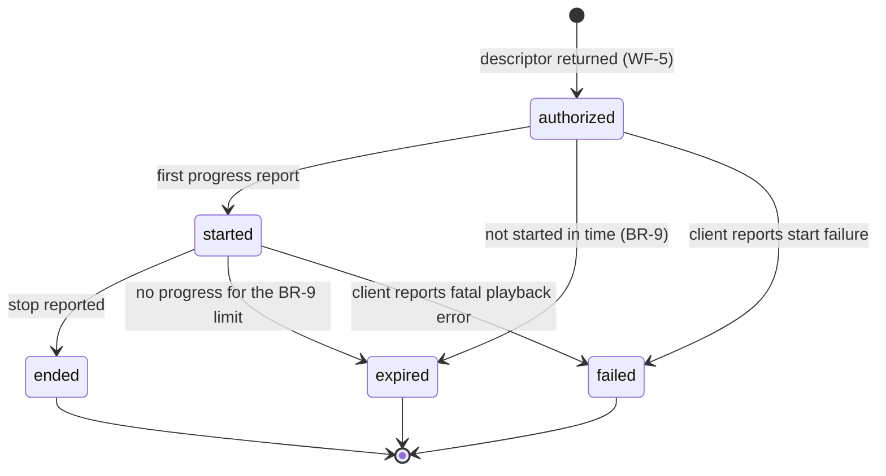
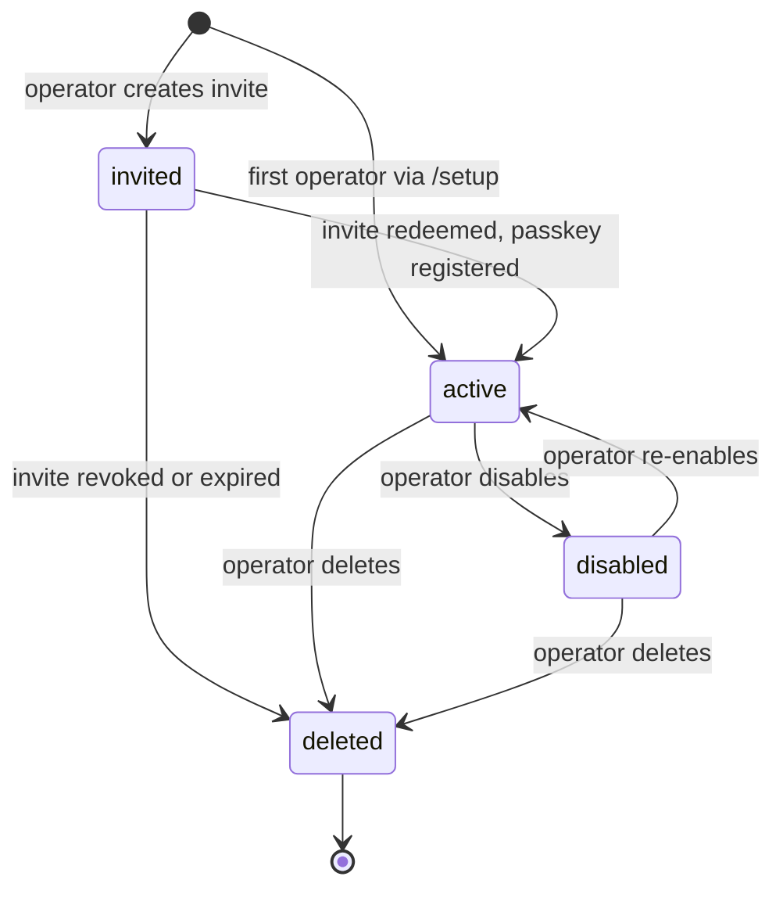
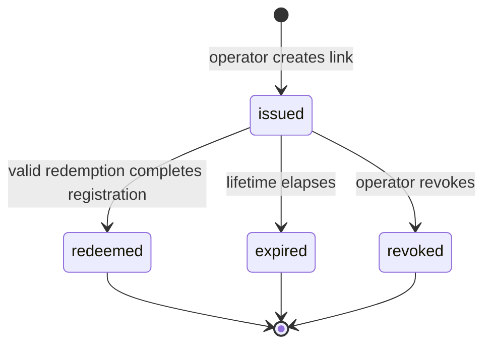

# Cinewren — FRD (Functional Requirements Document)

| | |
|---|---|
| **Status** | Draft v0.1 (2026-10-04). Agent-authored under delegation; not owner-reviewed. Nothing described here is implemented. Updated 2026-10-04 for owner decisions (ADR-0014, self-hosting). |
| **Owns** | Detailed workflow behaviour (WF-1 to WF-11), business rules (BR-1 to BR-9), permission matrix, state machines, validation rules, user-visible error behaviours. |
| **Does not own** | Requirement text ([SRS](SRS.md)); capabilities and journeys ([PRD](PRD.md)); business outcomes ([BRD](BRD.md)); component design ([HLD](../design/HLD.md)); algorithms and schemas ([LLD](../design/LLD.md)); sequencing ([ROADMAP](../ROADMAP.md)). |

Everything here is an **Agent decision (delegated)** (2026-10-04; not yet owner-reviewed) on top of the owner's [concept](../sources/2026-10-04-initial-architecture-concept.md). Requirements are referenced by SRS ID. Behaviour that depends on provider mechanics nobody has verified is marked "(to verify in M1 spike)". Numbers marked *(proposed)* may change; the SRS and the ROADMAP take precedence for any value they also state.

## Workflows

Common conventions. Actors: **Operator** (P-1), **Viewer** (P-2), **System** (scheduled or internal). Every operator workflow requires the operator role (BR-8). Every API workflow requires a valid session of an active user (FR-USR-001), except the public endpoints listed in WF-7. Failure responses use the user-visible errors in [Error behaviours](#error-behaviours-visible-to-users).

### WF-1 Register server

| | |
|---|---|
| Trigger | Operator submits the "add server" form. |
| Actors | Operator, System, origin server. |
| Preconditions | Operator signed in. The origin has a dedicated non-admin service account (A-2) and is reachable over public HTTPS (A-3, A-4). |
| Related SRS | FR-SRV-001, FR-SRV-002, FR-SRV-003, FR-SRV-007, DR-002, NFR-SEC-001, NFR-SEC-005 |

**Main flow**
1. Operator enters type, display name, base URL and credentials. The system applies the [validation rules](#validation-rules).
2. The system runs the four validation checks of FR-SRV-002: TLS reachability, credential validity, server identity, product version.
3. The system checks the server identity is not already registered.
4. The system encrypts the credentials (DR-002) and stores the server as `pending_validation`.
5. The system discovers the movie and TV libraries visible to the service account (FR-SRV-003).
6. The server becomes `active`. Operator enables the libraries to include, and may set a priority (FR-SRV-006).
7. The system queues a first full sync (WF-2) for the enabled libraries.

**Alternate paths**
- Operator disables every library: the server is saved but nothing syncs. The UI says so.
- Operator edits the server before enabling libraries: the checks in step 2 re-run on any URL or credential change.

**Failure paths**
- Any check in step 2 fails: nothing is saved, and the error names the failed check (FR-SRV-002).
- Server identity already registered: rejected with a "duplicate server" error naming the existing entry.
- Version below the supported minimum: rejected as "unsupported version" (minimums set by M1 spike, Q-6).
- Library discovery fails after the save: the server stays `pending_validation` and the operator can retry. The server stays hidden from viewers meanwhile.

**Postconditions**: the credentials are stored encrypted and never returned to the browser. The server and its libraries exist, and a sync is queued. An audit entry is written (FR-OPS-005).

### WF-2 Catalog sync (full and incremental)

| | |
|---|---|
| Trigger | Schedule (FR-SYNC-001), operator "sync now" (FR-SYNC-002), or the first sync after WF-1 or re-enable (WF-10). |
| Actors | System (Operator for on-demand). |
| Preconditions | Server is `active` or `degraded` and has at least one enabled library. No run is `running` for that server. |
| Related SRS | FR-SYNC-001 to FR-SYNC-007, FR-SRV-003, NFR-REL-001, NFR-REL-002, DR-003 |

**Main flow**
1. The system creates a sync run in `queued` for the server and type (full or incremental). The run moves to `running` when picked up.
2. For each enabled library, the system pages through the provider's items, normalizing each (FR-SYNC-003).
3. Each normalized item is upserted keyed by (server, provider item ID), so a retry creates no duplicates (FR-SYNC-004).
4. New or changed sources go through matching (WF-3).
5. For a full sync, once a library finishes, sources of that library not seen are marked `missing` and sources seen again are restored (BR-4, FR-SYNC-005).
6. The run records counts and a bounded error summary and ends as `succeeded`, `partial` or `failed` (FR-SYNC-006).

**Alternate paths**
- On-demand request while a run is `queued` or `running`: the system refuses with "sync already in progress" and shows the current run (FR-SYNC-002).
- Incremental sync: only items changed since the last successful run are fetched. How each provider reports changes is **(to verify in M1 spike)**. Where it cannot be done reliably, the run falls back to a full listing and the run record says so.

**Failure paths**
- Transient origin errors: retried with backoff and jitter up to the proposed limit (NFR-REL-002). Persistent failure of some pages or libraries ends the run `partial`.
- Credentials rejected: the run ends `failed` and the server's health shows the cause. The operator is directed to WF-11.
- Failed or partial full syncs never mark sources `missing` for a library that did not complete (BR-4).
- One server's failure does not affect others or already-synced data (FR-SYNC-007).

**Postconditions**: the catalog reflects the origin as of the run. Run history is retained per DR-003.

### WF-3 Item matching and deduplication

| | |
|---|---|
| Trigger | A source is created or changes its external IDs during WF-2, or a curation action (WF-9). |
| Actors | System. |
| Preconditions | Source item normalized. |
| Related SRS | FR-CAT-001, FR-CAT-007; rules BR-2, BR-3 |

**Main flow**
1. If a manual override exists for the source, it decides the canonical item (BR-3).
2. Otherwise the system looks for existing canonical items of the same media type sharing at least one strong external ID (BR-2).
3. If exactly one matches, the source attaches to it. If none matches, a new canonical item is created.
4. Episodes attach by (merged series, season number, episode number) or by episode external ID (BR-2).

**Alternate paths**
- A source gains an ID after a later sync: it is re-evaluated, and may attach to an existing item.
- A source loses all strong IDs: it stays attached to its current canonical item until an operator splits it or the item is purged.

**Failure paths**
- Conflicting IDs, or IDs matching more than one canonical item: no merge. The source stays separate and is flagged for review (BR-2). The flag is listed for the operator under FR-CAT-010.

**Postconditions**: every source belongs to exactly one canonical item. Title-only similarity never causes a merge.

### WF-4 Browse and search

| | |
|---|---|
| Trigger | A viewer or operator opens a list, the home view, a detail page or searches. |
| Actors | Viewer, Operator. |
| Preconditions | Active user. |
| Related SRS | FR-CAT-002 to FR-CAT-006, FR-CAT-008, FR-CAT-009, NFR-PERF-001, NFR-REL-001 |

**Main flow**
1. The system determines the user's visible sources under BR-1 (enabled, non-removed server; `present` source; granted, enabled library).
2. It returns only canonical items with at least one visible source. Counts, version summaries and server counts use visible sources only.
3. Search matches tokens and prefixes, ignoring case and diacritics (FR-CAT-004).
4. Artwork requests go through the platform, not to origins (FR-CAT-009).

**Alternate paths**: all origins down: lists, search and detail still work from last-synced data (NFR-REL-001). Play fails in that case (WF-5).

**Failure paths**: an item the user may not see responds as not found. It is indistinguishable from a nonexistent ID (BR-1, NFR-SEC-002).

**Postconditions**: none; read-only.

### WF-5 Play request, selection, authorization, origin stream

| | |
|---|---|
| Trigger | A viewer presses Play on an item or episode (or retries after a failed start). |
| Actors | Viewer, System, origin server. |
| Preconditions | Active user with at least one visible source (BR-1) for the item. Browser sends its capabilities (FR-PLAY-002). |
| Related SRS | FR-PLAY-001 to FR-PLAY-009, FR-PROG-002, NFR-SEC-001, NFR-SEC-003, NFR-COMP-001, NFR-PERF-002 |

**Main flow**
1. Browser sends the item (or episode), its capabilities and optionally an override (FR-PLAY-005) and an exclusion list.
2. The system filters and ranks candidate sources with BR-5.
3. The system negotiates with the selected source's origin and obtains a stream URL and a credential scoped to one playback session (FR-PLAY-007, ADR-0013). How each provider issues such credentials is **(to verify in M1 spike)**.
4. The system records a playback session in `authorized` (BR-9) and returns the descriptor (FR-PLAY-001).
5. The browser streams directly from the origin. The system never proxies media bytes (FR-PLAY-008).
6. On first progress report the session becomes `started` (WF-6). The system reports start, progress and stop to the origin where supported (FR-PLAY-009).

**Alternate paths**
- Manual choice of version or source: used for this request only. The filter step still applies, and if the chosen source is unavailable, the response says so rather than silently choosing another.
- Replacement request: the browser repeats the request with the failed sources excluded (FR-PLAY-004).

**Failure paths**
- No candidate survives filtering: "no playable source" error. It does not list hidden sources (BR-1).
- Negotiation fails on the selected origin: that source is treated as excluded and the next candidate is tried within the same request, within the time bound of NFR-PERF-002.
- Session not started within the BR-9 window: it becomes `expired`.
- Origin refuses the stream: the browser reports failure. The session becomes `failed`.

**Postconditions**: a playback session record exists, which is retained per DR-003. The stream credential is revoked or expires at session end (FR-PLAY-007).

### WF-6 Progress reporting and resume

| | |
|---|---|
| Trigger | Playback running, paused, seeked, stopped or the page hidden. Or the viewer starts an item with a stored position. |
| Actors | Viewer, System. |
| Preconditions | A playback session exists for reports. |
| Related SRS | FR-PROG-001 to FR-PROG-004, FR-CAT-008 |

**Main flow**
1. The client reports position every 15 s *(proposed)* and on pause, seek end, stop and page hide.
2. The system validates that the session belongs to the user and is not ended, then stores one position per user per canonical item (FR-PROG-001) and refreshes the session's last-progress time (BR-9).
3. If the position meets the watched threshold, the item is marked watched (BR-7).
4. On the next play, if a position exists above the resume floor and the item is not watched, the client offers to resume from it, whichever source plays (FR-PROG-002).

**Alternate paths**: manual mark watched or unwatched (FR-PROG-003). The next episode is derived from episode watched state (FR-PROG-004).

**Failure paths**: a report for an expired or ended session is rejected with a session error. The client may start a new session at its current position. Reports lost to a network error are not queued across page loads in v1, and the last stored position stands.

**Postconditions**: the stored position is at most one reporting interval behind the viewer.

### WF-7 Invitation, signup, sign-in and recovery

| | |
|---|---|
| Trigger | The deployment's first visit to `/setup`; an operator creates an invite or re-enrollment link; someone opens such a link; a user signs in or out. |
| Actors | Operator, Viewer, signed-out visitor, System. |
| Preconditions | The `SETUP_TOKEN` secret is set (setup only). The browser supports WebAuthn (NFR-COMPAT-001). |
| Related SRS | FR-USR-001 to FR-USR-007, FR-OPS-007, IR-006, NFR-SEC-002, NFR-SEC-004, NFR-SEC-007, NFR-PRIV-001 |

History: authentication through Cloudflare Access (ADR-0007) was superseded by [ADR-0014](../adr/0014-passkey-auth-with-invite-links.md) on 2026-10-04 (Owner decision). This workflow follows ADR-0014. Its token lifetimes and session details are Agent decisions (delegated) pending owner review.

The only routes reachable without a session are setup (with the token), invite redemption (with a valid invite), login, and the public health endpoint (FR-USR-001, FR-OPS-007). Everything else answers 401.

**Main flow A: setup bootstrap**
1. The first operator opens `/setup` and enters the `SETUP_TOKEN` value.
2. The system checks that no operator exists and that the token matches.
3. The visitor completes a WebAuthn registration ceremony. The system creates the user as an active operator with that passkey and a session (FR-USR-002).
4. `/setup` is disabled permanently.

**Main flow B: invite create**
1. Operator creates an invite: name for the invitee, role (default `viewer`; granting `operator` is a separate, explicit choice), and library grants (default: all enabled libraries) (FR-USR-004, FR-USR-005).
2. The system creates the invite (state `issued`) and a user in `invited`. It shows the link once. Only a hash of the token is stored (NFR-SEC-007).
3. The operator delivers the link out of band. Cinewren sends no email. The operator can list invites and revoke an unredeemed one.

**Main flow C: redeem with passkey registration**
1. The invitee opens the link. The system validates the invite (see [Validation rules](#validation-rules)) and shows the signup page.
2. The invitee confirms a display name and completes a WebAuthn registration ceremony.
3. The system stores the passkey, marks the invite `redeemed`, moves the user to `active` with the invite's role and grants, and starts a session.

**Main flow D: login with passkey**
1. A signed-out visitor chooses sign-in and completes a WebAuthn authentication ceremony.
2. The system verifies the assertion and that the user is `active`, then starts a session. The session cookie rules are in NFR-SEC-007.

**Main flow E: logout**
1. The user signs out. The system revokes the current session (FR-USR-006).

**Main flow F: re-enrollment (lost or replaced device)**
1. Operator issues a re-enrollment link for an existing user (FR-USR-007). It follows the same lifecycle as an invite and does not change role or grants.
2. The user opens the link and completes a registration ceremony. The new passkey is added to the existing account.

**Main flow G: last-operator CLI recovery**
1. An operator who has lost every passkey, with no other operator to help, runs the documented command-line procedure with Cloudflare account access (FR-USR-007).
2. The command prints a recovery link for that operator. Opening it registers a new passkey as in flow F.

**Alternate paths**
- An operator disables a user: their sessions end at once and their next request is refused. Re-enabling restores the previous grants, and the user signs in with an existing passkey.
- A user adds or removes their own passkeys (FR-USR-006).
- Revoking an invite, or its expiry, removes the `invited` user it created, so nothing lingers.

**Failure paths**
- Invite expired, revoked or already used: the signup page is not shown and the "invite not valid" error appears. The page does not say which case applies. The operator can issue a new invite.
- Setup already completed (an operator exists): `/setup` refuses, whatever the token. A wrong or missing token is refused with the same generic error.
- WebAuthn ceremony fails, times out or is cancelled: nothing is saved. An invite stays `issued` and can be tried again until it expires. Challenges are single-use, so a retry starts a new ceremony.
- Disabled user: login is refused with the not-allowed error, with no session issued. A deleted or unknown account cannot be told apart from a disabled one.
- Removing the last passkey is refused (FR-USR-006).
- Too many attempts on setup, redeem or login: rate limited (NFR-SEC-004).
- Session missing or expired: 401, and the app shows the sign-in page (FR-USR-001).

**Postconditions**: an account exists only if it came from `/setup` or a redeemed invite. User records hold passkeys, not passwords. Deleting a user removes their data per DR-005. Setup, invite, revocation, re-enrollment and recovery actions are audited without token values (FR-OPS-005).

### WF-8 Health probing

| | |
|---|---|
| Trigger | Schedule every 5 minutes *(proposed)* (FR-OPS-001). |
| Actors | System. |
| Preconditions | Server is enabled and not removed. |
| Related SRS | FR-OPS-001, FR-OPS-002, FR-OPS-004, NFR-REL-002 |

**Main flow**
1. The system probes each enabled server and records reachability and latency.
2. It derives the server's status per the [server state machine](#server-state-machine). Thresholds for `degraded` and `unreachable` are an LLD matter ([LLD-SYNC](../design/LLD.md)).
3. Probe history is stored and retained per DR-003.

**Failure paths**: a failed probe is a data point, not an error. Credentials rejected during a probe set the server to `unreachable` with the cause "credentials rejected".

**Postconditions**: status feeds source selection (BR-5) and the operator's health view.

### WF-9 Manual merge and split

| | |
|---|---|
| Trigger | Operator selects merge or split on the curation screen. |
| Actors | Operator. |
| Preconditions | Operator role. |
| Related SRS | FR-CAT-007, FR-OPS-005; rules BR-3, BR-8 |

**Main flow**
1. Merge: the operator selects two canonical items of the same media type. The system moves all sources of one into the other, which becomes the survivor. Child episode matching follows (WF-3).
2. Split: the operator selects a source of an item and detaches it. It becomes its own canonical item.
3. Both actions save a persistent override (BR-3) and write an audit entry.

**Failure paths**: different media types are rejected. Splitting the only source of an item is a no-op with a message. Stale selections (item changed since the screen loaded) are rejected with a conflict message and the screen refreshes.

**Postconditions**: the override survives later syncs. If the source is purged, its override is removed with it (DR-005).

### WF-10 Server disable and removal

| | |
|---|---|
| Trigger | Operator disables, re-enables or removes a server. |
| Actors | Operator, System. |
| Preconditions | Operator role. |
| Related SRS | FR-SRV-004, DR-005, FR-OPS-005 |

**Main flow**
1. Disable: sync and probing stop for the server and its sources leave browse and play at once (BR-1). Playback sessions already `started` are not interrupted by Cinewren, and their credentials expire per BR-9.
2. Re-enable: the server goes through validation again (FR-SRV-002). On success it becomes `active` and a full sync is queued.
3. Remove: the operator confirms. Credentials, libraries and sources are deleted. Canonical items left with no sources are removed with their overrides (DR-005).

**Alternate paths**: a sync run in progress at disable time is stopped at the next page boundary and ends as `partial` (or `failed` if nothing was written).

**Failure paths**: re-validation failure leaves the server `disabled` with the failed check shown.

**Postconditions**: removal is irreversible. Progress for removed items is deleted with them.

### WF-11 Credential rotation

| | |
|---|---|
| Trigger | Operator replaces a server's credentials. |
| Actors | Operator, System. |
| Preconditions | Operator role. Server exists. |
| Related SRS | FR-SRV-005, DR-002, NFR-SEC-001 |

**Main flow**
1. Operator submits new credentials.
2. The system validates them against the stored server identity (same server ID, per FR-SRV-002).
3. It replaces the stored ciphertext and discards the old credentials. Stream credentials already issued expire on their own schedule (BR-9).
4. Catalog data, grants and overrides are untouched.

**Failure paths**: credentials valid but for a different server identity: rejected with "server identity mismatch". Validation failure: the old credentials stay in place.

**Postconditions**: operator-visible entry in the audit log, with no secret values.

## Business rules

This is the canonical home of BR-1 to BR-9. Other documents reference them by ID. Values marked *(proposed)* are agent proposals.

| ID | Rule |
|---|---|
| BR-1 | A user sees an item only if at least one of its sources is `present`, on an enabled, non-removed server, in an enabled library the user is granted. Sources a user cannot see are never disclosed, not even as counts. |
| BR-2 | Automatic merge happens only when the items have the same media type AND share at least one strong external ID (TMDB or IMDb; TVDB also for series and episodes). Episodes merge by (merged series, season number, episode number) or by episode external ID. There is no fuzzy title-only merging. Conflicting IDs mean no merge, and the item is flagged for review. |
| BR-3 | A manual merge or split overrides automatic matching and persists across syncs. |
| BR-4 | A source not seen in a completed full sync of its library becomes `missing`. If it is seen again it becomes `present`. It is purged after the DR-003 retention. Items with no present sources are hidden. |
| BR-5 | Source selection is deterministic. **Filter:** the user may see the source (BR-1); the server is enabled and not `unreachable`; the source is `present`; the client has not excluded it. **Rank, in order:** (1) playback mode feasibility, `direct_play` over `direct_stream` over `transcode`, from the client's capabilities against the media version; (2) resolution closest to but not exceeding the client's maximum or the user's quality preference, higher being better; (3) HDR match where the client supports it; (4) server health, `active` over `degraded`; (5) server priority (FR-SRV-006); (6) lower recent latency; (7) stable tie-break by source ID. The algorithm is specified in [LLD-SEL](../design/LLD.md). |
| BR-6 | Origin service-account credentials never leave the Worker. Browsers receive only session-scoped stream credentials. |
| BR-7 | Watched threshold *(proposed)*: an item is marked watched when position reaches 90% of runtime, or when less than 5 minutes remain for items longer than 45 minutes. Resume is offered when position is over 60 s and the item is not watched. |
| BR-8 | Only operators manage servers, users, grants, curation and sync triggers. At least one active operator must always exist. The last operator cannot be deleted, disabled or demoted. |
| BR-9 | Playback session *(proposed values)*: authorization expires if playback has not started within 5 minutes. A session ends on stop, or after 4 hours without a progress report. The stream credential is revoked or expires when the session ends. |

Clarifications of BR-5 and BR-7 that the one-line rules leave open, recorded here as Agent decisions: in BR-7 the two conditions are alternatives ("or"), and the 90% condition applies to every item. In BR-5, when every candidate is `transcode`, ranking continues from criterion (2).

## Permission matrix

Legend: Y = allowed; N = refused; own = only the user's own data; — = not applicable. "Signed-out visitor" means no valid session, including a disabled or deleted user. A refused signed-out request gets 401.

| Action | Operator | Viewer | Signed-out visitor |
|---|---|---|---|
| Setup with `SETUP_TOKEN` (only until the first operator exists) | — | — | Y, with the token |
| Redeem an invite and register a passkey | — | — | Y, with a valid invite |
| Log in with a passkey | — | — | Y |
| Health endpoint, overall status only (FR-OPS-007) | Y | Y | Y |
| Detailed health status (FR-OPS-007) | Y | N | N |
| Open the app, call any other API (FR-USR-001) | Y | Y | N (401) |
| Browse, search, view detail (visible items only, BR-1) | Y | Y | N |
| Fetch artwork (visible items only) | Y | Y | N |
| Request playback; report progress | Y | Y | N |
| Mark watched or unwatched | own | own | N |
| Manual version or source override | Y | Y | N |
| View own progress and history | own | own | N |
| List, add and remove own passkeys (not the last one, FR-USR-006) | own | own | N |
| Register, edit, disable, remove servers; rotate credentials | Y | N | N |
| Enable or disable libraries; set server priority | Y | N | N |
| Trigger sync; view sync status and health history | Y | N | N |
| Create and revoke invites; issue re-enrollment links | Y | N | N |
| Disable, enable, delete users; change roles | Y | N | N |
| Grant or revoke library access | Y | N | N |
| Merge, split | Y | N | N |
| View audit log; export data | Y | N | N |
| Sign out (FR-USR-006) | Y | Y | — |

Operators implicitly have access to every enabled library (FR-USR-005). Only viewers have per-library grants. Operator-only endpoints refuse viewers with 403 on every request (FR-USR-003). Refusals never reveal whether a hidden resource exists (BR-1).

## State machines

Transition tables list the trigger and the guard. Implementation detail may be refined in the [LLD](../design/LLD.md).

### Server state machine

| From | To | Trigger | Notes |
|---|---|---|---|
| (none) | `pending_validation` | Registration checks pass (WF-1) | Failure on registration saves nothing (FR-SRV-002). |
| `pending_validation` | `active` | Library discovery succeeds | |
| `active` / `degraded` / `unreachable` | each other | Health derivation (WF-8) | Thresholds in LLD. `unreachable` excludes sources from selection. |
| `active` / `degraded` / `unreachable` | `disabled` | Operator disables | Sync and probes stop. |
| `disabled` | `pending_validation` | Operator re-enables | Re-validates; on success the server moves on to `active`, and failure leaves it `disabled` (WF-10). |
| any | `removed` | Operator removes | Terminal. Data deleted per DR-005. |

### Sync run state machine

| From | To | Trigger |
|---|---|---|
| `queued` | `running` | Job picked up; no other run for the server (FR-SYNC-002) |
| `queued` | `failed` | Server disabled or removed before pickup |
| `running` | `succeeded` | Every enabled library completed without error |
| `running` | `partial` | Some pages or libraries failed after retries (NFR-REL-002) |
| `running` | `failed` | Fatal error: credentials rejected, server unreachable throughout |

Only a `succeeded` full run can mark sources `missing` for the libraries it covered. A `partial` run marks them only for libraries it completed (BR-4).

### Source state machine

A source in a library the operator later disables stays in its stored state and is hidden by BR-1. While the library is disabled it is not synced, so no new `missing` marks occur. Sources already `missing` keep their purge timer (DR-003). Re-enabling the library triggers a full sync, which reconciles state (BR-4).

### Playback session state machine

| From | To | Trigger |
|---|---|---|
| `authorized` | `started` | First progress report accepted (WF-6) |
| `authorized` | `expired` | 5 minutes without start *(proposed)* |
| `authorized` / `started` | `failed` | Client reports an error that stops playback |
| `started` | `ended` | Stop reported, or the user's account is disabled or deleted |
| `started` | `expired` | 4 hours without progress *(proposed)* |

Every terminal state revokes or lets expire the stream credential (FR-PLAY-007).

### User state machine

| From | To | Trigger | Guard |
|---|---|---|---|
| (none) | `invited` | Operator creates an invite | Valid role and grants (FR-USR-004) |
| (none) | `active` | `/setup` completed with a passkey | `SETUP_TOKEN` matches and no operator exists (FR-USR-002) |
| `invited` | `active` | Invite redeemed and a passkey registered | Invite is `issued` (see below) |
| `invited` | `deleted` | Invite revoked or expired | |
| `active` | `disabled` / back | Operator | Not the last active operator (BR-8) |
| `active`, `disabled` | `deleted` | Operator | Not the last active operator (BR-8); data removed per DR-005 |

Disabling and deleting revoke the user's sessions immediately (FR-USR-004).

### Invite state machine

An invite (and a re-enrollment link, which behaves the same way) has its own small lifecycle.

| From | To | Trigger | Guard |
|---|---|---|---|
| (none) | `issued` | Operator creates the link | Operator role |
| `issued` | `redeemed` | Registration ceremony succeeds | Token matches, not expired, not revoked, not yet used |
| `issued` | `expired` | Lifetime elapses (FR-USR-002, FR-USR-007) | |
| `issued` | `revoked` | Operator revokes | |

`redeemed`, `expired` and `revoked` are terminal. A failed or cancelled ceremony leaves the invite `issued`.

## Validation rules

| Area | Rule |
|---|---|
| Server type | One of `jellyfin`, `emby`, `plex` (FR-SRV-001). |
| Display name | Required. Trimmed. Length limit in the LLD. Unique among servers, because it appears when a viewer chooses a source. |
| Base URL | Must parse as an absolute URL with host. Scheme must be `https://` (FR-SRV-007). `http://` is rejected unless `ALLOW_INSECURE_ORIGINS` is set, which only local development may do. No credentials in the URL. Stored without trailing path ambiguity. Outbound calls are limited to this host, and redirects to other hosts are refused (NFR-SEC-005). |
| Credentials | Required per type; format per provider **(to verify in M1 spike)**. Never echoed in responses, logs or errors (NFR-SEC-001). |
| Identity | The server's unique ID, read at validation, must not match an existing registration. On re-validation and WF-11 it must match the stored one. |
| Library choice | Only libraries returned by discovery can be enabled. |
| Priority | Integer (FR-SRV-006). Range in the LLD. |
| Invite | Role is `operator` or `viewer`; the default is `viewer`. Grants may only name enabled libraries and apply to viewers. Invitee name is required and trimmed. The link token is random, single-use, stored only as a hash, and expires (FR-USR-002). Redemption fails if the invite is not `issued`. Redemption never changes an existing user: only a re-enrollment link adds a passkey to an existing account (FR-USR-007). |
| Signup | Display name required and trimmed. A passkey registration ceremony must complete with a fresh challenge (IR-006, NFR-SEC-007). |
| Setup | `SETUP_TOKEN` must match, and no operator may exist yet (FR-USR-002). |
| Passkey removal | The user's last passkey cannot be removed (FR-USR-006). |
| Grants | May only name enabled libraries. |
| Track selection | Audio and subtitle choices must be among the tracks in the playback descriptor, or "none" for subtitles (FR-PLAY-006). Text subtitles are WebVTT. Image-based subtitles are only offered when the origin can burn them in, which forces a transcode. |
| Progress report | The session must belong to the caller and not be ended. Position must be between 0 and the item's runtime. |
| Play request | Includes device capabilities (FR-PLAY-002). Exclusion list may only name sources the user can see. |

## Error behaviours visible to users

Wording is plain language. The envelope and codes are in [LLD-API](../design/LLD.md). No error exposes credentials, origin tokens or the existence of hidden items.

| Situation | What the user sees | Who |
|---|---|---|
| Not signed in | The sign-in page. API returns 401. | All |
| Invite expired, revoked or already used | "This invite link is no longer valid. Ask the person who runs this app for a new one." | Signed-out visitor |
| Setup unavailable (completed, or wrong token) | "Setup isn't available." Does not say which. | Signed-out visitor |
| Passkey ceremony failed or cancelled | "Passkey step didn't finish. Nothing was saved. Try again." Offered while the invite is still valid. | All |
| Disabled or unknown user tries to sign in | "You don't have access to this app. Ask the person who runs it." No account details revealed. | All |
| Remove last passkey | "Add another passkey first. You can't remove your only one." | All signed-in users |
| Operator-only action by a viewer | Refusal (403). Operator controls are not shown to viewers. | Viewer |
| Item not found or not visible | "Not found" (identical for both). | All |
| No playable source | "This title can't be played right now." Shown when every source is hidden, down, excluded or unplayable. Offers retry. | Viewer |
| Selected source fails to start | The player automatically requests a replacement. If one exists it starts, otherwise the message above. | Viewer |
| Device cannot play any version | "Your device can't play this title." with the reason where known (for example codec). | Viewer |
| Resume position stale after the source changes | Playback resumes at the stored position. No error. | Viewer |
| Playback session expired | The player starts a new session at its current position. If that fails, shows a retry prompt. | Viewer |
| Rate limit exceeded (NFR-SEC-004) | "Too many requests. Try again in a moment." | All |
| Registration check failed | Names the failed check: unreachable or certificate; credentials rejected; identity mismatch or duplicate; unsupported version; URL rule. | Operator |
| Sync in progress | "A sync is already running for this server." with a link to the run. | Operator |
| Sync partial or failed | Status view shows the outcome, counts and a bounded error summary (FR-SYNC-006). | Operator |
| Last operator protection | "At least one operator must remain." (BR-8) | Operator |
| Stale curation selection | "This item changed. The screen has been refreshed." | Operator |
| All origins down | Browse, search and detail still work. Play shows the no-playable-source message. A status note is shown to operators. | All |

## Open points

Gaps found while drafting this document. All were resolved by the orchestrating agent on 2026-10-04 (agent decisions, not owner-reviewed). They are kept here for traceability.

| Ref | Point | Resolution |
|---|---|---|
| OP-1 | Where flagged merge conflicts (BR-2) are shown to the operator is not covered by any SRS requirement. | Added FR-CAT-010 (Should, M5). |
| OP-2 | FR-USR-001 and FR-OPS-007 disagreed on whether the health endpoint is public, so the signed-out column of the permission matrix could not be fixed. | Superseded: Access removed (ADR-0014); health is public, detailed status operator-only (FR-OPS-007). |
| OP-3 | An invited user had to be kept in step with a second, external allow-list, which no requirement covered. | Moot: Access removed (ADR-0014). |
| OP-4 | The behaviour of the `missing` timer for sources in a library that is later disabled is unspecified. | Resolved in the source state machine notes above. |
| OP-5 | FR-PLAY-009 (reporting playback to origins) and DEF-4 (no write-back of watch state) are compatible only if "reporting" means session telemetry and not watched flags. This FRD assumes that reading. | Reading confirmed. FR-PLAY-009 was reworded to "session telemetry". |
