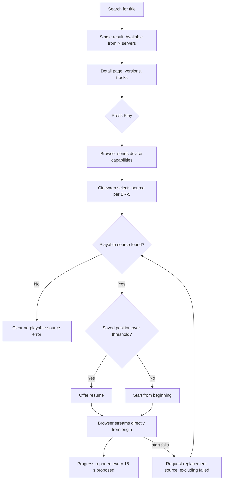

# Cinewren — PRD (Product Requirements Document)

| | |
|---|---|
| **Status** | Draft v0.1 (2026-10-04). Agent-authored under delegation; not owner-reviewed. Nothing described here is implemented. Updated 2026-10-04 for owner decisions (ADR-0014, self-hosting). |
| **Owns** | Personas, capabilities (CAP-1 to CAP-14), user journeys (J-1 to J-6), UX principles, product-level acceptance criteria, scope summary, non-goals and deferred capabilities (DEF-1 to DEF-11). |
| **Does not own** | Business outcomes and constraints ([BRD](BRD.md)); workflow detail, business rules, state machines ([FRD](FRD.md)); requirement text ([SRS](SRS.md)); design ([HLD](../design/HLD.md)); sequencing ([ROADMAP](../ROADMAP.md)). |

Requirements are referenced by SRS ID and never restated. Priorities follow SRS section 1: `Must` is required for v1.0, `Should` is planned but may slip with a recorded decision, `Could` is only if cheap. Capabilities, priorities and journeys are an **Agent decision (delegated, 2026-10-04; not yet owner-reviewed)** built on the owner's [concept](../sources/2026-10-04-initial-architecture-concept.md).

## 1. Personas

| ID | Persona | Description | Needs |
|---|---|---|---|
| P-1 | Operator | Technical. Deploys Cinewren, from a release, to their own Cloudflare account, runs or controls the origin servers (A-2), and invites viewers. | Quick setup; to see why something is missing or failing; control over who sees which libraries; to fix wrong merges; safe handling of server credentials. |
| P-2 | Viewer | Non-technical household member or friend, invited by the operator. | One place to find a title; playback that just starts; to resume where they left off; to pick audio and subtitles. No knowledge of servers. |

## 2. Capabilities

Each row links SRS requirements. A requirement may appear under more than one capability when it serves both.

| ID | Capability | Pri | Description | SRS requirements |
|---|---|---|---|---|
| CAP-1 | Server registration and management | Must | The operator registers Jellyfin, Emby and Plex servers, validates them, chooses which libraries to include, and edits, disables or removes them. | FR-SRV-001 to FR-SRV-007, IR-002 to IR-005, DR-002 |
| CAP-2 | Catalog sync and normalization | Must | The system pulls each enabled server's items on a schedule or on demand and normalizes them into one schema. | FR-SYNC-001 to FR-SYNC-007, FR-SRV-003, NFR-REL-001, NFR-REL-002, DR-003 |
| CAP-3 | Federated, deduplicated catalog | Must | The same work on several servers appears as one item with multiple sources. | FR-CAT-001, FR-CAT-006, DR-005 |
| CAP-4 | Browse and search | Must | Unified lists, sorting, filters, token and prefix search, and a home view with recent and continue-watching rows. | FR-CAT-002, FR-CAT-003, FR-CAT-004, FR-CAT-008, NFR-PERF-001, NFR-PERF-003 |
| CAP-5 | Title detail including versions and seasons/episodes | Must | Metadata, artwork, a summary of available versions and server count, and the season and episode list for series. | FR-CAT-005, FR-CAT-006, FR-CAT-009 |
| CAP-6 | Playback with automatic source selection | Must | One press of play picks the best source for the viewer's device and starts playback directly from the origin. | FR-PLAY-001, FR-PLAY-002, FR-PLAY-003, FR-PLAY-007, FR-PLAY-008, FR-PLAY-009, IR-007, NFR-SEC-003, NFR-COMP-001, NFR-COMPAT-001, NFR-PERF-002 |
| CAP-7 | Manual version/source override | Should | A viewer can pick a specific version or source instead of the automatic choice. | FR-PLAY-005 |
| CAP-8 | Watch progress, resume, watched state, next episode | Must | One position per user per item regardless of source; resume prompt; automatic and manual watched state; next-episode suggestion (Should). | FR-PROG-001 to FR-PROG-004, FR-CAT-008 |
| CAP-9 | User and access management | Must | Passkey-only sign-in. Accounts exist only through operator invite links, with the first operator created at `/setup`. Operators create and revoke invites, disable and delete users, grant or revoke library access, and issue re-enrollment links. Users manage their own passkeys and sign out. Owner decision (2026-10-04). | FR-USR-001 to FR-USR-007, IR-006, NFR-SEC-002, NFR-SEC-004, NFR-SEC-007, NFR-PRIV-001 |
| CAP-10 | Server health and play-time failover | Should | The system tracks server reachability and, when a selected source fails, offers the next-best source or a clear error. | FR-OPS-001, FR-OPS-002, FR-OPS-004, FR-PLAY-004 |
| CAP-11 | Audio and subtitle track selection | Must | The viewer chooses audio and subtitle tracks, including none. | FR-PLAY-006 |
| CAP-12 | Catalog curation: manual merge/split | Should | The operator corrects wrong or missed merges, and the correction survives later syncs. | FR-CAT-007 |
| CAP-13 | Operational visibility | Must (sync status); Should/Could for the rest | Sync status per server (Must); health history, audit log (Should); data export, health endpoint (Could/Should). | FR-OPS-003 (Must), FR-OPS-004, FR-OPS-005, FR-OPS-007 (Should), FR-OPS-006 (Could), FR-SYNC-006, NFR-OBS-001, NFR-OBS-002 |
| CAP-14 | Self-host packaging & upgrades | Should | Each deployment still has one operator, but Cinewren is packaged so that other operators can deploy their own instance from a tagged release and upgrade it safely. Owner decision (2026-10-04). | FR-OPS-008, NFR-MAINT-003 |

Cross-cutting requirements that apply to every capability (security, reliability, accessibility, observability, maintainability) are tracked in the [SRS](SRS.md#6-nonfunctional-requirements-nfr).

## 3. User journeys

Behaviour behind each step is defined in the [FRD](FRD.md) workflow named in the step.

### J-1 Operator first-time setup

Persona P-1. Capabilities CAP-1, CAP-2, CAP-9, CAP-13.

1. Operator deploys Cinewren to their Cloudflare account from a release and sets the `SETUP_TOKEN` secret (FR-OPS-008, CAP-14).
2. Operator opens `/setup`, enters the token and registers the first passkey. This creates the first operator, and `/setup` is then permanently disabled (FR-USR-002, WF-7).
3. Operator registers the first Jellyfin server with HTTPS URL and service-account credentials (WF-1, CAP-1).
4. The system validates the server and lists its libraries. Operator enables the movie and TV libraries to include (WF-1).
5. First sync runs, and the operator watches its status until it finishes (WF-2, CAP-13).
6. Operator invites a viewer by creating an invite link and chooses their library grants (WF-7, CAP-9).

### J-2 Viewer finds and plays a movie available on several servers

Persona P-2. Capabilities CAP-3, CAP-4, CAP-5, CAP-6, CAP-8, CAP-11.

1. Viewer signs in with their passkey and sees the home view (WF-7, WF-4).
2. Viewer searches for a title (WF-4, CAP-4).
3. Results show one entry per title. The entry shows "Available from N servers" and version badges.
4. Viewer opens the detail page and presses Play (CAP-5).
5. The browser sends its capabilities. The system picks the best source and returns a playback descriptor (WF-5, CAP-6).
6. The player starts streaming directly from the chosen origin. If there is a saved position, it first offers to resume (WF-6, CAP-8).
7. Viewer optionally switches audio or subtitles during playback (CAP-11).

### J-3 Viewer continues a TV series

Persona P-2. Capabilities CAP-4, CAP-8, CAP-6.

1. Viewer opens the home view and sees the "Continue watching" row (FR-CAT-008).
2. Viewer picks the series. The page highlights the next unwatched episode (FR-PROG-004).
3. Viewer presses Play. The system selects a source for that episode, which may be on a different server than the previous one (WF-5).
4. Player offers to resume if the episode is partly watched (WF-6, FR-PROG-002).
5. When the viewer finishes, the episode is marked watched and the next episode becomes the suggestion (BR-7).

### J-4 Play when the preferred server is down

Persona P-2, with P-1 as observer. Capabilities CAP-10, CAP-6, CAP-13.

1. Viewer presses Play on a title that exists on two servers. The preferred one is down.
2. If health data already marks it `unreachable`, the system excludes it and selects the other source (BR-5, WF-8).
3. If the health status is stale and the first stream fails to start, the client requests a replacement excluding the failed source (FR-PLAY-004, WF-5).
4. If no source can play, the viewer sees a clear no-playable-source error. Browsing still works from last-synced data (NFR-REL-001).
5. The operator sees the server's health in the status view (FR-OPS-004).

### J-5 Operator invites a viewer and restricts libraries

Persona P-1. Capabilities CAP-9.

1. Operator opens user management and creates an invite. The invite link carries the role (viewer) and the library grants (WF-7).
2. Operator unchecks the libraries the viewer must not see, for example an adult-content library (FR-USR-005), and sends the link to the viewer.
3. Viewer opens the link and creates a passkey. Their account becomes active (WF-7, FR-USR-002).
4. The viewer's lists, search and detail pages never show restricted items, source counts or version badges from restricted libraries (BR-1).
5. Operator later changes grants. The change applies to the viewer's next request (FR-USR-005).

### J-6 Operator corrects a wrong merge

Persona P-1. Capabilities CAP-12, CAP-3.

1. Operator notices that two different works appear as one item, or one work appears twice.
2. Operator opens curation for the item and splits a source out, or merges the two items (WF-9).
3. The result is visible to viewers immediately.
4. The next sync does not undo the correction (BR-3).
5. The action appears in the audit log (FR-OPS-005).

## 4. UX principles

These are an Agent decision (delegated, 2026-10-04) derived from constraint C-5 and the concept's example of a unified listing.

1. **Provider-agnostic UI.** Viewers never see "Jellyfin", "Emby" or "Plex" as a concept they must understand. Server display names appear only where the viewer chooses a source (CAP-7).
2. **Merged presentation.** A merged item shows "Available from N servers" and a version summary such as "4K HDR · 1080p" (FR-CAT-005). Counts and badges include only sources the viewer may see (BR-1).
3. **One action to play.** Play works without choices. Choosing a version, audio or subtitles is optional.
4. **Honest failure.** Errors say what happened in plain language, with a next step where there is one ([FRD error behaviours](FRD.md#error-behaviours-visible-to-users)).
5. **Responsive.** Usable on desktop and mobile browsers, per the supported-browser set in NFR-COMPAT-001.
6. **Accessible.** The target is NFR-A11Y-001: WCAG 2.2 AA (proposed), a fully keyboard-operable player, and captions.
7. **Fast to first paint.** Initial route payload per NFR-PERF-003.

## 5. Product-level acceptance criteria

Criteria are observable on a deployed environment. They summarize; the verifiable statements are in the SRS rows referenced.

| CAP | Acceptance criterion | SRS |
|---|---|---|
| CAP-1 | With valid details, a server registers and its enabled libraries are listed. With a wrong password, a bad certificate, or an `http://` URL, registration is refused with an error naming the failed check. Disabling a server removes its sources from viewer results. | FR-SRV-001, FR-SRV-002, FR-SRV-004, FR-SRV-007 |
| CAP-2 | A sync of a test origin produces the expected item counts. Re-running it with no origin changes produces no changes. Killing one server does not stop another's sync or the browsing of existing data. | FR-SYNC-001, FR-SYNC-004, FR-SYNC-007, NFR-REL-001 |
| CAP-3 | Two items that share a TMDB or IMDb ID appear as one entry with two sources. Items with conflicting IDs do not merge. | FR-CAT-001 (BR-2) |
| CAP-4 | Search finds a title by prefix, ignoring case and accents. Lists can be sorted and paged. Response times are within the proposed envelope at the design scale. | FR-CAT-002, FR-CAT-004, NFR-PERF-001 |
| CAP-5 | The detail page shows metadata, artwork served by Cinewren (not by an origin URL), a version summary and the server count. Series show seasons and episodes. | FR-CAT-005, FR-CAT-009 |
| CAP-6 | Pressing Play on a multi-source title starts playback using the source the selection rules choose, with the stream coming from the origin's own hostname. A network trace shows no video bytes through Cloudflare hostnames. A stream credential from one session cannot be used for administrative calls. | FR-PLAY-001, FR-PLAY-003, FR-PLAY-007, FR-PLAY-008 |
| CAP-7 | A viewer can choose a different version before playing, and that source is used for that play. | FR-PLAY-005 |
| CAP-8 | Position is saved during playback and offered on the next play, even if the next play is served by another source. Crossing the watched threshold marks the item watched. | FR-PROG-001 to FR-PROG-003 (BR-7) |
| CAP-9 | There is no way to create an account without a valid invite link (or, once, `/setup` with the token). An expired, revoked or already used invite is refused. Opening a valid invite and creating a passkey yields an active user who can then sign in with that passkey. A signed-out visitor reaches only setup, invite redemption, login and health. A disabled user is refused immediately. A user cannot remove their last passkey. A viewer cannot reach operator endpoints. After a grant is revoked, the library's items are no longer visible to that user. An operator can restore access for a user who lost their passkeys with a re-enrollment link. | FR-USR-001 to FR-USR-007, FR-CAT-006 |
| CAP-10 | When a server is unreachable, play selects another source. If the stream does not start, a replacement request returns the next source or a clear error. | FR-OPS-002, FR-PLAY-004 |
| CAP-11 | The viewer can switch audio and subtitle tracks, including turning subtitles off. | FR-PLAY-006 |
| CAP-12 | After a manual merge or split and a full sync, the correction is unchanged. | FR-CAT-007 (BR-3) |
| CAP-13 | The operator can see each server's last sync outcome, next run and recent errors. The audit log lists operator actions. | FR-OPS-003, FR-OPS-005, FR-SYNC-006 |
| CAP-14 | Following the self-host guide, a second operator deploys their own instance from a tagged release and reaches first-run setup. Upgrading that instance to a newer release keeps its existing data and applies pending migrations. Each deployment still has exactly one operator organization. | FR-OPS-008, NFR-MAINT-003 |

## 6. Non-goals and deferred capabilities

The SRS has no requirements for these items. A "revisit trigger" is the evidence that would justify reopening the item. Delivery order for any that are reopened belongs to the [ROADMAP](../ROADMAP.md).

| ID | Item | Reason | Revisit trigger |
|---|---|---|---|
| DEF-1 | Media gateway / hiding origin hostnames | Direct-to-origin playback is the chosen design ([ADR-0003](../adr/0003-direct-to-origin-playback.md)), and the owner confirmed on 2026-10-04 that viewers seeing origin hostnames is acceptable (Owner decision). Origins are on public HTTPS. Hiding origins would need a gateway outside Cloudflare's video-prohibited paths, adding cost and operations. | The owner reverses that decision, or browser reachability becomes a blocker (A-3). |
| DEF-2 | Native, TV and mobile apps, including casting beyond browser defaults | The browser is the only v1 client (A-6). | Viewers report the web client is not enough on a target device. |
| DEF-3 | Multi-tenant or hosted service | Each deployment has one operator ([ADR-0011](../adr/0011-single-operator-deployment-model.md)). Other operators self-host their own instance (CAP-14) instead of sharing one. | Q-1 answered "yes". |
| DEF-4 | Writing watch state back to origins | Cinewren owns progress (FR-PROG-001). Syncing it back would need per-provider semantics and conflict rules. | Operators ask for watch state to appear in the origins' own apps. |
| DEF-5 | Real-time presence and co-watching (Durable Objects) | No v1 journey needs it. | A co-watching or live-presence use case is chosen. |
| DEF-6 | Offline downloads | Needs per-provider download rights and device storage handling. | Operators ask for it and A-6 changes. |
| DEF-7 | Music, photos, live TV and DVR | v1 covers movies and TV only (C-4 scope). | Operators ask and the provider adapters can express the types. |
| DEF-8 | Cinewren-side transcoding or media storage | Never planned. It conflicts with C-2 and C-3. | None. Reopening requires superseding the constraints with owner approval. |
| DEF-9 | Own metadata enrichment (TMDB calls) | Origins already carry external IDs (A-9). | Many items lack IDs and merging suffers (BO-1 measure missed). |
| DEF-10 | Origins reachable only on private networks | A-4 assumes public HTTPS reachability from Workers (Q-5). | Q-5 answered "yes"; options include Workers VPC, Tunnel private routes, or overlay networks. |
| DEF-11 | Internationalization | English-only UI in v1 (A-8). | A non-English viewer group is added. |

## 7. Scope summary

| In v1.0 | Out of v1.0 |
|---|---|
| Web client on the latest two major versions of Chrome, Edge, Firefox and Safari (NFR-COMPAT-001) | Everything in section 6 |
| Jellyfin, Emby and Plex origins | Other origin types |
| Movies and TV series | Music, photos, live TV |
| One operator per deployment, up to the NFR-SCALE-001 envelope (proposed), with packaging for self-hosting by other operators (CAP-14) | Hosted multi-tenant service |
| Passkey sign-in with operator and viewer roles; accounts only from invite links | Passwords, OAuth or origin-server logins |

Delivery by milestone is in the [ROADMAP](../ROADMAP.md). All capabilities are currently Not started.
